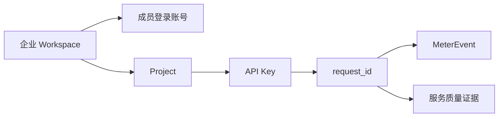
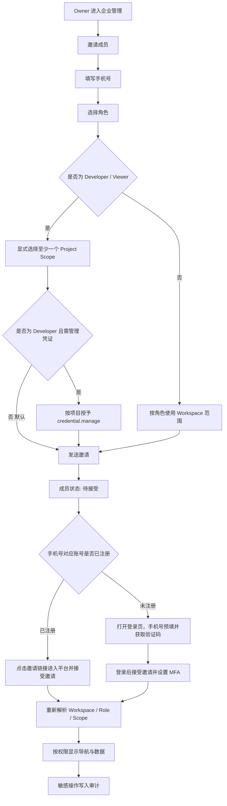
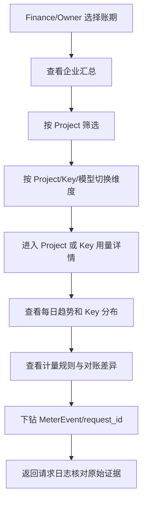
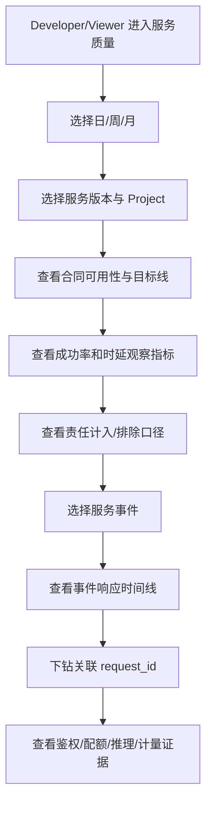
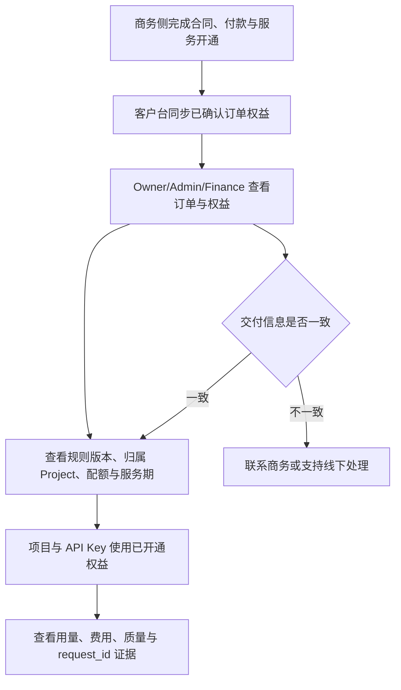
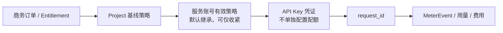
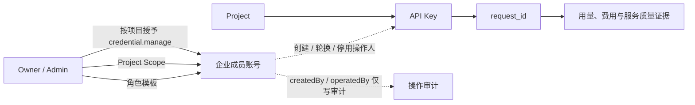
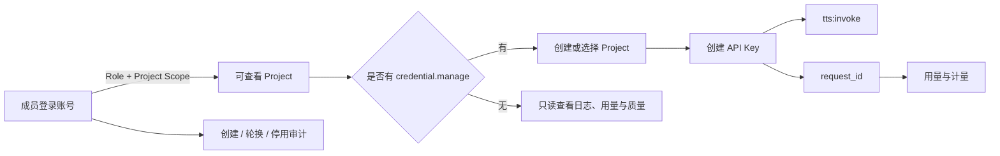

# Moss B 端交付控制台三项核心功能 PRD

> **历史文档提示（2026-09-04）**：本文仅保留为旧版实施基线，不再作为当前需求依据。当前账号、企业资源、邀请、API Key 和审计规则以 [`prd/PRD-企业账号与资源治理.md`](../prd/PRD-企业账号与资源治理.md) 及 [`prd/系统说明-账号切换与企业资源.md`](../prd/系统说明-账号切换与企业资源.md) 为准。

版本：3.0.0-beta.8 实现稿  
状态：历史原型实施基线（账号模型已由修订稿替代）  
日期：2026-09-01  
适用范围：V2 客户控制台框架；企业成员、项目与凭证、只读订单权益、用量与对账、服务质量

> **账号模型校准（2026-09-03，优先于本文旧 Project 口径）**：当前 B 端基线改为“一个企业 Owner 主账号 + Owner 创建/分配成员子账号”。成员子账号本身就是独立登录账号，不另建 `login_user` 对象；Moss 借鉴 MiniMax 的主账号 / 子账号关系，但根据 Owner 资源治理需求，支持 Owner 给 Member 分配 Voice、Token、RPM、并发账号级策略，企业总池为最终兜底（MiniMax 公开资料仍见 [官方前置准备](https://platform.minimaxi.com/docs/guides/quickstart-preparation) 与 [速率限制](https://platform.minimaxi.com/docs/guides/rate-limits)）。Project、Project Scope 不属于本期客户侧基线。正式修订稿见 [`PRD-MOSS-B2B-ACCOUNT-MODEL.md`](../../../语音api-minimax/PRD-MOSS-B2B-ACCOUNT-MODEL.md)。本文中与该校准冲突的 Project、成员登录身份拆分和共享-only 配额描述均视为待废止，研发实现以修订稿为准。

## 1. Summary

本 PRD 定义 Moss B 端交付控制台的四项核心功能。它帮助已签约企业管理 Owner 与成员 / 子账号，核对哪个成员账号和 API Key 产生了用量，并查看合同服务质量及对应请求证据。企业账号是资源与结算边界；成员 / 子账号是独立登录、调用归因和凭证归属主体；Project 不属于本期客户侧主流程。

本产品不是开放式云市场，也不替代商务合同、月度结算单或法律验收。原型只使用统一的模拟数据，展示完整业务关系和角色体验。

## 0. 本轮变更（2026-09-04）

### 0.1 企业成员邀请改为手机号

- 邀请入口只收集手机号、角色和资源配额，不再出现企业邮箱、邮箱域或邮件邀请字段。
- 已注册用户：点击邀请链接进入平台，确认企业角色与资源配额后完成受邀。
- 未注册用户：点击邀请链接进入登录页，手机号自动带入；获取短信验证码完成登录后，再接受企业邀请。
- 邀请令牌必须绑定企业、手机号、角色、资源配额和有效期；服务端在登录及接受邀请时二次校验手机号。
- 邀请成功后成员状态为“待接受”，预分配资源在接受前不生效；手机号已属于本企业成员时禁止重复邀请。

### 0.2 全量模型目录

以下为当前模型选择器中的全部模型，按模型类型分组；新增模型需同步更新本目录和模型选择器。

| 模型类型 | 展示名称 | 模型标识 |
|---|---|---|
| 音频合成 | MOSS-TTS-1.5-Flash | `moss-tts-1.5-flash-2026-06-26` |
| 音频合成 | MOSS-TTSD-1.0 | `moss-ttsd-1.0-2026-03-20` |
| 音频合成 | MOSS-Voice-Generator-1.0 | `moss-voice-generator-1.0-2026-07-22` |
| 音频合成 | MOSS-TTS-1.0-Pro | `moss-tts-1.0-pro-2026-02-07` |
| 语音识别 | MOSS-Transcribe-Diarize-Pro | `moss-transcribe-diarize-pro-2026-07-03` |
| 语音识别 | MOSS-Transcribe-1.0 | `moss-transcribe-1.0-2026-07-22` |

以上 6 个模型为当前版本的完整模型目录，模型选择器按“音频合成 / 语音识别”分组展示，不再补充未在目录中定义的模型。

### 0.3 邀请子页面（手机号）TXT 原型

邀请入口使用独立表单子页面（实现可采用弹窗承载），不出现企业邮箱字段。手机号同时作为邀请投递和登录识别依据。

```txt
┌──────────────────────────────────────────────────────────────┐
│ 邀请并分配成员                                      [×]      │
├──────────────────────────────────────────────────────────────┤
│ 通过手机号发送邀请链接；已注册用户点击链接接受，未注册用户   │
│ 使用短信验证码登录后接受。                                   │
│                                                              │
│ ┌──────────────────────────────────────────────────────────┐ │
│ │ 身份与角色                                               │ │
│ │                                                          │ │
│ │ 手机号 *                 │ 角色                          │ │
│ │ [请输入 11 位手机号    ] │ [Developer             ▼]     │ │
│ │ 手机号用于发送邀请链接  │                               │ │
│ │ 和后续登录验证。        │                               │ │
│ └──────────────────────────────────────────────────────────┘ │
│                                                              │
│ ┌──────────────────────────────────────────────────────────┐ │
│ │ 资源配额                                                 │ │
│ │ 提交后进入“待接受”；成员接受邀请后配额正式生效。         │ │
│ │                                                          │ │
│ │ 积分（积分）              [0        ] 企业剩余 30,000     │ │
│ │ ASR（小时）              [0        ] 企业剩余 2,000       │ │
│ │ TTS（字符）              [0        ] 企业剩余 100,000,000  │ │
│ │ RPM（请求 / 分钟）       [0        ] 企业剩余 500          │ │
│ │ 并发（路）               [0        ] 企业剩余 80           │ │
│ └──────────────────────────────────────────────────────────┘ │
│                                                              │
│ [取消]                                      [发送邀请]       │
└──────────────────────────────────────────────────────────────┘

发送后：
  已注册：邀请链接 → 平台 → 确认加入企业 → 配额生效
  未注册：邀请链接 → 登录页（手机号已带入）→ 获取短信验证码
        → 登录并接受邀请 → 配额生效
```

交互约束：手机号仅允许 11 位大陆手机号；同企业已存在或待接受的手机号禁止重复邀请；发送失败时保留表单输入。发送成功后状态为“待接受”，并展示对应的接受路径提示。

## 2. Contacts

| 角色 | 负责人 | 责任 |
|---|---|---|
| 产品负责人 | B 端产品组 | 范围、优先级、原型验收 |
| 商务与合同 | 商务负责人 | 合同条款、订单与结算口径 |
| 技术交付 | 交付负责人 | Project、项目、Key 与服务指标 |
| 客户成功 | 客户成功负责人 | 企业账号开通、培训与问题反馈 |
| 设计与前端 | 原型负责人 | 高保真交互、演示数据与可访问性 |

## 3. Background

### 3.1 背景

已签约的企业客户需要的不只是一个 API 文档页。客户还要回答三个实际问题：

1. 哪些员工可以登录，分别能看到和管理什么？
2. 哪个成员账号、API Key 产生了多少用量，月底依据什么结算？
3. 合同中的可用性、故障响应和时延指标是否达标，证据在哪里？

V2 已提供完整客户控制台框架和中国大陆下单支付链路。V3 保留客户控制台信息架构，但移除在线下单、支付、认款、充值和自动开通，把企业成员与凭证、用量对账、服务质量三条交付链做深。商务侧完成采购和开通后，客户台只读展示订单权益并连接项目、凭证、用量和服务质量证据。

### 3.2 核心对象



成员只负责登录、管理与审计。生产调用和费用归因使用 `Project → API Key → request_id → MeterEvent`。

## 4. Objective

### 4.1 产品目标

- 企业 Owner 能在 3 分钟内完成邀请成员、设置角色和项目范围。
- Developer 能从异常指标下钻到 request_id，并判断是客户侧还是服务侧原因。
- Finance 能从企业总量下钻到API Key 和计量事件，并核对预计费用。
- Viewer 能只读查看已授权范围，不看到管理按钮。

### 4.2 Key Results

| KR | 指标 | 原型验收标准 |
|---|---|---|
| KR1 | 核心流程可演示率 | 3 条主流程均可从列表进入详情并回到证据，不需要口头补充 |
| KR2 | 角色正确率 | Owner、Developer、Finance、Viewer 的导航、按钮和数据范围符合权限矩阵 |
| KR3 | 证据闭环率 | 用量和服务质量的聚合数据都能下钻到项目、Key 或 request_id |
| KR4 | 状态完整率 | 成员邀请至少覆盖待接受、已激活、已过期/撤回一种非正常状态 |
| KR5 | 原型质量 | Lint、构建、覆盖检查通过；桌面和窄屏无关键布局溢出 |

## 5. Market Segments

### 5.1 企业 Owner / Admin

工作：管理员工账号、角色、Project Scope 和安全策略。  
限制：不能替成员产生调用量，也不能绕过服务端 RBAC。

### 5.2 Developer

工作：管理授权项目的项目和 Key，查看调用日志与服务质量。  
限制：只能看到邀请人显式分配的项目；被邀请或从全局角色调整为 Developer 时，必须至少分配一个 Project Scope。获得项目可见权限不等于获得凭证写权限；`credential.manage` 默认关闭并按项目单独授予。不能查看企业财务或认证材料。

### 5.3 Finance

工作：查看余额、订单权益、用量、预计费用和结算依据。  
限制：不创建或轮换 Key，不查看输入内容，只查看计量元数据。

### 5.4 Viewer / 审计查看者

工作：只读查看已授权的日志、用量和服务质量。  
限制：没有写操作，不能看到密钥完整值。

## 6. Value Propositions

| 客户任务 | 当前痛点 | 产品价值 |
|---|---|---|
| 管理企业登录账号 | 角色、项目范围和最近登录分散，交接依赖人工 | 一个成员详情页说明登录状态、角色、范围、安全和管理责任 |
| 核对用量和费用 | 月底只有总数，无法解释哪个系统或 Key 产生 | 从企业总量逐级下钻到项目、Key、MeterEvent 和 request_id |
| 查看交付质量 | 服务方自报指标，客户无法看到计算口径和原始证据 | 合同目标、公式、排除项、事件和请求证据同屏关联 |
| 排查异常 | 成功率、限流、超时混在一起 | 明确区分客户 4xx/429 与服务方 5xx/超时责任 |

## 7. Solution

### 7.1 UX 与演示流程

#### 流程 A：企业成员



成员状态转换：

| 当前状态 | 操作角色 | 动作/触发 | 必要输入 | 下一状态 | 下一责任人 | 通知 | 时限 |
|---|---|---|---|---|---|---|---|
| 未创建 | Owner/Admin | 发送邀请 | 手机号、角色；Developer/Viewer 至少一个 Project Scope；Developer 的 `credential.manage` 可选且默认关闭 | 待接受 | 受邀成员 | 短信/平台邀请链接 + 站内通知 | 7 天 |
| 待接受 | Owner/Admin | 重新发送 | 无 | 待接受 | 受邀成员 | 新邀请通知 | 有效期重置 7 天 |
| 待接受 | Owner/Admin | 撤回 | 原因可选 | 已撤回 | Owner/Admin | 受邀成员收到撤回通知 | 立即 |
| 待接受 | 受邀成员 | 接受并设置 MFA | 登录验证、MFA | 正常 | 受邀成员 | Owner 收到已加入通知 | 立即 |
| 待接受 | 系统 | 超过有效期 | 无 | 已过期 | Owner/Admin | 过期提醒 | 第 7 天 |
| 正常 | Owner/Admin | 修改角色或范围 | 新角色；Developer/Viewer 至少一个 Project Scope；Developer 的 `credential.manage` 可选且默认关闭 | 正常 | 成员 | 权限变化通知 | 下次请求/登录生效 |
| 正常 | Owner/Admin | 从 Owner/Admin 调整为 Developer/Viewer | 清除原全局范围后，重新显式选择至少一个 Project Scope；Developer 凭证权限重新授权 | 正常 | 成员 | 权限收缩通知 | 保存后立即生效 |
| 正常 | Owner/Admin | 停用账号 | 原因 | 已停用 | Owner/Admin | 成员收到停用通知 | 立即 |
| 已停用 | Owner/Admin | 恢复账号 | 角色与范围复核 | 正常 | 成员 | 恢复通知 | 立即 |

成员列表必须展示：用户姓名（未注册时显示手机号脱敏值）、手机号、角色、Project Scope、MFA、最近访问、状态。成员详情必须展示登录安全、权限计算、负责资源和审计记录。成员页不得出现“个人调用量”。

邀请与授权口径：

- “邀请成员”不是先创建一个无范围账号再等待授权，而是在发送邀请前完成最小可用范围配置。
- Developer 和 Viewer 未选择任何 Project Scope 时不得发送邀请，界面需就地提示“请显式分配至少一个 Project Scope”。
- 勾选 Project Scope 只授予项目可见与该角色允许的只读能力，不得联动勾选 `credential.manage`。
- 只有 Developer 展示 `credential.manage` 选择项；该选择项仅在对应 Project Scope 已勾选时可用，默认不勾选。
- Owner/Admin 使用 Workspace 全局项目范围；Finance 使用 Workspace 财务范围，不要求选择 Project Scope，也不能获得凭证写权限。
- 从 Owner/Admin 等全局角色切换为 Developer/Viewer 时，系统必须清除原全局项目与凭证权限，再要求管理员重新显式分配范围，避免隐式继承。

#### 流程 B：用量与对账



数据状态：

| 状态 | 页面表达 | 允许操作 |
|---|---|---|
| 生成中 | 显示账期和更新时间，不显示假完整值 | 刷新、返回上期 |
| 可查询 | 指标、图表、明细和规则版本一致 | 筛选、下钻、导出 |
| 部分缺失 | 明确缺失时间段和影响对象 | 查看缺失详情、导出已有数据 |
| 已更正 | 保留原快照和新快照，不回写历史 | 对比版本、查看审计 |

平台只展示用量、预计费用和结算依据。最终金额以商务提供的月度结算单为准；页面不增加线上“确认对账”或“提交异议”。

#### 流程 C：服务质量



服务质量数据状态：

| 状态 | 页面表达 | 允许操作 |
|---|---|---|
| 计算中 | 显示统计周期和数据截止时间 | 返回上个完整周期 |
| 可查询 | 展示合同指标、观察指标、公式和证据 | 筛选、事件下钻、请求下钻 |
| 数据不完整 | 显示缺口与受影响指标，不能标“达标” | 查看缺失范围 |
| 已更正 | 显示规则版本和快照变化 | 查看前后版本 |

服务质量页面只提供信息展示和查询，不提供确认验收、提交异议、生成验收报告等动作。

#### 流程 D：商务交付结果查询



查询对象与边界：

| 对象 | 客户可见状态 | 页面表达 | 客户动作 |
|---|---|---|---|
| Order | 已生效 / 已到期 / 已终止 | 商务订单号、服务、规则版本、归属 Project 和生效时间 | 查看详情；异常时联系商务 |
| Entitlement | 有效 / 即将到期 / 已失效 | 计费方式、配额、并发、服务期和适用模型 | 进入项目、用量或质量页面查询 |
| DeliveryOrder | 交付中 / 已交付 | 线下商务交付结果和 Endpoint 状态 | 只读查看进度；联系交付负责人 |

产品约束：

- 客户台不提供套餐选择、订单确认、支付、对公认款、充值或自动开通动作。
- 权益由商务侧确认后同步到 Workspace 并绑定 Project，不属于成员，也不直接属于 API Key。
- 订单与权益页面只用于查询交付结果；通知仅提醒，订单与权益对象才是状态事实。
- 费用页面只展示商务授信余额、预警、用量和预计费用，不承担真实结算确认。

#### 7.1.1 Project 与配额边界

- API Key 直接归属于 Project，不是企业成员账号，也不是独立的登录主体。
- 客户侧不维护独立的“应用/调用系统”对象；Project 是唯一业务资源边界，API Key 直接挂在 Project 下。调用系统名称如有需要，只作为请求元数据或 Key 名称，不进入导航、权限或统计层级。
- Project 是合同权益、成员范围、数据隔离和调用归因边界；API Key 是项目发起调用的凭证。
- 配额与限流的合同额度、套餐上限、并发权益、默认 RPM 和规则版本由商务订单与平台后台配置后同步到 Workspace。客户侧不开放任意修改合同额度或绕过权益的入口。
- 导航归属上，“配额与限流”不再作为“管理 → 凭证与授权”的子页，而归入“组织 → 企业管理 → 企业与用户”。该页面集中展示企业资源池、Member 分配、Member 生效水位、适用规则和 429 请求证据；Project 只作为下钻和归因上下文，不新增独立侧栏入口。
- 客户侧“配额与限流”页面只提供当前水位、适用对象、规则来源、重置周期、耗尽策略、预警状态和 429 请求下钻；“申请提额”进入商务审批链路。Owner 在“企业与用户”中邀请或编辑 Member 时完成 Voice、Token、RPM 和并发资源分配。
- Project 级和服务账号级限流可由平台根据合同权益下发默认值；API Key 只继承服务账号有效策略。如生产需要差异化策略，由 Owner/Admin 发起申请，审批结果回写为新的规则版本并形成通知与审计记录。

#### 7.1.2 配额、服务账号与 API Key 的控制模型

为避免把同一份合同权益拆成多套互相矛盾的表单，客户台采用单一配置主体、逐层继承的模型：

> 导航归属与底层策略归属分开：配额与限流的客户入口位于“组织 → 企业管理 → 企业与用户”；底层有效策略仍按 Project、服务账号和 API Key 的继承关系计算，页面不因此新增 Project 或 Key 的独立配额编辑入口。



- **Project 是配额配置主体。** 合同套餐、月度计量上限、项目 RPM、项目并发、重置周期、耗尽策略、预警阈值和规则版本均以 Project 为归属；其值由商务订单与平台策略同步，客户台只读展示有效值。
- **服务账号是机器执行身份，不是新的账单或授权边界。** 它位于 Project 内，用于区分生产、调度、评测等调用链。默认继承 Project 策略；只有经 Owner/Admin 或平台策略明确下发时，才允许配置更严格的项目内 RPM/并发上限，不能突破 Project 上限。页面须同时展示“继承 Project”或“项目内覆盖”的来源。
- **API Key 是服务账号的调用凭证。** Key 归属 `Project → 服务账号`，承担 Scope、IP 白名单、有效期和生命周期，不提供一套独立的任意配额表单。Key 级用量可以查询，限流命中应回溯到服务账号和 Project 的有效策略。
- **有效策略计算：** `Project 基线 ∩ 服务账号覆盖（如有）`；API Key 只继承服务账号有效策略。任何调整都不得通过 Key 表单绕过合同权益。
- **配额页的表格层级：** 首行展示 Project 策略，后续展示服务账号的继承结果；使用“归属 Project、策略对象、继承关系、指标、当前/上限、耗尽策略、重置、规则来源、状态”字段，不把 Project、服务账号和 Key 作为三个并列配置对象。
- **客户操作：** Owner/Admin 可从具体 Project 发起“申请调整策略”；在“全部项目”视角必须先选择具体 Project。表单显示当前有效值（只读）、期望值和业务说明，提交后进入商务/平台审批，当前限流保持不变，并生成通知与审计记录。Finance、Developer、Viewer 只能查看有效策略；无权角色点击时引导联系 Owner/Admin。
- **统计关联：** 用量与对账按 `Workspace → Project → 服务账号 → API Key → request_id → MeterEvent` 逐级追溯；服务账号和 Key 是分析维度，不是额外的合同配额主体。项目汇总必须等于其下有效服务账号/Key 的可计费事件之和。

### 7.2 凭证归属、授权与离职风险模型

#### 7.2.1 归属原则

- 企业成员是登录、授权和审计主体，不是生产调用主体。
- API Key 由获得授权的成员创建，但必须直接归属于 `Project`；`createdBy` 只记录是谁执行了创建动作。
- 调用量和费用归属 `Workspace → Project → API Key → request_id`，不归属创建人、复制人或当前登录成员。
- Owner/Admin 给成员分配的是角色、Project Scope 和项目内的 `credential.manage` 权限，不是把某个 Key 分配给成员。
- 同一 Developer 可以在项目 A 拥有“查看 + 凭证管理”，在项目 B 只有“查看”，两个项目的权限独立计算。
- 新邀请的 Developer 不自动继承任何 Project Scope；邀请人必须显式选择至少一个项目。项目级 `credential.manage` 默认关闭，需由 Owner/Admin 另行勾选授权。
- Developer 的有效凭证管理权限按交集计算：`角色允许凭证管理 ∩ Project Scope ∩ 项目级 credential.manage`。任一条件不满足即只读或不可见。
- Viewer 同样必须显式分配至少一个 Project Scope，但始终只读，不展示 `credential.manage`。
- Owner/Admin 调整为 Developer/Viewer 时不得保留原“全部项目”隐式范围或全局凭证能力，必须按新角色重新授权。
- 移除成员的项目范围或凭证管理权限，不会自动停用该项目已有 Key，避免误伤生产服务。



#### 7.2.2 成员停用与已暴露 Key

停用成员只会阻止该成员登录控制台，不会撤销一个仍然有效的机器凭证。如果成员曾创建、复制或轮换过 Key，其离职后仍可能使用已知完整值调用接口。因此成员停用必须先进行“凭证暴露检查”。

| 当前状态 | 操作 | 系统检查 | 管理员选择 | 结果 |
|---|---|---|---|---|
| 正常成员 | 停用账号 | 列出该成员创建、复制或轮换过的有效 Key | 先轮换相关 Key（推荐） | 生成新 Key，提示业务系统迁移，旧 Key 按迁移窗口失效，再停用成员 |
| 正常成员 | 停用账号 | 存在相关有效 Key | 保留 Key 并确认风险 | 成员会话失效；Key 继续调用；记录高风险确认、通知 Owner/Admin |
| 正常成员 | 停用账号 | 不存在相关有效 Key | 确认停用 | 会话失效，成员无法登录，生产调用不受影响 |
| 已停用成员 | 恢复账号 | 复核角色、Project Scope、`credential.manage` | 确认恢复 | 成员重新登录后按最新权限计算 |

不允许在停用成员时静默批量停用全部相关 Key，因为这可能直接导致生产中断。管理员必须看到影响对象、最近调用、所属项目和推荐处置。

#### 7.2.3 角色与项目权限矩阵

角色管理采用“企业所有权”和“日常资源管理”分层：Owner 是 Workspace 唯一最高权限主体；Admin 是受 Owner 授权的日常管理员。普通邀请只能创建 Admin（仅 Owner 可见）或 Developer / Finance / Viewer，不能创建第二个 Owner。Admin 不能编辑、停用或授予 Admin，也不能修改企业认证与安全策略；这些操作必须由 Owner 发起并进入敏感操作确认与审计。

| 功能 | Owner | Admin | Developer | Finance | Viewer |
|---|---|---|---|---|---|
| 创建 Workspace Project | 创建、查看全部 | 创建、查看全部 | 不可创建；查看授权项目 | 不可见 | 不可见 |
| 查看项目资源、日志与用量 | 全部项目 | 全部项目 | 仅 Project Scope 内项目 | 全部财务范围 | 仅 Project Scope 内项目 |
| 管理项目与 API Key | 全部项目 | 全部项目 | 仅同时具备 Project Scope 与 `credential.manage` 的项目 | 不可见 | 不可见 |
| 邀请、停用 Developer / Finance / Viewer | 管理 | 管理 | 不可见 | 不可见 | 不可见 |
| 邀请、停用或调整 Admin | 管理 | 不可管理 | 不可见 | 不可见 | 不可见 |
| 修改角色与 Project Scope | 管理（Owner 只能由所有权转移流程变更） | 管理 Developer / Finance / Viewer | 不可见 | 不可见 | 不可见 |
| 修改企业认证与安全策略 | 管理 | 只读 | 不可见 | 不可见 | 不可见 |
| 查看操作审计 | 全部 | 全部 | 授权项目 | 费用相关 | 只读授权范围 |
| 查看用量 | 全部 | 全部 | 授权项目 | 全部财务范围 | 授权范围只读 |
| 查看预计费用 | 全部 | 全部 | 授权项目 | 全部 | 按授权范围 |
| 查看请求日志 | 全部 | 全部 | 授权项目 | 仅计量元数据入口 | 授权范围只读 |
| 查看服务质量 | 全部 | 全部 | 授权项目 | 全部只读 | 授权范围只读 |
| 修改服务质量数据 | 无 | 无 | 无 | 无 | 无 |

#### 7.2.4 操作审计口径与页面规则

操作审计面向当前企业账号，记录企业 Workspace 内成员对组织、凭证、资源、认证和登录安全的管理动作。它不记录模型调用明细、音频内容、计量事件或业务请求；这些内容分别在“调用日志”和用量页面查看。页面不提供“审计范围”选择器，默认就是当前企业账号。

每条审计事件至少包含以下字段：

| 字段 | 口径 | 页面展示 |
|---|---|---|
| `actor_id` | 执行操作的企业成员唯一标识 | 成员姓名 + 脱敏手机号；手机号用于区分同名成员 |
| `actor_role` | 操作发生时的角色 | Owner / Admin / Developer / Finance / Viewer |
| `occurred_at` | 服务端记录的操作时间 | 按本地时区显示完整时间 |
| `module` | 发生操作的企业管理模块 | 组织成员、凭证与授权、资源管理、企业认证、登录安全、费用与订单 |
| `action` | 模块内的具体动作 | 由模块动作字典枚举，不允许自由输入 |
| `object` | 被操作的对象 | 成员、角色、Project、API Key、企业主体或安全规则 |
| `result` | 操作是否完成 | 成功 / 失败 |
| `source_ip` | 操作来源网络地址 | 页面列表展示，详情展示完整值 |
| `device` | 操作设备和浏览器 | 详情抽屉展示 |
| `request_id` | 本次管理动作的追踪标识 | 详情抽屉展示 |
| `before` / `after` | 变更前后的快照或摘要 | 仅详情抽屉展示；历史事件只读 |

模块和动作必须使用统一字典遍历生成筛选项和审计事件：

| 模块 | 动作 |
|---|---|
| 企业认证 | 查看认证信息、提交认证信息、修改认证信息、认证通过、认证驳回 |
| 组织成员 | 邀请成员、接受邀请、撤回邀请、编辑角色、调整成员权限、停用成员、恢复成员 |
| 凭证与授权 | 创建 API Key、复制 API Key、轮换 API Key、停用 API Key、授予凭证管理权、撤销凭证管理权 |
| 资源管理 | 调整成员资源策略、调整 Project 配额、申请调整限流策略 |
| 登录安全 | 修改 MFA 规则、修改会话策略、退出成员会话、退出全部会话 |
| 费用与订单 | 查看订单、导出用量、导出结算单 |

操作审计页面采用多页列表，不一次性加载全部记录。默认按时间倒序分页，每页 20 条；筛选条件包括时间、操作人、操作模块和操作结果。表格展示“时间 / 操作人（姓名 + 手机号）/ 模块 / 动作 / 对象 / 结果 / 来源 IP / 详情”，点击“详情”打开只读抽屉，展示设备、请求 ID 和变更前后内容。导出按当前筛选条件执行，历史记录不可编辑、不可删除。

### 7.3 页面清单

企业管理：企业与用户（成员列表、邀请/编辑成员、成员详情、角色与权限、企业资源池、配额与限流、会话安全）、企业认证、操作审计。  
凭证与授权：API 凭证、API Key 详情与创建/轮换/停用、音色授权。Project 详情只作为凭证、用量或日志的下钻对象，不作为侧栏导航项。  
费用中心：费用概览、订单与权益、订单详情、用量明细、用量对象详情。  
调用日志：请求日志、请求证据详情、服务质量。  
服务质量：合同口径、TTS/ASR 线上性能与离线评测、时延分布、责任口径、服务事件列表、15/30/120 分钟响应阶段、事件详情、关联请求详情、数据不完整状态。完整指标定义见 `V3-CUSTOMER-METRICS-DASHBOARD.md`。

页面层级规则：左侧一级导航固定为“平台首页 / 发现 / 开发 / 管理 / 组织”。“管理”下的二级页面为“凭证与授权 / 费用中心 / 调用日志”；“组织”下的二级页面为“企业管理”。页面内部 Tab、详情页和弹窗不升级为侧栏导航。

导航目录：

```text
平台首页

发现
├─ 模型与服务
├─ 体验中心
└─ 解决方案

开发
├─ Playground
└─ API Docs

管理
├─ 凭证与授权
│  ├─ API 凭证
│  │  └─ API Key 详情
│  └─ 音色授权
├─ 费用中心
│  ├─ 费用概览
│  ├─ 订单与权益
│  │  └─ 订单详情
│  └─ 用量明细
│     └─ 用量对象详情
└─ 调用日志
   ├─ 请求日志
   │  └─ 请求证据详情
   └─ 服务质量

组织
└─ 企业管理
   ├─ 企业与用户
   │  ├─ 成员列表
   │  ├─ 成员详情
   │  ├─ 邀请 / 编辑成员
   │  ├─ 成员资源分配
   │  └─ 配额与限流
   ├─ 企业认证
   └─ 操作审计
```

“邀请 / 编辑成员”“成员资源分配”“角色权限”“成员安全处置”均为“企业与用户”页面内的操作或弹窗，不是独立侧栏项。

通知中心：顶栏未读入口、最近通知抽屉、通知列表与筛选、通知详情、单条已读、全部已读、业务对象跳转。通知按角色和 Project Scope 过滤；项目创建、成员权限变化、Key 创建/轮换/停用、配额预警、计量更新和服务质量快照均形成站内消息。通知不是业务对象状态源。

#### 7.3.0 通知事件与角色投递矩阵

通知的职责是“提醒 + 导航”，不是改变业务状态。任何事件先写入成员、Project、项目、Key、MeterEvent 或服务质量事件，再生成通知；通知点击后进入对应对象详情，详情页才是最终状态来源。

生产通知至少包含 `event_type`、`source_object_id`、`audience_roles`、可选 `project_id`、严重级别、创建时间和已读状态；当前 Demo 使用通知 `id`、标题/分类、`target` 和 `audience` 模拟这些字段，避免把 mock 数据误认为真实投递记录。投递顺序为：

1. 根据事件解析接收角色（`audience_roles`）。
2. 若事件带 `project_id`，再按成员的 Project Scope 过滤；Owner/Admin 的全局范围可见全部项目。
3. 只对当前角色可见的消息计入铃铛未读数；抽屉和完整页面共享同一已读状态。
4. 点击消息只标记已读并导航，不在通知内直接执行权限、凭证、计量或结算变更。

| 事件 | 触发条件 | 默认接收角色 | Project Scope | 跳转与权威来源 |
|---|---|---|---|---|
| `project.created` 项目创建 | Owner/Admin 创建 Workspace Project 成功 | Owner、Admin | Workspace（新项目对 Owner/Admin 可见） | 项目与凭证 / 项目；项目列表 |
| `member.invited` 成员邀请 | 发送邀请成功或邀请即将过期 | Owner、Admin；受邀人通过手机号对应的邀请链接和站内待处理入口接收 | Workspace | 企业管理 / 成员详情；邀请状态 |
| `member.permission.changed` 成员权限变更 | 角色、Project Scope 或 `credential.manage` 保存成功 | Owner、Admin、被影响成员 | 变更涉及的项目；无项目时 Workspace | 成员详情；成员权限与审计 |
| `member.deactivated` / `member.restored` 成员状态变化 | 停用或恢复确认完成 | Owner、Admin、被影响成员 | Workspace | 成员详情；账号状态 |
| `credential.permission.changed` 凭证管理权变化 | 授予或撤销项目级 `credential.manage` | Owner、Admin、被影响成员 | 授权项目 | 成员详情 / API 凭证；权限结果与审计 |
| `key.created` / `key.rotated` / `key.disabled` Key 生命周期 | Key 创建、轮换或停用完成 | Owner、Admin；该项目的凭证管理员 Developer | Key 所属 Project | API 凭证 / Key 详情；Key 版本状态 |
| `key.expiring` Key 即将到期 | Key 到达 30/7 天提醒阈值 | Owner、Admin；该项目的凭证管理员 Developer | Key 所属 Project | API 凭证 / Key 详情；有效期 |
| `quota.threshold` 配额预警 | RPM、并发或套餐用量达到配置阈值 | Owner、Admin；该项目的凭证管理员 Developer | 告警所属 Project | 配额与限流；当前水位 |
| `usage.snapshot.updated` 用量快照更新 | 账期计量快照或对账数据发布 | Owner、Admin、Finance | Workspace 或相关 Project | 费用中心 / 用量；MeterEvent 快照 |
| `usage.reconciliation.exception` 对账异常 | 计量缺失、重复、差异或规则更正被发现 | Owner、Admin、Finance | 异常所属 Workspace/Project | 用量明细 / 对账；异常记录 |
| `quality.snapshot.updated` 服务质量快照更新 | ASR/TTS 指标快照生成或刷新 | Owner、Admin、Developer、Finance、Viewer | 相关 Project；按 Scope 过滤 | 调用日志 / 服务质量；指标快照 |
| `quality.incident.opened` / `quality.incident.recovered` 服务事件 | 服务异常达到事件门槛或恢复 | Owner、Admin；有该项目可见范围的 Developer/Viewer/Finance | 受影响 Project | 服务质量 / 事件详情；事件时间线 |
| `security.policy.changed` 企业安全策略变更 | MFA、会话或登录策略保存成功 | Owner、Admin | Workspace | 企业认证与安全；策略版本 |
| `audit.export.ready` 审计导出完成 | 导出任务生成可下载文件（生产） | 发起人；Owner/Admin 可按审计范围查看 | 当前审计范围 | 操作审计；导出任务状态 |

角色投递原则：Owner 接收全部企业级和项目级治理消息；Admin 接收日常项目、成员、凭证、配额和质量消息，但不能通过通知获得 Owner 专属操作权；Developer 只接收其 Project Scope 内的质量、配额和凭证生命周期消息，且只有被授予 `credential.manage` 才接收 Key 管理类消息；Finance 以用量、对账、费用和质量只读消息为主；Viewer 只接收其可见项目的质量与请求诊断消息，不接收管理类待办。

当前 Demo 以 `audience` 角色投递为主，并对成员状态/权限事件保存受影响成员的定向模拟；角色切换仍只提供每个角色一个代表账号，无法模拟同一角色下多个真实成员的独立收件箱，也不会发送真实短信或企业 IM。生产需要将其升级为 `recipient_member_ids`、手机号投递渠道、送达状态和幂等键，并保留站内消息作为可追溯记录。通知始终不替代成员状态、Key 状态、MeterEvent、对账结果或服务质量事件的查询。

### 7.3.1 Key 操作模型



- Key 不归属于成员个人，成员只作为管理操作人与审计主体。
- Key 必须直接绑定 Project；完整值只在创建或轮换结果中展示一次。
- 创建 Key 使用顶部 Project 上下文作为归属来源：当前为具体 Project 时，弹窗只读显示该项目，不再重复切换；当前为“全部项目”时，弹窗提供一次性的归属 Project 选择，提交后 Key 只绑定所选项目。顶部“全部项目”仍仅用于查询和汇总，不作为 Key 的归属值；新建 Project 立即进入顶部项目列表并可作为后续 Key 的归属目标。不存在“先创建应用再创建 Key”的前置步骤，也不允许把 Key 直接挂到成员或 Workspace。
- Developer 只有在同时具备 Project Scope 和该项目 `credential.manage` 时，才可创建/轮换/停用 Key；Owner/Admin 可操作全部 Project。
- 邀请或编辑 Developer 时，Project Scope 是必填的可见范围，`credential.manage` 是默认关闭的可选动作权限；两者不得合并成一个开关。
- `createdBy`、`copiedBy`、`rotatedBy` 只用于审计和离职暴露检查，不改变 Key 的 Project 归属。
- 每次完整值展示都形成按 Key 版本记录的暴露事件，至少包含成员、动作、时间和版本；成员停用检查以 Key 的暴露事件为准，不依赖个人用量。
- 停用成员、移除 Project Scope 或撤销 `credential.manage` 都不会自动停用已有 Key；管理员需在风险确认弹窗中决定是否先轮换。
- 选择“先轮换后停用”时，必须先生成并一次性展示新版本，管理员确认安全保存后才完成成员停用；旧版本保留明确的迁移窗口。
- 日志与用量查询由成员角色控制，不向调用 Key 添加 `logs:read` 或 `usage:read`。
- 顶部 Project 上下文必须贯穿项目、API 凭证、配额与限流、费用概览、用量与对账、请求日志和服务质量页面；切换到具体 Project 后，所有指标、表格、图表、排除项和下钻入口均只使用该 Project 的数据。`全部项目` 只允许聚合查询，不能作为创建或配置对象；新建且尚无事件的 Project 必须显示零值/空状态，不得回退展示其他 Project 的统计。
- 创建、轮换、停用后，Key 列表、详情、通知和审计使用同一个本地 mock 记录同步更新。
- 页面文案只保留动作所需的对象、范围、有效期和可执行风险提醒；对象归属、成员停用与 Key 生命周期的解释性规则统一维护在本 PRD，不在客户运行界面展开实现说明。

### 7.4 原型状态要求

- 所有图表显示标题、单位、时间范围、更新时间和 tooltip。
- 图表筛选必须同步更新指标、表格和详情。
- 列表有搜索、筛选、空状态和分页语义。
- 角色切换后导航、首页任务、数据范围和可用动作同步变化。
- 邀请 Developer/Viewer 未选择 Project Scope 时必须阻止提交并显示字段级错误；选择项目后方可发送邀请。
- 新 Developer 仅选择 Project Scope 时可以查看对应项目，但不能创建、轮换或停用 Key；只有额外授予该项目 `credential.manage` 后相关操作才可用。
- Owner/Admin 降级为 Developer/Viewer 时，原全局范围和凭证权限必须被清空并重新分配，不得静默继承。
- 邀请接受、撤回、过期、停用至少有一个可演示的非正常分支。
- Toast 只确认动作，真实状态必须同时更新列表、详情、通知和审计。
- 所有模拟数据标记为 Demo，不得使用真实客户信息、录音、Key 或合同结果。
- 创建/轮换/停用 Key、授予 `credential.manage`、停用/恢复成员、退出全部会话等生产敏感动作必须使用站内 `alertdialog`，展示操作对象、生产影响、不可逆后果、审计与通知结果；不得使用浏览器原生 `alert/confirm`。

### 7.5 技术边界

原型使用 React/Next.js、集中 fixture 和本地状态。图表使用 Recharts。原型不连接真实 IAM、邮件、网关、计量、账单或合同系统。

生产版需要后端提供：Workspace 隔离、RBAC、邀请令牌、MFA、不可变审计、日志与 MeterEvent、规则版本、质量快照和导出任务。

### 7.6 Assumptions

- 企业客户会按 Project 划分业务边界，并为不同调用链路创建独立 Key，而不是共用员工个人 Key。
- 商务订单和结算单继续在线下完成，平台主要负责查询证据。
- 合同可用性目标和责任排除规则由合同配置，不由客户在页面编辑。
- Project Scope 足以表达当前原型的数据隔离；更细字段权限留给生产 IAM 设计。

### 7.7 页面信息架构与唯一入口

- “邀请成员”和“分配成员权限”属于同一成员资源的创建、编辑状态，不设两个平行导航页面。
- 企业管理一级页签固定为“企业与用户 / 企业认证 / 操作审计”。
- “企业与用户”承载成员列表、成员详情、邀请/编辑成员、成员资源分配和配额与限流；成员新增从“邀请成员”进入，存量成员从成员列表“查看账号 → 编辑权限”进入；两者复用同一套 Role、Project Scope、资源分配和 `credential.manage` 表单。
- 配额与限流只在“企业与用户”中提供企业资源池、Member 生效配额、限流水位、规则来源和 429 证据查询；不得在“凭证与授权”下重复出现可配置的配额页面。
- 角色动作矩阵只作为“企业与用户”页的可展开只读参考，不承担成员分配动作。
- 页面应覆盖列表、详情、创建/编辑、敏感确认、结果通知与审计、返回来源六类状态，不允许从列表直接跳到缺少上下文的其他模块默认详情。
- 企业账号管理、项目与凭证、费用与用量、调用日志与质量的对象关系、页面图和返回规则见 `V3-ENTERPRISE-CONTROL-PLANE-FLOWS.md`。

### 7.8 高保真界面的信息边界

业务对象关系、权限计算原理、为什么这样设计、跨模块流程图和实现术语属于 PRD 与交付说明，不直接展示在客户界面。运行界面只保留完成当前任务所需的标题、简短提示、业务数据、状态、操作、字段校验和风险确认。

- 成员页固定为“页签 → 标题与主操作 → 账号统计 → 搜索筛选 → 成员表格”；不得在表格前展示控制台对象链路或邀请流程图。
- “角色权限”使用独立只读弹窗展示动作矩阵，不与成员授权表单并列，不重复解释权限模型。
- 邀请/编辑成员表单使用用户语言“角色 / 项目权限 / 查看与查询 / 管理 API 凭证”，不得显示 `Project Scope`、`credential.manage` 等实现字段名。
- 只有会直接改变生产状态的动作展示影响说明，例如授予凭证管理、停用成员、轮换或停用 Key；普通页面不展示设计解释。
- 原型说明、演示角色和后端边界不得以大卡片、横向步骤条或产品内帮助文案占据首屏。Demo 身份切换器可以保留，但必须与生产信息层级分离。

### 7.9 成员统计指标口径

成员页统计必须能由当前成员数据直接计算，并在邀请、接受、撤回、停用、恢复、角色或权限变更后同步刷新。

| 指标 | 计算口径 | 展示要求 |
|---|---|---|
| 已启用账号 | `status = 正常` 的企业成员账号数 | 辅助信息展示全部成员记录数 |
| 待接受邀请 | `status = 待接受` 的邀请数 | 同时展示邀请有效期，不并入已启用账号 |
| 凭证管理员 | 正常账号中，角色为 Owner/Admin，或至少拥有一个项目“管理 API 凭证”权限的去重人数 | 不统计 Viewer/Finance，不按 Key 创建人统计 |
| 高权限 MFA | 已启用 Owner/Admin 中 MFA 已开启人数 / 已启用 Owner/Admin 总人数 | 使用分数而非模糊百分比；分母为 0 时展示 `—` |

当前合同与权益数据没有成员席位上限这一可核验字段，因此原型不展示“已用席位 / 总席位”。未来只有在商务权益同步明确提供席位额度后，才允许增加该指标。

### 7.9.1 “企业与用户”页面迭代

正式“企业与用户”页面作为视觉基线保持不动；“企业与用户 2”以正式页更清晰的布局为基线进行独立实现与逻辑迭代，便于在两个页签之间直接比较，不改变合同与权益口径。迭代重点是资源卡片层级、筛选区扫描路径、表格操作可发现性和邀请弹窗的表单分组：

- 筛选为即时生效：角色、账号状态和成员搜索任一条件变化后，列表和“筛选人数”同步更新，不设置额外“查询”按钮。搜索需支持清空，并在中文输入法组合完成后再提交搜索结果。
- 筛选区不再额外展示“筛选人数 / 邀请上限”统计；角色、账号状态和成员搜索仍即时作用于列表，不改变实际已占用名额。坐席上限只在企业资源池的坐席卡片中展示，并以“可分配坐席”为主值。
- 成员表格将“状态”和“操作”拆成两列。状态支持“正常、接近上限、已停用、待接受、已过期”；操作支持“查看账号、调整资源、编辑成员、停用账号、恢复账号”，并按角色权限显示。
- “查看账号”进入独立的用户详情下钻页；“调整资源 / 编辑成员”打开独立弹窗，详情页与编辑表单不并排出现。页签 2 的“邀请并分配成员”进入独立的邀请表单子页面，按确认稿分为“身份与角色”和“资源配额”两组；身份区只保留手机号和角色，资源区包含积分、ASR、TTS、RPM、并发，不展示姓名、企业邮箱、项目范围、凭证策略或配额来源；提交后账号状态为“待接受”，邀请接受后配额正式生效。
- 接近上限按当前生效的资源预警策略判断，不在界面写死业务阈值。对积分、ASR、TTS、RPM、并发等指标逐项判断；只要任一有限指标触发预警，该成员整体状态即为“接近上限”。高亮只应用于触发预警的“已用值”，配额值和未触发指标不高亮；状态文字与颜色圆点同时展示，不能仅依赖颜色。
- 待接受邀请在列表中单独体现；邀请接受前分配额度不生效。已过期邀请不占用邀请名额，停用成员保留名额，最终口径以生产后端生命周期与权益合同为准。
- 企业资源池各指标统一以“可分配 / 剩余”作为主值。坐席卡片展示“可分配坐席”，辅助信息拆分为“已占用坐席”和“待接受邀请（已预留）”；进度条按已占用加待接受预留计算。不得用“5 / 100”同时表达占用和预留而不说明口径。
- 迭代后的“企业与用户 2”不展示顶部企业统计卡、资源栏“预览数据”提示或筛选区邀请上限提示；企业资源栏保留为资源分配的唯一总览。正式“企业与用户”页面保持现状不变。
- “企业与用户 2”采用与正式“企业与用户”一致的页面布局基线（页签、标题、资源池、筛选、成员表格），但使用独立的页面实现与状态逻辑，两个页签互不共享页面渲染组件，便于后续分别修改。页签 2 的资源卡片主值统一为剩余/可分配，坐席卡片固定排在资源卡片末位；成员表格表头在滚动时保持可见，操作按钮使用一致的低噪声样式。

### 7.10 用量与质量指标的一致性约束

原型中的数字也必须满足生产产品的数据约束，不允许为了填满看板而在不同页面维护相互冲突的常量。

- 同一账期、项目和服务范围内，项目汇总必须等于其 API Key 之和。允许的差异仅限显示精度带来的末位舍入。
- 首页、项目详情、API Key 详情和费用中心读取同一组用量快照，不使用名称判断或页面专用常量推导指标。
- 请求数、计费量和预计费用分别聚合，不能用请求占比代替计费量占比；TTS 使用计费字符，ASR 使用音频小时，单位不得混用。
- 服务质量的统计周期、服务版本和项目筛选必须同时作用于指标卡、趋势图、服务事件及事件详情。当前筛选范围没有事件时，不展示“达标”结论或虚构 SLA 用时。
- 合同指标、线上观测指标和离线评测指标分区展示。只有合同明确约定的指标可标注合同目标；其余指标标注为平台观测或固定评测集结果。
- 每次更新 fixture 或引入新对象时，回归验证项目数、Key 数、总请求、总计量和费用的父子级守恒关系。

## 8. Release

### Beta.4：三条核心演示链

- 企业成员邀请、接受、撤回/过期、角色与 Project Scope、会话和审计。
- 用量总览、Project/API Key 归因、计量对账、Project 详情和 request_id 证据。
- 服务质量趋势、合同口径、事件详情、责任判断和请求下钻。

### Beta.5：Workspace 项目权限与身份入口收敛

- 当前企业身份与 Workspace 只在左下角展示，移除顶栏重复账号卡。
- Owner / Admin 创建的 Project 写入同一个 Workspace 状态，切换角色后仍可见。
- Developer 不可创建 Project，只能管理授权项目内的 API Key；Finance / Viewer 不显示凭证写入口。
- Owner、Developer、Finance、Viewer 角色演示入口和任务说明。

### Beta.6：权限、Key 与通知闭环

- 新增角色与动作权限矩阵，成员权限使用 Workspace 动态 Project Scope。
- 项目与 API Key 在 Workspace 共享状态中创建；Key 创建、轮换、停用会同步列表、详情、通知与审计表达。
- Key Scope 收敛为调用权限 `tts:invoke`；查询权限由成员角色负责。
- 新增通知抽屉与完整通知中心，支持角色/项目过滤、搜索、分类、阅读状态、详情和业务跳转。
- Developer/Viewer 的邀请必须显式选择至少一个 Project Scope；Developer 的项目级 `credential.manage` 与可见范围分离并默认关闭。
- Owner/Admin 调整为 Developer/Viewer 时清除原全局范围与凭证授权，防止降级后隐式保留高权限。
- 成员停用前检查已接触 Key，演示“先轮换后停用”和“保留 Key 并确认风险”两条生产处置分支。
- 创建/轮换/停用 Key、授予凭证权限、停用/恢复成员与退出会话统一使用站内敏感操作确认弹窗。
- Viewer 与 Developer 均严格受 Project Scope 限制；Admin 无法创建、修改或转移企业 Owner。
- Owner 是企业唯一最高权限主体：负责企业认证、安全策略、Admin 授予/撤销和所有权转移；Owner 不能通过普通邀请流程创建第二个 Owner。
- Admin 是日常资源管理员：可邀请和管理 Developer、Finance、Viewer，可创建项目并管理项目凭证，但不能管理 Owner/Admin、授予 Admin 角色或修改企业认证与安全策略。
- 成员详情将“访问与管理范围”和“凭证接触记录”分开呈现；凭证接触是历史风险证据，不代表 Key 归属成员，也不等同于当前权限。
- Key 详情新增按版本的完整值接触记录；离职轮换增加新 Key 一次性交付与迁移窗口确认。

### Beta.7：四域链路与成员入口收敛

- 成员账号、角色权限、资源分配与配额限流合并为单一“企业与用户”入口，去除重复的成员分配页面。
- 新增同页角色规则参考，通过成员列表和成员详情完成邀请、编辑权限和账号安全处置。
- 新增企业账号、项目与凭证、费用与用量、调用日志与质量的统一对象链路图和页面清单。
- 明确企业成员是登录、授权与审计主体；Project 和 API Key 是生产调用及用量归属主体；MeterEvent 与 request_id 是计费和交付证据主体。
- “项目与凭证”只保留 Project 与 API Key 两层；API Key 创建、轮换、停用与详情、用量、日志下钻使用同一 Project 上下文。
- 明确配额与限流归入“企业与用户”；其内容仍是商务权益和平台规则的只读结果，客户侧仅可查看、接收预警、下钻 429 证据并发起提额申请，不直接编辑合同额度。

### Beta.8：高保真界面与统计口径收敛

- 从成员运行界面移除对象链路、授权流程和权限实现说明，统一落入 PRD 与流程文档。
- 统一首页、项目、API Key、用量与费用的账期快照，修复跨页面汇总不守恒和 ASR Key 维度重复聚合。
- 服务质量筛选同时约束指标、趋势与事件，无事件范围不输出虚构 SLA 结论。
- 成员列表首屏收敛为可操作的账号统计、筛选和表格；角色权限矩阵改为按需打开的只读弹窗。
- 邀请成员弹窗改用业务语言并修复项目授权表格布局；高风险凭证授权仍保留独立确认。
- 成员统计改为数据驱动的已启用账号、待接受邀请、凭证管理员和高权限 MFA，并移除无权益来源的席位指标。

### Beta.9：请求日志筛选与统计主体收敛

- 请求日志主筛选固定为“时间 → Project → API Key → 状态/责任”，项目切换时联动清空 Key 条件。
- 状态筛选按客户侧 4xx/429 与服务方 5xx/超时分层，服务质量只聚合服务方责任异常。
- 请求数、成功率、P95 与责任分布随当前筛选样本更新；API Key 是调用与用量主统计主体。
- 成员维度仅作为权限/审计辅助；只有后端提供可信 `actor_id / caller_subject` 时，才允许增加成员用量辅助视图，不得用 Key 创建人推断调用人。
- 详细指标层级、计算口径和后端缺口见 [请求日志与用量指标口径](./REQUEST-LOGS-METRICS-SPEC.md)。

### Beta.10：页面信息密度与操作位置收敛

- 普通客户页面不再使用说明型盾牌提示卡；业务规则通过页面标题、字段、状态、指标和 PRD 表达。
- 盾牌提示仅保留在敏感操作确认弹窗、真实账号异常或空状态中，用于明确风险或当前状态。
- CSV/计量事件导出属于结果卡片级操作，统一放在对应表格卡片标题栏右侧；页面级 Header 仅保留创建、申请等页面主动作。
- 表格标题栏统一使用 18px 水平内边距，卡片内操作组垂直居中，避免导出按钮漂移到页面底部或与结果脱节。

### 后续原型

- 数据生成中、部分缺失和规则更正的完整可切换场景。
- 审计导出、用量导出和质量快照下载的任务状态。
- 更丰富的项目和服务版本数据。

### 生产实现

- 真实 IAM/RBAC、邀请与 MFA。
- 网关日志、不可变计量和服务质量计算。
- 真实通知、导出、结算单和审计存储。

上述生产能力不属于当前高保真原型交付范围。
