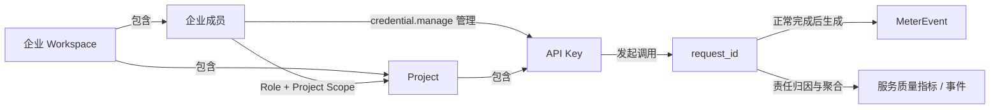
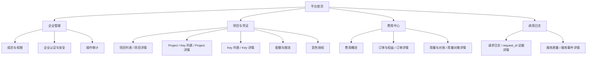
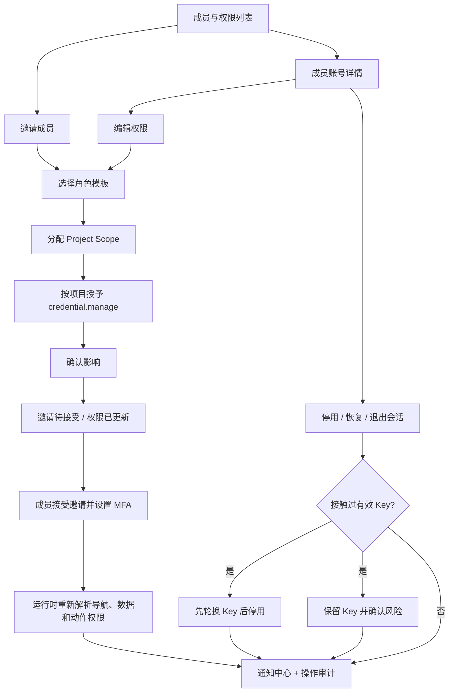
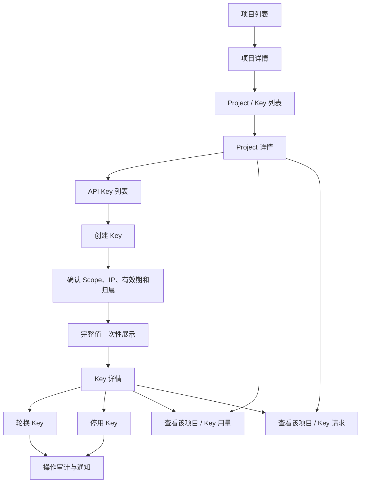
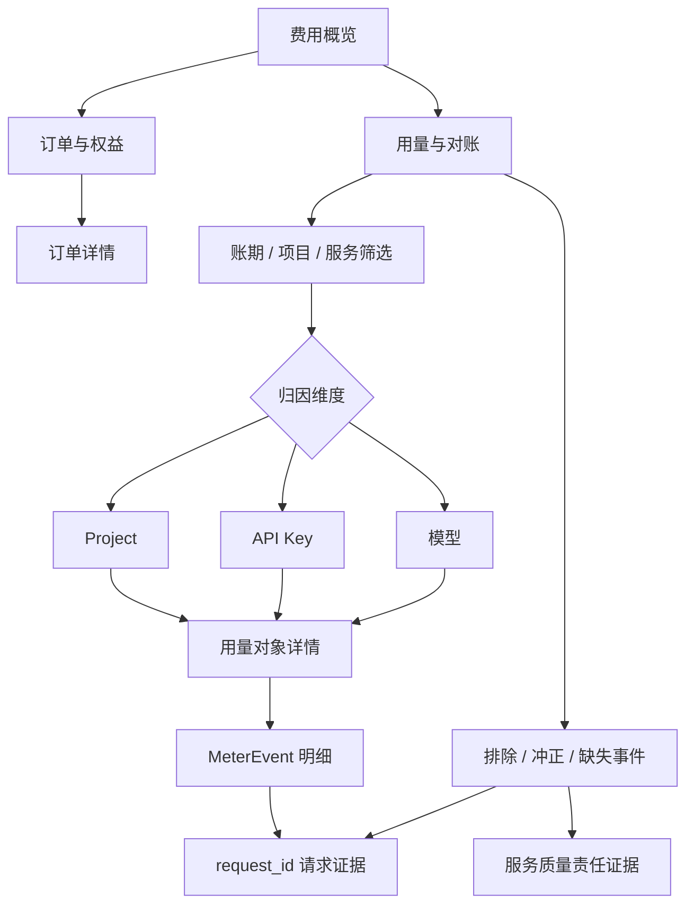
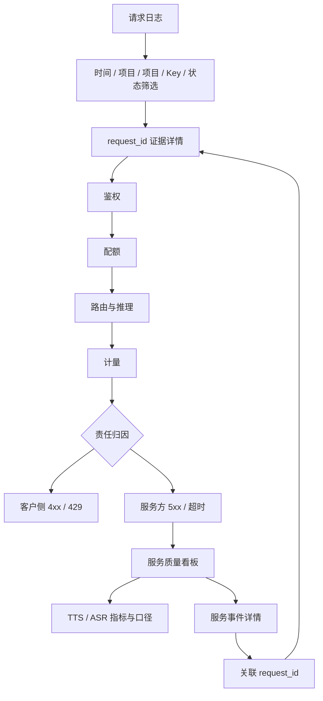

# Moss API v3 企业交付控制台逻辑与页面地图

## 1. 产品边界

本控制台服务于已通过商务和合同完成采购的企业客户。它不承担线上选购、支付或运营审批，核心任务是让客户管理企业账号与调用凭证，并自行查询用量、费用、请求和合同交付指标。

### 主体边界

- 企业成员：登录、授权、管理和审计主体，不是生产调用或计费主体。
- Project：企业业务和数据隔离边界。
- API Key：直接归属 Project 的机器调用凭证；创建人、轮换人只是审计责任字段。
- request_id：一次调用的证据主键。
- MeterEvent：一次可计费用量的证据记录，通过 request_id 与请求关联。

## 2. 全局信息架构

## 3. 企业账号管理闭环

“邀请成员”和“分配成员权限”是同一资源的创建与编辑动作，不应成为两个平行页面。v3 使用一个成员目录：新增从“邀请成员”进入，存量成员从行级“查看账号 → 编辑权限”进入，二者复用同一表单和权限模型。

权限计算公式：

`最终权限 = 角色动作上限 ∩ Project Scope ∩ 项目级 credential.manage ∩ 账号状态`

角色规则只作为同页只读参考，不提供第二套成员分配入口。

## 4. 项目与凭证闭环

Key 详情必须同时展示：归属 Project、归属项目、调用 Scope、IP 白名单、有效期、状态、版本、创建与轮换操作人、完整值接触记录、用量摘要和请求入口。

## 5. 费用、用量与对账闭环

成员不是默认计费维度。只有 Playground、个人测试 Key 或请求显式携带且通过校验的 `end_user_id`，才允许显示“直接会话成员 / 终端用户”辅助归因，并必须同时展示归因覆盖率；它不能替代 Key 与Key 维度。

## 6. 调用日志与服务质量闭环

服务质量是客户查询和交付证据，不提供“验收确认”动作。TTS 合同指标与平台扩展指标必须分层；ASR 在合同未约定时只能标记为平台观测或交付评测指标。

## 7. 页面完成性与返回规则

| 模块 | 列表页 | 详情页 | 创建 / 编辑 | 结果与追溯 |
| --- | --- | --- | --- | --- |
| 企业管理 | 成员与权限 | 成员账号详情 | 邀请成员 / 编辑权限 / 安全处置 | 通知中心、操作审计、返回成员列表 |
| 项目与凭证 | 项目、Key | 项目详情、Project 详情、Key 详情 | 创建项目、Key；轮换 / 停用 Key | 通知、审计、用量和请求下钻 |
| 费用中心 | 费用概览、订单、用量 | 订单详情、用量对象详情 | 只读筛选和导出，不提供购买 / 支付 | MeterEvent、request_id、质量证据 |
| 调用日志 | 请求日志、服务质量 | request_id 详情、服务事件详情 | 筛选、切换模型 / 周期 / 责任口径 | 回到请求、用量对象或质量事件 |

跨模块跳转必须保留或明确展示 Project、项目、Key、账期、服务 / 模型中的已知上下文；没有上下文时回到模块列表，而不是跳到无来源的默认详情。
