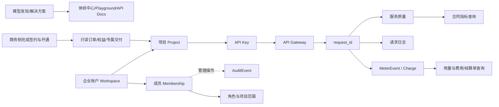
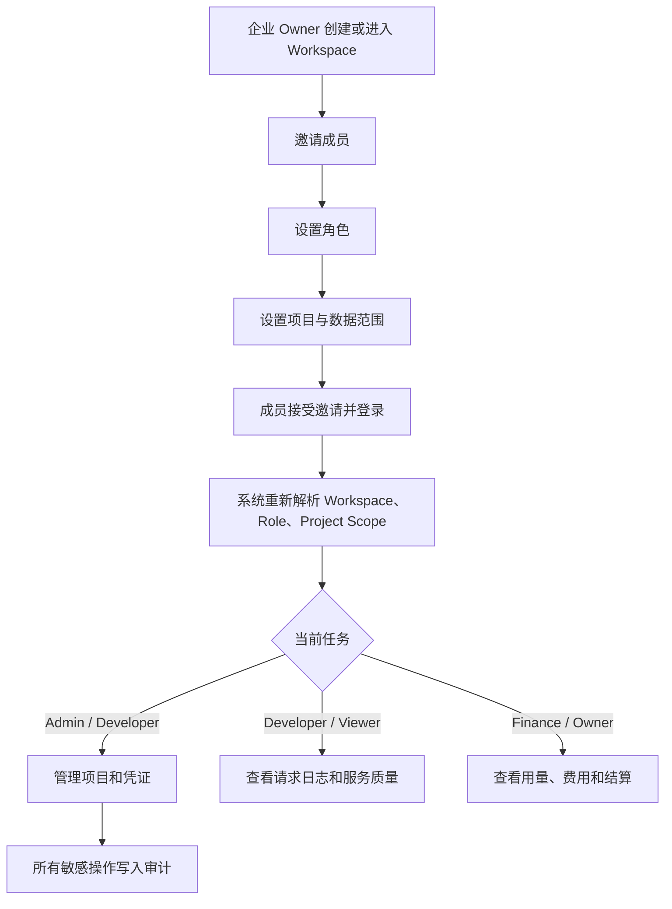
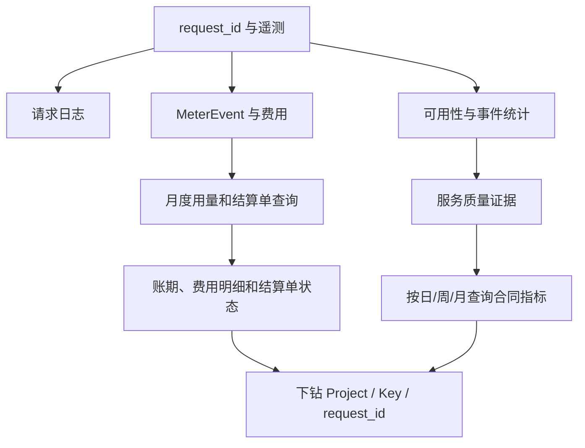

# Moss API V3 迭代规格：保留 V2 客户端框架并补齐企业交付链路

版本：V3 迭代基线（范围校准版）  
日期：2026-08-31  
适用对象：个人开发者、Team 与已签约企业客户  
基线：V2 客户控制台；不包含 Moss Ops 内部运营台

## 1. 范围决策

V3 不再以“收缩后的合同门户”替代 V2，而采用以下公式：

> V3 = V2 客户控制台框架 − 在线商业交易 − 内部运营台 + 企业接入治理 + 用量归因 + 合同服务质量查询

因此：

1. V2 的平台首页、模型与服务、体验中心、解决方案、Playground、API Docs、项目与凭证、费用中心、调用日志、企业管理和专属服务全部保留。
2. V2 的模型详情、只读订单权益、企业认证、Key 生命周期和专属交付结果继续保留；购买配置、订单确认、收银台、支付结果、充值汇款和自动开通不进入 V3。
3. 同时删除 `Moss Ops · 内部运营` 入口及运营总览、模型发布、商品定价、商务协议、支付认款、客户运营、计量复核、Pod 交付、容量与毛利等内部页面。
4. V3 在 V2 客户端能力之上补齐企业成员权限、Project/Key 级用量、统一调用证据和合同 SLA 信息查询。

V2 已封板，不回写 V2 代码；V3 复用其信息架构、页面逻辑和可验证交互。

## 2. 产品定位

Moss API 是面向 B 端语音和模型服务交付的客户控制台。它既保留客户发现、体验、技术接入和服务管理能力，也重点承担商务签约后的接入治理、用量核查、费用对账和服务质量查询。

产品心智统一为：

> 人登录并管理，Project 下的 API Key 发起调用，企业账户承担结算；模型、订单、权益、请求、计量和服务质量使用稳定对象串联。

V3 与通用公有云的差异不是“删除所有发现和体验页面”，而是将核心判断从“某个人用了多少”改为：

- 哪个企业账户承担合同与结算；
- 哪个 Project 和 API Key 发起调用；
- 哪些 request_id 形成了用量、费用和服务质量证据；
- 合同约定的交付指标是否达成。

## 3. pm-skills 评审结论

本次使用 `intended-vs-implemented` 对照 V2 文档、V2 页面和当前 V3 原型，并使用 `prioritize-features` 排定迭代顺序。

### 3.1 意图与实现差距

| 产品意图 | V2 实现证据 | 当前 V3 状态 | V3 决策 |
|---|---|---|---|
| 完整客户控制台 | V2 有发现、开发、管理、组织四组导航 | 当前 V3 仅保留少数管理页面 | 恢复全部 V2 客户导航与页面 |
| 内外控制面分离 | V2 客户台和 Moss Ops 以模式切换 | V3 不需要内部运营 | 不迁移 Ops 入口、导航与页面 |
| 企业接入可治理 | V2 有 Project、Key、配额、成员 | V3 对象链不完整 | 补详情、状态、失败恢复和审计 |
| 调用量可归因 | V2/V3 有日志和用量，但缺统一层级 | Key、项目、费用筛选未完全一致 | 统一 Workspace → Project → Key → request_id |
| 合同指标客户可核查 | V3 已有服务质量样机 | 仍缺事件详情和口径下钻 | 保留并加深为信息展示和查询，不设置验收动作 |

### 3.2 Top 5 优先级

| 排名 | 迭代项 | 影响 | 原因 |
|---:|---|---|---|
| 1 | 恢复 V2 客户端页面与导航归属 | 极高 | 先恢复正确产品基线，避免在错误范围上继续补页面 |
| 2 | 补齐项目、API Key 和成员权限 | 极高 | 决定企业接入是否可管理、可审计、可交接 |
| 3 | 统一用量、费用、日志和质量的归因维度 | 极高 | 决定客户能否解释账单与调用责任 |
| 4 | 完成服务质量和月度维度查询 | 高 | 让客户直接核查合同指标、口径和明细 |
| 5 | 补通知、告警、导出与审计恢复入口 | 高 | 异步任务不能只依赖 Toast，企业操作必须可追踪 |

## 4. 保留的 V2 客户端框架

### 4.1 左侧主导航

```text
平台首页

发现
├─ 模型与服务
├─ 体验中心
└─ 解决方案

开发
├─ Playground
└─ API Docs

管理
├─ 项目与凭证
├─ 费用中心
└─ 调用日志

组织
├─ 企业管理
└─ 专属服务
```

不得增加“内部运营台”入口。角色权限只控制客户侧菜单和数据范围，不切换到运营产品。

### 4.2 全局壳层

- 顶栏保留当前 Project、通知和 Demo 角色切换；当前成员身份与 Workspace 统一放在左下角。
- 只有一个项目时弱化 Project 切换器；多个项目时常驻。
- 侧栏底部继续区分“当前工作区”和“个人账号”，不把 Workspace 与自然人混为一个对象。
- 桌面使用固定侧栏，窄屏使用可恢复的导航抽屉。
- 同一时刻只允许一个一级导航 active；详情页归属唯一父入口。

### 4.3 页面内二级导航

#### 项目与凭证

1. 项目
2. API Key（直接归属 Project）
3. API Keys
4. 配额与限流
5. 音色授权

#### 费用中心

1. 费用概览
2. 订单与权益
3. 用量明细/用量与对账

订单详情是商务交付结果的只读子页面。费用中心不提供充值、购买、支付或认款入口。

#### 调用日志

1. 请求日志
2. 服务质量

“服务质量”是 V3 增量，继续归属 V2 的“调用日志”一级入口。日、周、月是筛选时间范围，不再单独设置“月度报告”或“月度验收”Tab。

#### 企业管理

1. 成员与权限
2. 企业认证与安全
3. 操作审计

个人资料、个人认证、登录安全和退出进入顶栏个人账号菜单；企业主体认证归属企业管理。

#### 专属服务

1. 资源列表
2. Pod/Endpoint 详情
3. 交付时间线
4. 健康与容量
5. 到期、续期与释放

专属服务保持独立一级入口，不复用企业管理的 Tabs。

## 5. V2 客户页面保留矩阵

| V2 业务域 | 必须保留的页面/链路 | V3 处理方式 |
|---|---|---|
| 平台首页 | 状态化任务、指标、最近调用、下一步动作 | 恢复，并增加服务异常或数据更新摘要 |
| 模型与服务 | 目录、模型详情、版本、交付方式、文档 | 保留已签约服务的技术事实，不提供在线选购 |
| 体验中心 | 展厅入口、体验卡、能力说明 | 保留；明确不携带生产 Key 和真实账单 |
| 解决方案 | Voice Agent、字幕、有声书、质检等浅入口 | 保留；不进入 Work B 的业务工作台 |
| Playground | Project、Key、模型、请求、结果、request_id | 保留；生产近似验证与展厅体验继续分离 |
| API Docs | 模型/API 文档、错误码、SDK/示例 | 保留并支持从错误、Key、模型详情带上下文进入 |
| 项目与凭证 | Project、API Key、配额、音色授权 | 以项目为唯一资源边界，Key 直接挂在项目下 |
| 费用中心 | 概览、只读订单权益、用量 | 聚焦商务授信余额、合同对账和月度证据下钻 |
| 调用日志 | 请求搜索、request_id 诊断、服务质量 | 保留并增加月度筛选、事件和指标明细查询 |
| 企业管理 | 成员、角色、项目范围、企业认证、安全 | 保留并补邀请状态、停用、MFA、审计 |
| 专属服务 | 资源、Endpoint、交付、容量、续期 | 完整保留；客户只看自身权益和交付状态 |
| 通知中心 | 权益、认证、Pod、Key 到期 | 保留并增加配额、SLA 和结算数据消息 |

## 6. 明确删除的内部运营范围

以下页面和对象不进入 V3 客户控制台：

- Moss Ops 运营总览和 WorkforceRole 切换；
- 模型 Candidate、Manifest、技术/商业准入与内部发布审批；
- PriceBook/商品版本内部审批、成本和毛利；
- 商务协议内部履约、支付认款与银行流水匹配；
- 全租户客户运营、租户健康和跨客户全局搜索；
- 内部计量批次复核、Adjustment 审批；
- Pod 容量池、排队、GPU 水位、资源调度和内部交付操作。

客户仍可看到与自身相关的模型状态、订单、权益、计量调整结果、专属资源和服务事件，但不能进入内部审批或全租户运营界面。

## 7. 核心对象与全链路



### 7.1 默认简化层级

默认界面使用：

`企业账户 → Project → API Key`

项目本身承担机器身份与数据隔离边界；不同调用链路通过不同 API Key、Scope 和 Key 名称区分，不新增应用/调用系统层级。

## 8. 需要从 V2 迁入 V3 的逻辑

这些能力在 V2 已有，不重新发明，只迁入 V3 客户端基线：

1. Workspace/个人账号分层与个人、Team、企业切换。
2. 模型目录、模型详情、体验中心和解决方案页面。
3. Playground 与 API Docs 上下文跳转。
4. 商务侧已确认订单与权益的只读查询。
5. Key 创建、仅展示一次、轮换、吊销和到期状态。
6. 企业认证、成员邀请、专属资源和通知中心。

迁入时删除在线交易动作，但不删除客户需要核查的订单、权益、计费和交付事实。

## 9. V3 需要新增或加深的页面

| 业务域 | 当前缺口 | 必须补齐的页面/状态 | 主要入口 |
|---|---|---|---|
| 项目 | 列表后无稳定详情 | 创建、详情、改名、负责人、API Key、权益、配额、用量 | 项目与凭证 → 项目 |
| API Key | 生命周期和用量未合并 | 详情、轮换、吊销、过期、IP、Scope、用量、质量、审计 | 项目与凭证 → API Keys |
| 成员与权限 | 静态表格 | 邀请、接受/撤回/过期、角色、项目范围、停用、席位、MFA | 企业管理 → 成员与权限 |
| 配额告警 | 只有水位 | 阈值、通知对象、历史告警、429 下钻、提额进度 | 项目与凭证 → 配额与限流 |
| 用量归因 | 各页面筛选不一致 | Workspace、Project、Key、模型、接口、日期统一筛选 | 费用中心 → 用量与对账 |
| Key 用量 | 只能间接筛选 | 调用量、计费字符、费用、成功率、错误、P95、最近请求 | Key 详情 |
| 服务质量 | 有看板，证据详情不足 | 指标口径、时间序列、不可用窗口、事件、排除项、请求下钻 | 调用日志 → 服务质量 |
| 月度结算查询 | 展示不足 | 账期、调用量、并发包、技术服务天数、费用、发送时间和结算单状态；无线上验收动作 | 费用中心 → 用量与对账 |
| 通知与审计 | 依赖 Toast | 消息列表、已读、对象链接、导出任务；敏感操作审计 | 顶栏通知/企业管理 |

## 10. 企业账户、成员与凭证



这条链不能由一张静态成员表或前端菜单隐藏代替。当前 V3 需要补齐：

| 流程节点 | 必须补充的页面/状态 | 权限生效结果 |
|---|---|---|
| 创建或进入 Workspace | Workspace 选择、创建结果、企业主体与当前角色 | 确立租户和数据隔离边界 |
| 邀请成员 | 邀请表单、待接受、已接受、已撤回、已过期 | 邀请是可追踪对象，不用 Toast 代替 |
| 设置角色 | 角色选择、权限预览、高风险变更确认 | 决定可执行动作 |
| 设置项目与数据范围 | 全部项目/指定项目、费用和日志可见范围 | 决定可见数据而不只是可见菜单 |
| 接受邀请并登录 | 接受结果、失效链接、重复加入、无权访问状态 | 建立 Membership |
| 重新解析权限 | 登录、切换 Workspace、角色变化后重新计算 | 导航、按钮、查询范围和 403 同步更新 |
| 按任务进入页面 | 项目/凭证、日志/质量、用量/费用三类任务入口 | 同一角色可拥有多个任务权限 |
| 写入审计 | 审计列表与详情 | 记录操作人、对象、前后值、时间和结果 |

成员被停用或离职时，只撤销其控制台 Membership；生产 API Key 不随成员账号自动失效。

### 10.1 角色和数据范围

| 角色 | 成员 | 项目 | API Key | 日志/质量 | 用量/费用 | 合同信息 |
|---|---|---|---|---|---|---|
| Owner | 全部管理 | 全部管理 | 全部管理 | 全部查看 | 全部查看 | 查看 |
| Admin | 邀请与调整 | 管理授权项目 | 管理授权项目 | 授权范围 | 授权范围 | 查看 |
| Developer | 不管理 | 查看授权项目 | 创建/轮换授权范围 | 查看并诊断 | 技术用量 | 查看质量 |
| Finance | 不管理 | 查看名称 | 不管理 | 默认不看请求参数 | 费用、权益、用量 | 查看 |
| Viewer/Auditor | 不管理 | 只读 | 只读或不可见 | 只读 | 按授权只读 | 只读 |

生产调用不属于登录成员。成员停用只撤销其控制台权限；生产 API Key 按独立生命周期管理。

### 10.2 Key 页面规则

- 生产 Key 直接归属于 Project，不归属于某位成员。
- 列表显示“创建人”和“最后变更人”作为审计字段，不显示“所属成员”。
- Key 详情回答：调用了多少、计费多少、花费多少、是否稳定、是否接近配额、最近发生了什么。
- Key 轮换提供新旧凭证重叠窗口；吊销不删除历史日志、计量和审计证据。
- 个人调试凭证仅存在于测试项目，必须短有效期、低配额，并与生产统计分开。

## 11. 用量与费用归因

```text
企业合同账户
└─ Project / Cost Center
   └─ API Key
         └─ 模型 / Endpoint / 接口
            └─ request_id
               └─ MeterEvent / Rating / Charge
```

用量、费用、请求日志和服务质量必须复用同一组筛选维度与稳定 ID。

成员详情不显示“个人调用量”，而显示：

- 负责的项目和 API Key；
- 有权管理的 Key；
- 创建、轮换和吊销操作；
- 最近登录和权限变化；
- “查看负责资源的用量”跳转，进入已按项目或 Key 过滤的用量页。

## 12. 合同服务质量与月度数据查询



页面必须：

- 区分请求成功率、合同可用性和观察指标；
- 展示合同目标、公式、统计周期、数据来源和更新时间；
- 明确 5xx、超时、维护、客户原因和第三方原因；
- 展示重大故障响应、初判、恢复或替代方案时间；
- 从不可用窗口、错误类型和费用差异下钻到 request_id；
- 显示统计口径、数据来源、更新时间和适用范围；
- 只提供展示、筛选、查询和明细下钻，不提供“确认验收”“提交异议”等动作；
- 如需提示合同异议渠道，仅展示合同约定的线下书面流程，不把它实现为平台工作流。

## 13. 页面与状态恢复规则

- 创建、支付、认证、交付、Key、配额和导出均不得只用 Toast 表示完成。
- 所有异步结果必须能从通知中心、业务列表或详情页重新进入。
- 列表进入详情后，返回时恢复原 Workspace、Project、筛选、分页和滚动位置。
- 详情页必须显示稳定对象 ID、状态、时间线、下一步和失败恢复入口。
- 权限不足进入产品自有 403；前端隐藏菜单不代表服务端授权完成。
- 状态不能只依赖颜色；键盘、200% 缩放和窄屏下仍可完成关键链路。

## 14. 迭代顺序

### Iteration 1：恢复 V2 客户端基线

- 迁入 V2 全部客户导航、页面、详情和子链。
- 恢复发现、开发、管理、组织四组导航。
- 移除内部运营台入口、Ops 状态、导航和页面。
- 保留 V3 已完成的服务质量和用量内容，移除月度验收动作。

### Iteration 2：补齐企业接入治理

- 完成项目和 API Key 详情。
- 完成 Key 用量、轮换、吊销、到期和审计。
- 完成成员邀请、角色、范围、停用、席位和 MFA。

### Iteration 3：统一用量与证据

- 用量、费用、请求日志和服务质量使用同一归因层级。
- 企业账户可逐层下钻至 Key、request_id 和 MeterEvent。
- 项目和 Key 详情增加用量与质量入口。

### Iteration 4：完成合同信息查询闭环

- 完成服务事件、维护窗口、月度筛选和结算单明细查询。
- 完成通知、配额告警、导出任务和操作审计。
- 验证共享 API、Token Plan 和专属 Pod 各自的质量/用量口径。

## 15. 原型验收标准

1. V2 的全部客户一级页面均可进入，内部运营台不可进入。
2. 模型发现、体验、技术验证、购买/开通、权益和接入链能够连续演示。
3. Workspace、个人账号和当前 Project 是三个清晰对象。
4. 企业 Owner 可以邀请成员并设置角色和项目范围。
5. Owner/Admin 可以创建 Project；获得项目级 `credential.manage` 的 Developer 可以在项目下创建、轮换和停用 API Key。
6. 完整 Secret 只展示一次，Key 可轮换、吊销并查看历史审计。
7. 生产调用归属于 Workspace、Project 和 API Key，不归属于自然人成员。
8. 企业账户可以从总用量逐层下钻到 Key、request_id 和计量证据。
9. Key 详情可以回答调用量、费用、质量、配额和最近错误。
10. 财务可从月度费用下钻计量证据，但不能管理凭证。
11. 客户可按日、周、月核查合同可用性、故障响应、排除项和明细数据。
12. 支付、认证、交付、告警和导出均有持久页面和失败恢复入口。
13. 所有成员、权限、Key、配额和导出操作均可审计。
14. 角色切换只改变客户菜单权限和数据范围，不显示内部运营菜单。

## 16. 最终范围

V3 保留两条相互连接的客户链路：

```text
发现与开通：模型/方案 → 体验/文档 → 购买或商务开通 → 订单/权益/专属交付

接入与核查：企业账户 → 成员权限 → Project → API Key → 调用日志
           → 用量费用/结算单查询 → 服务质量
```

V3 的目标不是缩成几个合同看板，也不是恢复内部运营，而是在 V2 完整客户产品逻辑上，把企业接入、用量归因和合同指标查询做深、做成可验证的信息链路。
