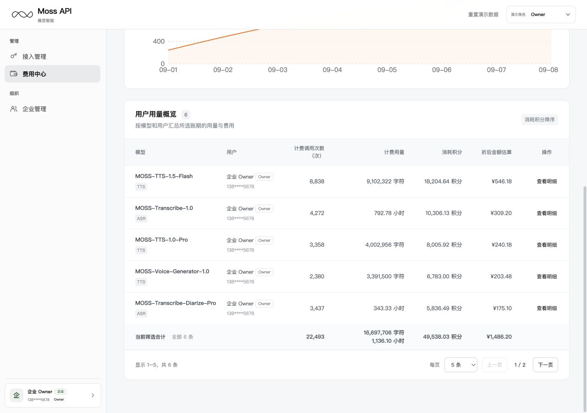
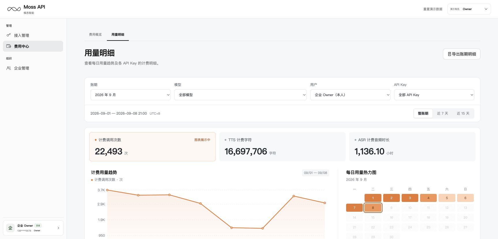
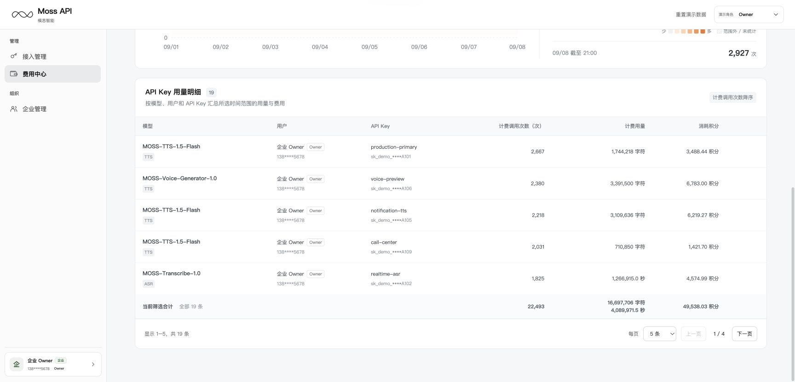

# 费用中心研发 PRD（MVP-P0）

同步基线：2026-09-09 [研发主 PRD](./PRD-管理和组织模块.md)与[飞书研发文档](https://acnc6zeentra.feishu.cn/wiki/GfJQwQLMFiabOOktdUNcaAxsnRd)。本文细化对应章节的研发要求，截图为线上演示快照；生产数据及权限以服务端为准。

对应主 PRD 7.4、7.5、7.8、7.10。适用前端、计量账务接口和测试；页面名称统一为费用概览、用量明细。

## 1. 页面与权限

| 页面 | 路由 / 实现文件 | 业务粒度 | 权限 |
|---|---|---|---|
| 费用概览 | [费用概览](https://moss-api-enterprise-console.vercel.app/?view=billing3) / `app/v3/billing3-mvp.tsx` | 模型 × 用户 | Owner / Admin |
| 用量明细 | [用量明细](https://moss-api-enterprise-console.vercel.app/?view=usage3) / `app/v3/usage3-mvp.tsx` | 模型 × 用户 × API Key | Owner / Admin 企业范围；Developer 本人范围 |

费用中心仅两个页签。Developer 侧栏进入用量明细，仅显示有权页签。原型固定提供2026年9月、8月，默认9月、本人、全部模型；生产默认当前账期，选项来自服务端。用量页默认全部 API Key、整账期。Owner/Admin 可主动选择全部或指定用户，Developer 用户范围固定本人。服务端必须再次校验企业、用户、模型和 Key 的可信归属；篡改 URL 不得扩大权限。

费用概览副标题：“查看账期积分消耗、费用估算及各用户用量。”
用量明细副标题：“查看每日用量趋势及各 API Key 的计费明细。”

## 2. 费用概览

页面依次为标题/打印按钮、当前企业积分余量及有效期、账期/模型/用户筛选、三项摘要、累计金额趋势、用户用量概览。

- 当前企业余额是独立权益快照，不随筛选变化；余额旁不重复显示数据截至时间或“不随筛选变化”。
- 摘要卡片从左到右固定为：折后金额估算 → 账期积分消耗 → 计费调用次数；窄屏单列时按相同顺序从上到下显示。先呈现成本，再呈现积分消耗与调用规模。累计金额按自然日绘制，与当前筛选范围一致。
- 金额保留“折后金额估算”完整标签及人民币符号，不表述为最终账单或实付金额；金额数值字重为 700，积分与调用次数数值字重为 500。此层级仅作用于费用概览摘要卡片。
- “用户用量概览”按所选账期的模型与用户汇总，合并其全部 Key，按消耗积分降序排列。
- 表格列序：模型 → 用户 → 计费调用次数（次） → 计费用量 → 消耗积分 → 折后金额估算 → 操作。
- 模型保留 TTS/ASR 类型；用户显示姓名、角色和脱敏手机号。ASR 用量为小时，两位小数；TTS 为字符。跨类型合计分别列出字符和小时，不混加。
- “查看明细”携带当前账期和行内模型/用户进入用量明细。查询参数为 `usagePeriod`、`usageModel`、`usageUser`，以稳定标识关联，刷新可恢复；目标 Key=全部、窗口=整账期、页码=1。普通页签导航清除下钻参数，切角色重验权限。

## 3. 用量明细

标题/导出按钮后直接进入筛选区，不展示企业余额或有效期。

- 筛选顺序：账期 → 模型 → 用户 → API Key；窗口为整账期 / 近 7 天 / 近 15 天。用户变化重置 Key；条件变化重置页码，重置筛选保留当前每页条数。窗口与所选账期及数据截至时间取交集。
- 筛选区集中展示实际起止时间与 UTC+8。当前原型截至 2026-09-08 21:00；生产使用服务端快照，禁止写死日期或伪装实时。
- 三类指标为计费调用次数、TTS 计费字符、ASR 计费音频时长；按模型类型显示适用指标，切换模型后原指标不适用时回落计费调用次数。ASR 卡片和图表按小时显示。
- 日趋势及热力图共用当前范围和选中指标。热力图点击只查看当天数据，不改变表格或导出范围。无覆盖与真实零用量分别表达。
- 表格按模型、用户和 API Key 汇总所选时间范围的用量与费用，按计费调用次数降序排列。
- 列序：模型 → 用户 → API Key → 计费调用次数（次） → 计费用量 → 消耗积分 → 折后金额估算。Key 显示名称及掩码，不展示内部标识或完整 secret；用户显示角色与脱敏手机号。
- TTS 为字符；ASR 表格与 CSV 使用秒，保留 0.1 秒精度。图表小时与明细秒数需可换算，不能用已舍入显示值重新计算费用。

## 4. 打印账期账单

入口仅在费用概览，使用描边文档图标按钮“打印账期账单”。预览和打印均按所选企业完整账期、全部用户与全部模型聚合，每个有计量的模型一行。页面模型、用户、分页不影响打印范围。

摘要：账期、计费模型数、计费调用次数、积分消耗、折后金额估算、企业有效换算率。
表格：计费模型 → 计费规则 → 计费调用次数 → 计费用量 → 消耗积分 → 折后金额估算。模型保留 TTS/ASR 类型，ASR 用音视频小时。用户与 Key 已合并，账单没有用户或 Key 列。

预览确认后调用浏览器打印，可由用户另存 PDF；不宣称生成服务端文件、发送给他人或完成结算。打印隐藏页面导航和操作按钮，保留账期、计费规则与估算语义。

### 4.1 按钮交互与验收

操作顺序：费用概览点击“打印账期账单” → 核对账单预览 → 再次点击“打印账期账单” → 浏览器打印对话框 → 用户选择打印或另存为 PDF。

| 步骤 / 场景 | 交互与数据规则 |
|---|---|
| 入口与权限 | 费用概览右上角显示“打印账期账单”，仅当前企业的 Owner、Admin 可使用；Developer 不提供企业账单入口，生产接口同时校验企业归属与权限。 |
| 点击页面按钮 | 在当前页打开“YYYY 年 MM 月账单预览”弹窗，不立即调用打印，也不直接下载 PDF。账期取页面当前所选月份。 |
| 账单范围 | 汇总当前企业所选完整账期的全部用户、全部 API Key 与全部有计量模型，按模型合并、消耗积分降序排列；忽略页面模型、用户筛选及分页。即使当前筛选列表为空，也不能据此禁用打印。当前月仅包含截至数据快照已产生的计量，不包含未来用量，也不代表账期已结算。 |
| 核对与关闭预览 | 预览显示企业名称、账期、摘要、各模型计费规则与费用及生成时间（UTC+8）。点击右上角关闭按钮或按 Esc 返回费用概览，保留原筛选和页码，不触发打印；焦点回到页面打印按钮。 |
| 点击预览内按钮 | 调用浏览器原生打印能力（window.print），打印内容为当前账单预览。隐藏控制台导航、页面内容、关闭与打印按钮，保留账单正文、企业名称、账期、规则、估算说明及生成时间。 |
| 打印或另存为 PDF | 在浏览器打印对话框选择打印机并打印，或选择“另存为 PDF”后保存。目标设备、文件名、保存位置、页面范围、纸张、方向、边距与缩放由浏览器和用户控制；页面不自动选择打印机、不自动保存文件。 |
| 取消与再次打印 | 取消浏览器打印对话框后仍停留在账单预览，可再次打印或关闭预览。浏览器打印对话框结束后不自动关闭账单预览，不改变账期筛选、成员权益或账务数据。 |
| 结果反馈 | 唤起或关闭打印对话框不能证明用户已打印或已保存 PDF；页面不显示“打印成功”“保存成功”或“账单已发送”。此操作不创建结算确认、发票或发送记录。 |
| 版式与分页 | 支持浏览器按纸张和缩放自然分页，不固定为 1 页或 2 页。截图中的 A4、横向和默认缩放是用户打印设置示例，不是页面强制默认值。验收需检查所有模型行与列完整、文字可读、不截断、不因隐藏页面占位产生多余空白页。 |

生产接入要求：账单预览使用所选企业账期的同一权威快照，计费规则及换算率取销售订单对应的运营配置，历史费用遵循生效规则版本；原型固定费率仅供参考。加载期间禁止重复提交及打印未就绪内容；请求失败提供重试，权限失效终止展示，真实零用量与加载失败分开表达。当前原型使用本地演示数据，未单独实现打印请求的加载、失败或整账期无数据专用处理，不能据此认定生产异常已验收。

打印专项验收：分别以 Owner、Admin 操作并验证 Developer 越权被拒；切换账期、指定模型/用户、翻页及筛选为空时核对整账期合计；验证预览关闭、Esc、浏览器取消后重试和另存 PDF；核对 PDF 全部行列、总额、规则、生成时间与预览一致，并检查多页及空白页。

## 5. 导出账期明细

入口仅在用量明细，按钮为“导出账期明细”，沿用白底描边圆角与文档图标。

- 导出所选完整授权账期的模型 × 用户 × API Key 聚合行，忽略页面临时模型、用户、Key、近 7/15 天及分页筛选。Owner/Admin 为企业授权范围；Developer 仅本人可查询范围。
- 禁用条件依据完整授权账期是否有数据，不因临时筛选为空而禁用。
- CSV 列序：账期、统计开始（UTC+8）、统计结束（UTC+8）、模型、用户、API Key 名称、API Key 脱敏值、计费调用次数（次）、计费用量、计费单位、消耗积分（积分）、折后金额估算（元）。
- 数值与单位分列；TTS 字符、ASR 秒。不适用类型不再拆成填零列。名称缺失显示占位，禁止用内部 Key ID 替代；无请求/链路/计量事件 ID。
- UTF-8 BOM，正确引用逗号/引号/换行，防止名称触发表格公式。文件名 `Moss-账期明细-YYYY-MM.csv`。
- 下载生成与下载时都校验授权。账期范围说明只放在导出操作所需的位置，不重复铺在页面底部。

## 6. 计费规则与数据一致性

| 模型 | 原型参考计费规则 |
|---|---|
| MOSS-TTS-1.5-Flash | 20 积分 / 万字符 |
| MOSS-TTSD-1.0 | 20 积分 / 万字符 |
| MOSS-Voice-Generator-1.0 | 20 积分 / 万字符 |
| MOSS-TTS-1.0-Pro | 20 积分 / 万字符 |
| MOSS-Transcribe-Diarize-Pro | 17 积分 / 音视频小时 |
| MOSS-Transcribe-1.0 | 13 积分 / 音视频小时 |

以上费率及 0.03 元/积分的换算率仅供原型参考。实际计费规则由模思运营人员根据销售订单在后台配置，包含适用企业与模型、价格、折扣、积分换算率、计费单位、进位规则及生效时间；控制台从服务端获取对应企业的生效规则，不直接使用原型固定费率。历史账单按计费发生时的规则版本核对，新配置不覆盖历史计费结果。`mvpBillingRules` 按模型 ID 配置，原型计量与打印规则共用配置，未知模型不套用其他价格。演示计算不代表已接通生产账务。

计费调用次数指纳入有效计费计量的逻辑调用去重次数，不等于请求尝试数、成功数或 MeterEvent 行数。失败、重试、流式部分输出、取消是否计费，由生效协议和服务端计量决定。用户/Key 归因使用稳定标识，不按名称合并。

原型每条计量先按整数积分分/金额分舍入，再汇总账本，所有卡片、图表、Key 摘要、两种页面粒度、CSV 和模型账单使用同一来源。不能以调用次数反算金额，也不能按已舍入的汇总用量重新计价。生产需提供价格/规则版本、单位、可信范围、账期快照和更正记录。

## 7. 视觉与状态

- 两页统一白色圆角面板、浅灰表头、橙色趋势、正常字重的右对齐数值。数值及表头保持单行，移除调用次数占比装饰条。
- 用户用量概览与API Key用量明细均移除固定最小表宽，自适应容器；容器760px及以下以带字段名的纵向记录展示，两表不出现横向滚动条。数值右对齐，内侧列左右内边距10px、表格左右外缘24px，与标题及分页对齐，窄屏外缘16px；费用操作列占10%、居中，与金额区分。
- 结果数、筛选全量合计与分页分工明确：默认每页 5 条，可选 5/10/20，末页用空行保持高度；合计不随页码变化。
- 图表 callout 使用白底、浅灰描边和圆角，日期与指标分层、金额两位小数，不被图表裁切。
- 统计起止范围与 UTC+8 在筛选区集中展示；计费规则在打印账单展示。页面使用精简说明，完整计量契约保留在本文。
- 保留加载、失败重试、无数据、未覆盖和权限失效反馈；不将加载失败显示为 0。

## 8. 验收与实现入口

1. 两页同账期同范围的调用、用量、积分、金额一致；用户汇总等于其 Key 汇总，模型账单等于企业完整账期汇总。
2. 查看明细传参及刷新恢复正确；伪造用户/模型/Key 不扩大权限。
3. 改变页码不改变合计；临时筛选不影响完整账期打印/导出，Developer 导出仍限本人。
4. 月初、历史月、近 7/15 天交集、无覆盖、空结果与全量导出可核验。
5. 六模型规则、字符/秒/小时换算、逐条舍入、CSV 掩码及公式安全正确。
6. 费用中心展示费用概览与用量明细两个页签；入口、角色权限、筛选和操作反馈保持一致。
7. 费用概览摘要顺序为折后金额估算、账期积分消耗、计费调用次数，桌面与窄屏阅读顺序一致；金额数值字重 700，其余两项 500，保留“估算”标签。筛选后各项数值仍对应原指标及同一统计范围。

实现：`billing3-mvp.tsx`、`usage3-mvp.tsx`、`mvp-policy.ts`、`mvp-fixtures.ts`、`page-navigation.ts`。`usage8-data.ts` / `usage8.css` 为现行页面共享数据和样式基础。

回归：`node scripts/verify-mvp.mjs`、`node scripts/verify-usage8.mjs`、`node scripts/verify-v3.mjs`，另做浏览器核对、TypeScript 和生产构建。前端验证不代表真实账号、账务与生产权限已接通。

P0统一列表规格：共用Pagination，计数“显示 X–Y，共 N 条”，文字上一页/下一页，空态0–0与1/1。列表正文和分页11px、辅助10px、区标题15px、筛选12px高38px；行内操作无下划线，焦点为#596168。

## 9. 服务端数据与异常契约

账期为 Asia/Shanghai 自然月；近7/15天包含数据截至日，与所选账期求交集。无交集保持空态和返回整账期入口，不扩大范围。本人可查询模型包括当前允许模型及历史授权期间已有计量的模型；历史查询资格不恢复调用授权。

查询返回可信企业/用户范围、账期和快照标识、数据截至时间、模型/用户/Key稳定标识、聚合行、单位、规则版本、筛选全量合计和分页总数。余额独立返回单位及有效期。接口名称、字段名和错误码在研发评审统一。

查询或下载权限失效时终止旧上下文；网络失败提供重试，不能显示为零用量。导出生成与文件获取均重新鉴权，CSV容量、生成方式和超时策略在联调前确定。价格更正保留原规则及更正记录，同一快照的页面、趋势、CSV、账单和账本可核对。

验收对应主 PRD AC-09–13，覆盖下钻刷新、历史月交集、当前筛选为空但整账期可导出、Developer越权请求拒绝、公式前缀名称安全和同快照合计一致。

## 10. 线上截图与流程

流程源码：[账务查询、打印和导出](./diagrams/04-billing-flow.mmd)，渲染图见主 PRD 7.5。截图日期2026-09-09，数值为演示快照。

