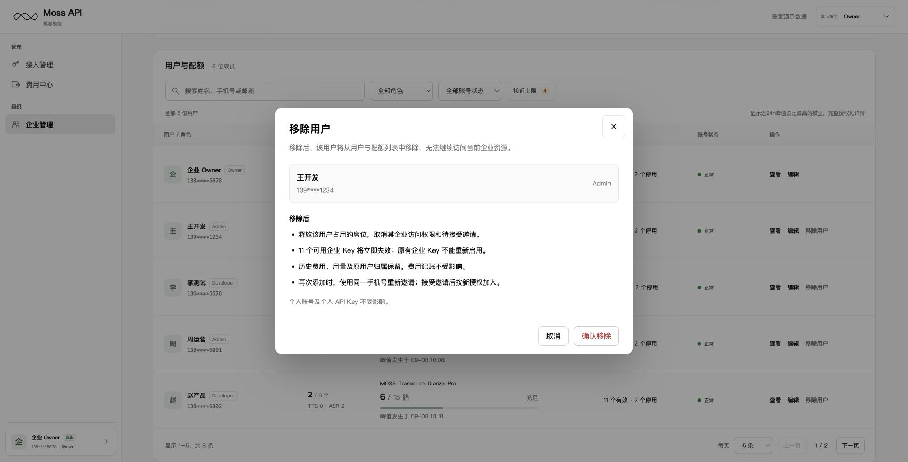

# 企业管理正式页面实现说明（MVP-P0）

同步基线：2026-09-09 [研发主 PRD](./PRD-管理和组织模块.md)与[飞书研发文档](https://acnc6zeentra.feishu.cn/wiki/GfJQwQLMFiabOOktdUNcaAxsnRd)。本文细化对应章节的研发要求，截图为线上演示快照；生产数据及权限以服务端为准。

对应主 PRD 7.6；代码路径相对于仓库根目录。

| 页面 | 路由 | 组件 |
|---|---|---|
| 企业与用户 | [线上页面](https://moss-api-enterprise-console.vercel.app/?view=enterprise) | app/v3/enterprise-mvp.tsx |

企业管理仅提供企业与用户页签；仅正常企业成员中的Owner/Admin可访问，Developer直接访问时回到API密钥。角色名不授予企业成员资格。

## 企业与用户

资源摘要为企业积分余量、已开通模型、可邀请席位；不显示只读角标。总席位50，正常和待接受占用，已加入数量始终显示；待接受为0时只隐藏待接受占位数和分隔点。模型资源两列；近24h峰值/当前企业并发上限由mvp-capacity提供，80%接近、100%已达。

主列表仅可见成员，搜索/角色/状态/接近上限交集，标题总数稳定、结果数独立。共享Pagination默认5、5/10/20，重置后搜索框聚焦。

邀请/编辑采用单页手机号、角色、模型授权和可选上限。邀请/编辑统一使用两列模型卡：首行“模型名 · 企业并发上限 X 路”，次行“成员上限”输入和单位“路”。勾选后默认留空，提示“不限制”；取消勾选清空并禁用，保存为未授权。邀请至少选择一个模型，编辑可取消全部。填写时只允许1至企业上限的整数，无变化禁用保存。超限仅使企业上限文字与输入边框同色标红，不新增错误行或改变卡片高度；不显示“选填”“最多N路”或顶部解释文案。 详情内Key展示全部掩码记录，从详情编辑取消回列表；移除撤销企业访问和Key，保留个人数据及历史账本。

## 共同实现与边界

四页通过mvp-storage.ts共用moss-api-shared-enterprise-demo-v2。首次迁移合并原正式页与选定共享页数据，同记录以选定共享页配置为准，保留原页独有成员、邀请和Key，永久失效Key不恢复。显式成员上限保留，缺失Owner配置初始化为null；重置确认后清除新键和两旧键，避免旧数据重新导入。生产仍须服务端鉴权、幂等及真实数据接入。 member-lifecycle负责权限、席位、模型上限和成员版本校验。ModalSurface统一焦点与背景隔离。

生产邀请投递/接受、网关撤权、角色鉴权与必要业务记录尚需后端接入。后台业务记录须保留。

## 联动与验收

企业Owner由模思运营人员根据销售订单在后台配置，成员邀请不提供Owner角色。Owner负责企业成员的模型授权和并发配置，Admin保留对Developer的配置权限；当前线上原型通过演示成员模拟后台已配置关系，真实后台配置流程须联调验收。

Owner管理Admin/Developer，Admin只管理Developer；不能修改本人角色或管理其他Owner；Owner可勾选本人模型配额并配置不小于1的整数，取消勾选即不分配。正常、待接受可编辑；正常、待接受、已过期可按角色规则移除。邀请先生成待接受记录，真实接受及到期转换由账号服务实现。

接近上限N按全部正常成员中任一授权模型达到80%及以上去重，不受其他筛选影响；点击后与条件取交集。代表模型按本人已授权模型峰值/当前上限的最高比例选择，未知值不计预警。

对应主 PRD AC-05–08、AC-13–15；重邀必须拒绝旧关系请求并保持旧Key永久失效，生产需要原子成员/Key撤权证据。截图与完整流程见[资源治理PRD](./PRD-企业账号与资源治理.md)，源码见[成员生命周期](./diagrams/03-member-lifecycle.mmd)。

## 并发额度分配与Owner本人编辑（2026-09-10）

user-policy-dialog.tsx是唯一邀请/编辑表单，enterprise-mvp.tsx是唯一企业与用户页面；原预留分配组件已删除。邀请/编辑统一使用两列模型卡：首行“模型名 · 企业并发上限 X 路”，次行“成员上限”输入和单位“路”。勾选后默认留空，提示“不限制”；取消勾选清空并禁用，保存为未授权。邀请至少选择一个模型，编辑可取消全部。填写时只允许1至企业上限的整数，无变化禁用保存。超限仅使企业上限文字与输入边框同色标红，不新增错误行或改变卡片高度；不显示“选填”“最多N路”或顶部解释文案。 member-lifecycle.ts以policyVersion拒绝旧表单。

Owner首次默认授权全部企业模型，成员上限为null，继承企业上限；本人可编辑授权和可选上限，显式值保留，手机号及角色只读，不能移除本人。Admin仅管理Developer，不能编辑本人或Owner。列表、详情及API密钥资源区统一展示峰值/生效上限；Owner默认两模型68/80、50/60接近上限，无专属继承说明。 生产原子并发计数和在途终止策略需接入，见Q-06。
