> 旧企业多角色方案归档：2026-09-14 起，当前工作区以 [Platform 企业端 PRD](platform/PRD-platform企业端.md) 为准。本文件的邀请、成员和多角色规则不适用于新版。

# Moss 企业控制台研发 PRD（MVP-P0）

版本：MVP-P0 研发评审稿，2026-09-11。本文是业务需求与验收基线；页面入口见3.1，原型与交付要求的差异见3.2，功能排期建议见8.2，待确认细节仅保留文末Q-04、Q-05。

原型：[Moss 企业控制台](https://moss-api-enterprise-console.vercel.app/?view=keys)。[飞书研发PRD](https://acnc6zeentra.feishu.cn/wiki/GfJQwQLMFiabOOktdUNcaAxsnRd)与本文同步，研发可直接阅读飞书完成需求评审；本地系统、交互、设计及实现说明按开发需要查阅。

## 1. 概要

企业 Owner 为成员配置模型授权和并发上限，成员管理本人企业 API Key。Owner 由模思运营人员根据销售订单在后台配置；Admin 保留对 Developer 的模型授权和并发配置权限。企业与成员按各自权限核对计费用量。企业工作区由 API 密钥、费用概览、用量明细、企业与用户四个页面组成；个人身份进入 C 端个人页。

截图说明布局与交互，金额、人数、日期和容量为演示数据；生产规则以正文为准。

## 2. 协作分工

| 职责 | 负责内容 | 交付物 |
|---|---|---|
| 产品 | 页面范围、规则、异常口径 | 本 PRD、验收场景、待确认项结论 |
| 前端 | 页面、表单、筛选、图表、打印与导出 | 与在线原型一致的交互及接口消费逻辑 |
| 账号与成员服务 | 身份、企业关系、角色、邀请与移除 | 权威成员状态、鉴权与访问撤销 |
| 凭证与资源服务 | Key、模型授权、并发限制和峰值 | Key 生命周期、调用校验、资源快照 |
| 计量与账务 | 账期、计费调用、计费用量、积分与金额 | 可核对的聚合、规则版本及独立余额 |
| 测试与模思运营 | 联调验收；根据销售订单在后台配置企业Owner，办理企业开通与信息变更 | 测试证据、销售订单对应的Owner配置记录、企业开通和信息变更流程 |

实际负责人、接口评审参与人和联调时间在研发启动时补齐。

## 3. 背景与交付范围

B 端 ASR/TTS 服务面向多个企业租户，共享底层推理资源。当前 MaaS 层主要受硬件容量和模型服务整体承载能力约束，尚缺少按企业、按模型执行的并发额度控制。单个企业的突发流量可能占用过多资源，引发其他企业请求排队、响应变慢或超时，影响服务稳定性，也使销售订单中的并发权益难以落实到实际调用。

通常需要在请求进入推理服务前，按企业、按模型控制并发，对达到企业或成员并发上限后的新请求直接拒绝并返回明确错误，不排队，由调用方稍后重试，同时保留服务整体容量保护。本项目据此建立“订单配置企业模型与并发权益—Owner 配置成员授权与并发上限—成员通过本人 API Key 调用—查看并发峰值与用量”的交付流程。企业主体和资源由模思运营开通，企业 Owner 由模思运营人员根据销售订单在后台配置。Admin 保留对 Developer 的配置权限；同一成员的多个 Key 共享成员限额，企业内所有成员共同受企业限额约束。

### 3.1 页面地图与线上入口

| 分组 / 模块 | 页面及线上入口 | 正常企业成员权限 | 主要任务 |
|---|---|---|---|
| 管理 / 接入管理 | [API 密钥](https://moss-api-enterprise-console.vercel.app/?view=keys) | Owner、Admin、Developer | 本人模型资源、Key 创建及启停 |
| 管理 / 费用中心 | [费用概览](https://moss-api-enterprise-console.vercel.app/?view=billing3) | Owner、Admin | 按模型与用户核对费用、打印账期账单 |
| 管理 / 费用中心 | [用量明细](https://moss-api-enterprise-console.vercel.app/?view=usage3) | Owner、Admin、Developer | 按模型、用户、Key 查看趋势和明细，导出账期明细 |
| 组织 / 企业管理 | [企业与用户](https://moss-api-enterprise-console.vercel.app/?view=enterprise) | Owner、Admin | 企业资源池、成员邀请、授权、并发和移除 |

默认进入 API 密钥。接入管理和企业管理各有一个页签；费用中心有两个页签。Developer 进入费用中心时直接打开本人用量明细。侧栏、页签、页面标题和浏览器标题保持一致，服务端独立验证访问权限。

### 3.2 原型与生产的责任边界

下表区分当前原型能力与必须交付的要求。原型使用浏览器演示状态，生产鉴权、数据和状态变更以服务端为准。

| 能力 | 当前页面 / 原型 | 研发交付要求 |
|---|---|---|
| 身份与Key | 支持演示角色、身份切换和本地Key创建/启停 | 接入真实登录、成员关系、Key签发与网关撤权；前端角色和URL不授予权限 |
| 邀请与席位 | 表单校验并创建待接受记录；未接入真实短信、接受或过期计时 | 完成24小时有效期、Mossland登录与自动接受、到期释放席位，详见7.6.3–7.6.4 |
| 共享并发 | 支持模型授权、可空成员上限和峰值展示；未接入真实请求计数 | 按企业/成员/模型原子计数，超限直接拒绝且不排队，已接纳请求允许完成，详见7.7.1 |
| 账期与计费 | 固定2026年9月/8月，数据截至2026-09-08 21:00；费率、积分及金额为Mock | 支持当前月及此前11个月；接入销售订单对应的计费配置与可信账本，详见7.8 |
| 打印、导出及异常 | 本地账单预览、浏览器打印与CSV已实现；真实服务加载/失败/权限失效待接入 | 生成与获取均鉴权，保持完整授权账期与同快照一致，区分真实零、未覆盖及失败 |
| 空态重置 | 四张主列表筛选无结果时均有空态重置入口；API密钥重置后恢复搜索焦点 | 保持默认条件、第一页、原每页条数及搜索焦点规则一致 |

## 4. 目标与验收结果

| 目标 | 验证阶段 | 通过标准 |
|---|---|---|
| 完成授权和调用准备 | 首轮联调结束前 | 三角色在授权范围内完成成员配置、本人 Key 创建及启停 |
| 费用能够核对 | 首个完整试运行账期 | 同一快照下，页面、CSV、模型账单与账本没有未解释差异 |
| 企业与个人隔离 | 首次上线前 | 切换后不残留上一身份数据；篡改企业、用户和Key参数不能越权 |
| 状态变更及时生效 | 首次上线前 | Key停用和成员移除后，后续新调用按新状态拒绝；历史记账保留 |
| 页面与交互一致 | 原型验收时 | 四页导航、默认筛选、分页、状态、确认、键盘与窄屏行为通过核对 |

## 5. 使用者与任务

| 使用者 | 主要任务 | 授权范围 |
|---|---|---|
| 企业 Owner | 为成员配置模型授权和并发上限，管理企业成员、资源和费用 | 由模思运营人员根据销售订单在后台配置；可管理Admin、Developer，可编辑本人模型授权与并发上限；本人Key由本人管理 |
| Admin | 为Developer配置模型授权和并发上限，管理Developer，核对企业费用与用量 | 不能管理Owner或其他Admin；本人Key由本人管理 |
| Developer | 创建本人 Key、调用授权模型、核对本人用量 | 查询和导出固定在本人允许范围 |
| 个人身份用户 | 使用个人 API 服务 | 进入个人页，服务链接在现有 C 端新窗口打开 |
| 模思运营与支持 | 根据销售订单在后台配置企业Owner，办理企业开通、信息变更与排障 | 通过运营后台和既有业务流程维护权威主体、Owner关系与资源信息 |

## 6. 用户价值

企业Owner能够在一个页面完成成员邀请、模型授权和并发配置，看到企业及成员的容量使用情况；Admin在权限范围内继续管理Developer。开发者能够清楚判断本人有哪些可用模型、哪些 Key 生效，并按本人 Key 核对用量。企业费用按用户归集，调用用量按 Key 归集，打印和导出的范围清晰，减少人工对账和权限误配。

## 7. 需求、流程与研发契约

### 7.1 身份与权限

企业Owner由模思运营人员根据销售订单在后台配置，控制台读取该成员关系。邀请只提供操作者有权配置的Admin/Developer角色，不能通过邀请或演示角色选择获得Owner身份。各角色操作范围以本节权限表为准。

下图的销售订单与运营配置为企业开通前置流程，日常访问从“进入控制台”开始；需要切换为企业身份时，点击左下角用户信息卡片，在“切换身份”中选择“企业”。

Admin的企业资格按实际成员关系判断。当前演示Admin是正常企业成员，可访问企业四页并配置Developer；不能配置本人、Owner或其他Admin。

企业访问资格按实际的正常企业成员关系判断，页面和操作权限按该关系中的角色加载。有正常企业成员关系的用户，通过左下角用户信息卡片中的“切换身份”选择“企业”或“个人”；切换为个人身份不改变企业成员关系。没有企业账号时仅显示个人身份信息与 C 端个人页，不提供身份切换。右上角演示角色切换始终保留，包括个人身份下。

身份或角色切换时清空搜索、筛选、页码、未提交草稿、弹窗、旧请求结果和下载上下文。生产端通过可信登录主体与企业关系鉴权，不能信任 URL、角色下拉、姓名、手机号掩码或前端提交的用户标识。演示角色与身份通过地址参数恢复；生产会话和缓存隔离由账号服务实现。

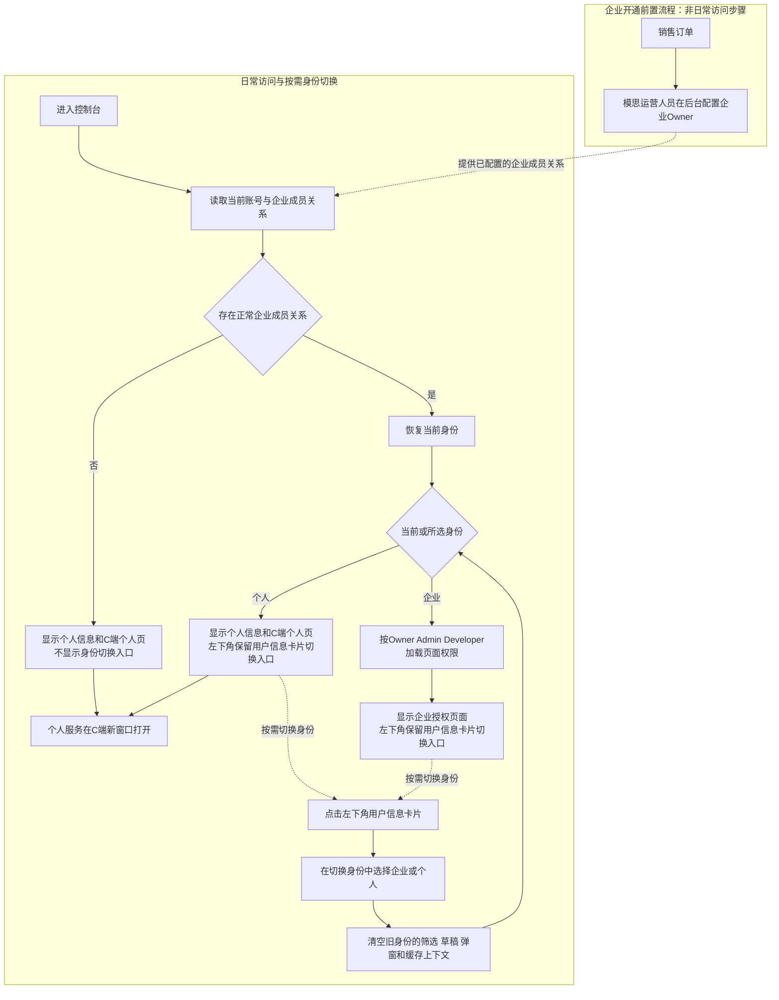

| 能力 | Owner | Admin | Developer |
|---|---|---|---|
| 管理本人企业 Key | 是 | 是 | 是 |
| 查看成员详情及其 Key 掩码 | 企业范围只读 | 企业范围只读 | 否 |
| 操作他人 Key | 否 | 否 | 否 |
| 费用概览、打印企业账期 | 是 | 是 | 否 |
| 用量查询与导出 | 默认本人，可查询企业授权范围 | 默认本人，可查询企业授权范围 | 固定本人允许范围 |
| 企业与用户 | 是 | 是 | 否 |
| 邀请、编辑、移除用户 | Admin / Developer | Developer | 否 |
| 修改本人模型授权与并发上限 | 是 | 否 | 否 |
| 修改本人角色、移除本人或管理其他 Owner | 否 | 否 | 否 |

### 7.2 共用 UI 与交互

| 项目 | 统一规则 | 验收点 |
|---|---|---|
| 页面结构 | 标题和主操作在上，筛选、结果、分页按阅读顺序排列 | 主操作和侧栏定位在四页保持一致 |
| 主列表分页 | API Key、用户、费用、用量四张主列表默认5条，可选5/10/20 | 显示起止和总数；空结果为0–0、1/1；首页与末页按钮禁用 |
| 条件变更 | 搜索、筛选、每页条数变化回第一页；数据变化后校正页码 | 不出现空的越界页；合计取筛选全量，不取当前页 |
| 重置筛选 | 条件偏离默认值时显示，恢复默认条件和第一页，保留当前每页条数；筛选为空时也提供空态重置入口 | API Key和用户搜索重置后恢复搜索框焦点；图表指标与模型展开不属于筛选重置范围 |
| 模型展开 | 默认收起，整行及Enter/Space可操作，右侧加减号表示状态 | 展示全部授权模型，展开前后保留接近/已达上限提示 |
| 业务弹窗 | 创建、邀请、编辑、详情、启停与移除使用模态层；关闭/Escape退出，焦点限制在层内并在关闭后恢复 | 无效表单禁用提交，失败保留输入；危险确认默认聚焦取消。身份菜单与顶栏重置确认为非模态展开层 |
| 页签与焦点 | 方向键、Home/End导航；选中页签进入Tab序列 | 聚焦可见，行内操作使用统一中性焦点 |
| 状态反馈 | 原型已有账号/演示数据加载、空结果和窗口无交集；生产补齐网络失败、权限失效和覆盖状态 | 生产失败不提示成功，重复提交期间禁用动作，未知不按真实0处理；生产接入边界见3.2 |
| 响应式 | 摘要按原顺序折为单列；两张费用/用量汇总表窄屏转为纵向记录，其余宽表在容器内横向滚动 | 窄屏主操作、筛选、确认与分页可达 |
| 视觉 | 白色圆角面板、浅灰表头、右对齐数字、橙色趋势 | 停用Key为中性弱化，启用操作保持可见；状态同时使用文字与颜色 |

企业身份下，“重置演示数据”位于右上角演示角色选择左侧。点击展开行内确认；取消或焦点位于该区域时按Escape保持数据不变，确认后清除演示存储并刷新，恢复初始成员和Key。个人身份下隐藏重置入口，仍显示演示角色选择。两处资源摘要采用统一的标题、摘要数据及模型展开入口。

### 7.3 API 密钥

线上入口：[API 密钥](https://moss-api-enterprise-console.vercel.app/?view=keys)。副标题：“查看本人的模型授权与用量，并管理本人创建的 API Key。”

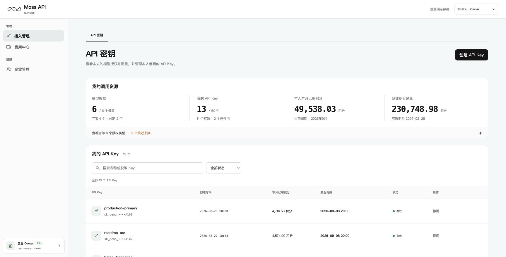

#### 7.3.1 我的调用资源

摘要从左到右固定为：模型授权、我的 API Key、本人本月已用积分、企业积分余量。模型显示已授权数/企业模型总数及TTS/ASR数量；Key显示本人关系下总数/50、有效及已停用数量。点击已停用数量应用列表状态筛选。

Key额度包含普通停用记录，因成员移除而永久失效的历史Key不占额度。本人积分来自当前账期本人计量；企业余量及有效期来自独立权益快照，不能以企业余额减去本人消耗推算。空结果显示“没有匹配的 API Key”、调整提示及“重置筛选”按钮；点击恢复默认条件和第一页，保留每页条数并聚焦搜索框，详见7.2。

“查看全部 N 个授权模型”默认收起，展示当前本人获授模型。展开后三列为模型、近24h并发峰值/本人并发上限、本月已用积分。入口保留橙色接近上限数、红色已达上限数，0项连同分隔点隐藏；详见7.7。

#### 7.3.2 列表和操作

| 内容 / 动作 | 输入或触发 | 结果与校验 |
|---|---|---|
| 列表字段 | API Key名称及掩码、创建时间、本月已用积分、最近调用、状态、操作 | 只查询本人企业Key；最近调用为空显示尚未调用 |
| 搜索与筛选 | 名称或脱敏Key关键词；全部状态、有效、已停用 | 与分页共用规则一致；无结果显示空态 |
| 创建 | 页头保留创建按钮；名称去首尾空格后1–50字，显示字符计数，模型授权只读继承 | 成员正常、至少一个模型授权、Key数少于50；不满足时按钮禁用并提示原因，成功创建有效Key |
| 创建成功 | 展示一次完整secret，允许复制并提示保存 | 关闭或刷新后不可再次取回；关闭不回滚创建；复制失败保留弹窗并提示 |
| 停用 | 本人对有效Key确认停用 | 重新校验所有权和当前状态；成功后新调用拒绝，历史用量保留 |
| 启用 | 本人对普通停用Key确认启用 | 重新检查成员正常、模型授权和资源条件；永久失效Key不可启用 |
| 操作冲突 | Key状态已变化、被移除或无权操作 | 保持原状态，给出错误和刷新指引，不显示成功 |

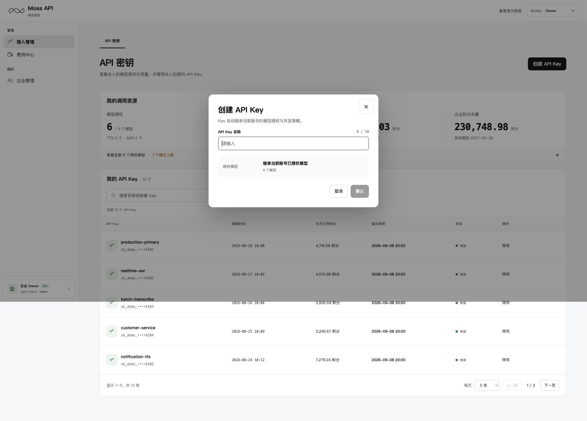

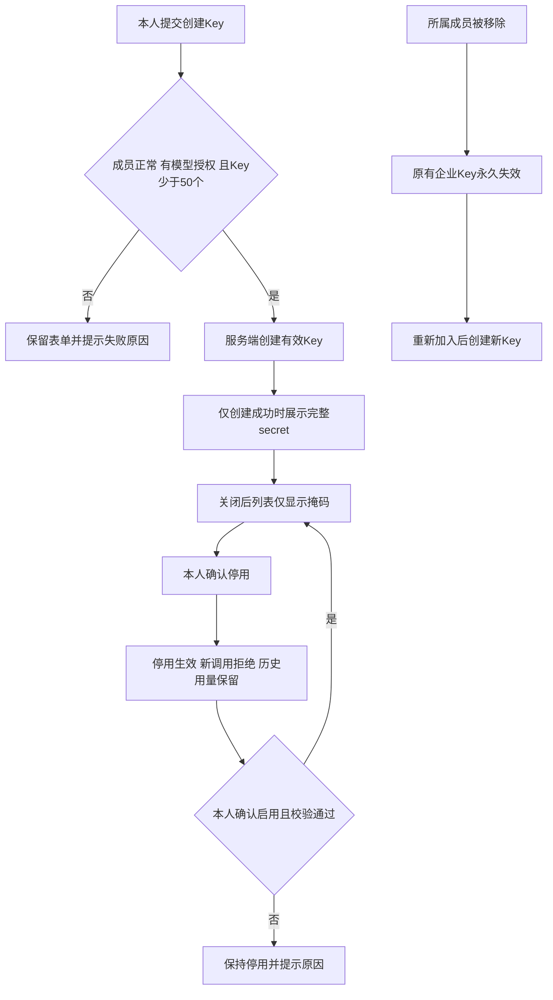

生产secret不进入列表、埋点、日志或持久缓存。原型生成的sk_demo_仅用于演示。必要业务事件记录主体、对象、动作和结果；复制事件只能表示客户端报告的复制结果，不包含secret。

### 7.4 费用概览与账单打印

线上入口：[费用概览](https://moss-api-enterprise-console.vercel.app/?view=billing3)。副标题：“查看账期积分消耗、费用估算及各用户用量。”

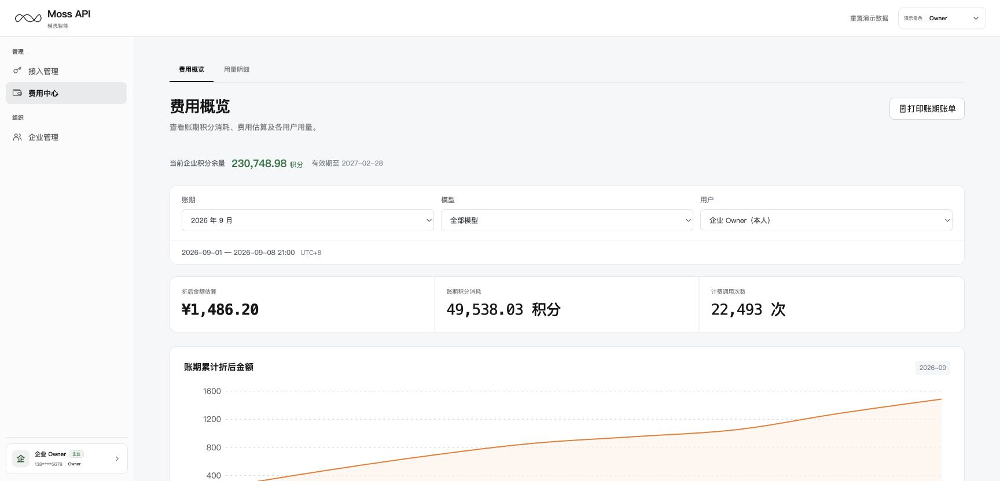

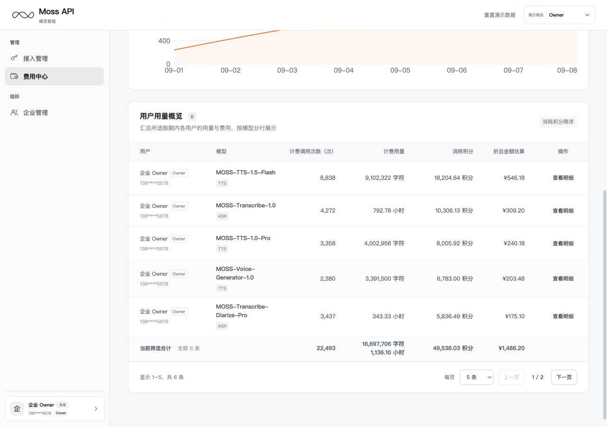

| 区域 | 默认与字段 | 行为 |
|---|---|---|
| 企业余额 | 当前企业积分余量、有效期 | 独立快照，不随临时筛选变化 |
| 筛选 | 当前自然月、全部模型、本人；Owner/Admin可选全部或指定用户 | 改变筛选后更新摘要、趋势、表格，页码归1；账期由服务端提供，范围见7.8 |
| 摘要 | 折后金额估算、账期积分消耗、计费调用次数 | 顺序固定，窄屏一致；金额字重700，其余数值500；金额保留估算语义 |
| 趋势 | 当前范围的账期累计折后金额，按自然日 | 与筛选和快照一致，悬浮信息为日期及金额 |
| 用户用量概览 | 用户、模型、计费调用次数、计费用量、消耗积分、折后金额估算、操作 | 每行一个用户×模型，合并该用户在该模型下的Key；消耗积分降序 |
| 查看明细 | 行内模型与用户、当前账期 | 进入用量明细，传usagePeriod/usageModel/usageUser；Key重置全部，窗口整账期，页码1 |
| 打印账期账单 | 所选完整企业账期、全部模型及用户 | 忽略页面临时模型、用户、分页；先预览，再调用浏览器打印 |

表名保留“用户用量概览”，用户为首列。副说明：“汇总所选账期内各用户的用量与费用，按模型分行展示”。同一用户使用不同模型时分行展示。桌面列序与列宽依次为：用户18%、模型16%、计费调用次数12%、计费用量15%、消耗积分15%、折后金额估算13%、操作11%。

模型显示TTS/ASR，用户显示姓名、角色和脱敏手机号。TTS计费用量为字符；ASR在费用表和模型账单中为小时，显示两位小数。跨类型分别合计，数值右对齐。

普通页签导航清除下钻参数；刷新可恢复明细下钻的账期、模型和可信用户，角色变化后重新鉴权。费用表数值右对齐、操作居中，窄屏保留全部字段、查看明细、合计和分页。

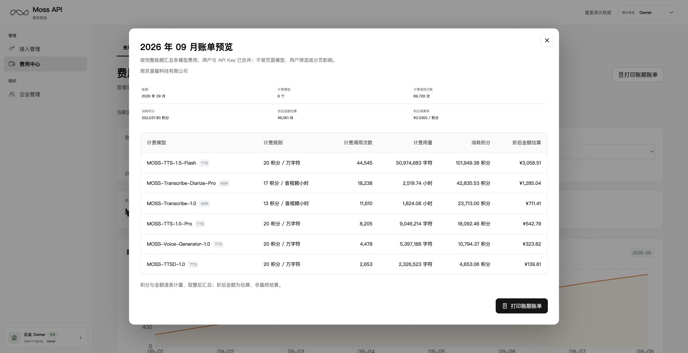

账单摘要为账期、计费模型数、计费调用次数、消耗积分、折后金额估算及换算率。表格每模型一行，列为计费模型、计费规则、计费调用次数、计费用量、消耗积分、折后金额估算；包含企业名称和生成时间。

#### 7.4.1 打印账期账单按钮逻辑

操作顺序：费用概览点击“打印账期账单” → 核对账单预览 → 再次点击“打印账期账单” → 浏览器打印对话框 → 用户选择打印或另存为 PDF。

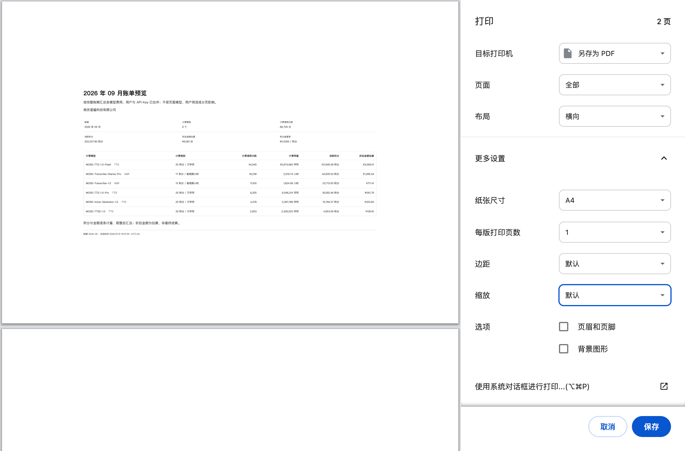

| 步骤 / 场景 | 交互与数据规则 |
|---|---|
| 入口与权限 | 费用概览右上角显示“打印账期账单”，仅当前企业的 Owner、Admin 可使用；Developer 不提供企业账单入口，生产接口同时校验企业归属与权限。 |
| 点击页面按钮 | 在当前页打开“YYYY 年 MM 月账单预览”弹窗，不立即调用打印，也不直接下载 PDF。账期取页面当前所选月份。 |
| 账单范围 | 汇总当前企业所选完整账期的全部用户、全部 API Key 与全部有计量模型，按模型合并、消耗积分降序排列；忽略页面模型、用户筛选及分页。即使当前筛选列表为空，也不能据此禁用打印。当前月仅包含截至数据快照已产生的计量，不包含未来用量，也不代表账期已结算。 |
| 核对与关闭预览 | 预览显示企业名称、账期、摘要、各模型计费规则与费用及生成时间（UTC+8）。点击右上角关闭按钮或按 Esc 返回费用概览，保留原筛选和页码，不触发打印；焦点回到页面打印按钮。 |
| 点击预览内按钮 | 调用浏览器原生打印能力（window.print），打印内容为当前账单预览。隐藏控制台导航、页面内容、关闭与打印按钮，保留账单正文、企业名称、账期、规则、估算说明及生成时间。 |
| 打印或另存为 PDF | 在浏览器打印对话框选择打印机并打印，或选择“另存为 PDF”后保存。目标设备、文件名、保存位置、页面范围、纸张、方向、边距与缩放由浏览器和用户控制；页面不自动选择打印机、不自动保存文件。 |
| 取消与再次打印 | 取消浏览器打印对话框后仍停留在账单预览，可再次打印或关闭预览。浏览器打印对话框结束后不自动关闭账单预览，不改变账期筛选、成员权益或账务数据。 |
| 结果反馈 | 唤起或关闭打印对话框不能证明用户已打印或已保存 PDF；页面不显示“打印成功”“保存成功”或“账单已发送”。此操作不创建结算确认、发票或发送记录。 |
| 版式与分页 | 支持浏览器按纸张和缩放自然分页，不固定为 1 页或 2 页。截图中的 A4、横向和默认缩放是用户打印设置示例，不是页面强制默认值。验收需检查所有模型行与列完整、文字可读、不截断、不因隐藏页面占位产生多余空白页。 |

账单预览使用当前企业所选账期的同一权威快照，规则版本与换算率遵循7.8。加载期间禁用打印未就绪内容，失败可重试，权限失效终止展示；整账期真实零用量与请求失败分别表达。

打印专项验收：分别以 Owner、Admin 操作并验证 Developer 越权被拒；切换账期、指定模型/用户、翻页及筛选为空时核对整账期合计；验证预览关闭、Esc、浏览器取消后重试和另存 PDF；核对 PDF 全部行列、总额、规则、生成时间与预览一致，并检查多页及空白页。

### 7.5 用量明细与CSV导出

线上入口：[用量明细](https://moss-api-enterprise-console.vercel.app/?view=usage3)。副标题：“查看每日用量趋势及各 API Key 的计费明细。”

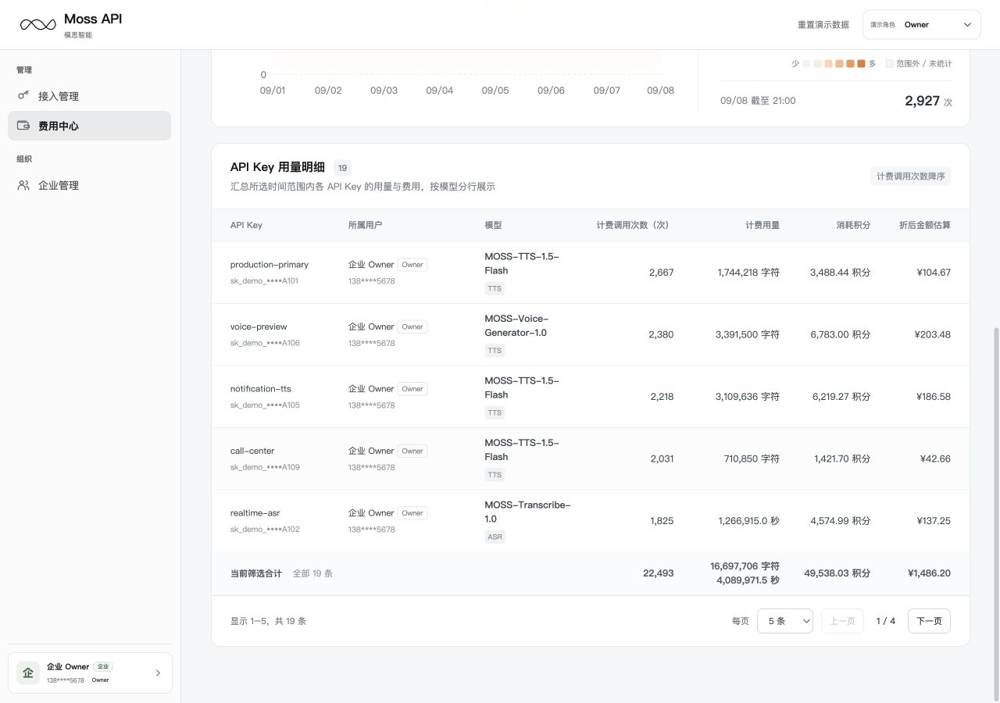

表名保留“API Key 用量明细”，API Key为首列，随后为所属用户、模型。副说明：“汇总所选时间范围内各 API Key 的用量与费用，按模型分行展示”。同一Key调用不同模型时分行展示。桌面列序与列宽依次为：API Key 17%、所属用户18%、模型14%、计费调用次数13%、计费用量14%、消耗积分12%、折后金额估算12%。保留完整七列，表头可换行、数值右对齐；窄屏字段顺序与桌面一致。

两表首列对应表格主体，不随筛选条件动态换列。筛选器继续按账期、模型、用户、API Key（仅明细页）排列，统计口径、默认行排序、下钻及CSV列序保持不变。桌面统一使用上述列宽比例，不再用宽屏断点覆盖；模型名允许换行，避免模型列集中留白。两张账务表按7.2统一响应式规则展示。

| 区域 | 默认与字段 | 行为 |
|---|---|---|
| 筛选 | 当前账期、全部模型、本人、全部API Key、整账期 | Owner/Admin可选企业用户，Developer固定本人；用户变化清空原Key |
| 时间窗口 | 整账期、近7天、近15天 | 与账期及数据截至时间取交集；集中展示实际起止范围与UTC+8 |
| 指标卡 | 计费调用次数、TTS计费字符、ASR计费音频时长 | 按模型类型显示适用指标；切换模型后若原指标不适用，回落计费调用次数 |
| 日趋势与热力图 | 同一筛选范围与当前指标 | 点击日历仅查看当天数值，不改变明细表或导出范围 |
| API Key 用量明细 | API Key、所属用户、模型、计费调用次数、计费用量、消耗积分、折后金额估算 | 每行一个用户×API Key×模型，同一Key调用不同模型时分行；计费调用次数降序，合计为筛选全量 |
| 导出账期明细 | 所选完整授权账期 | 忽略临时模型/用户/Key、7/15天窗口及分页；Owner/Admin企业授权范围，Developer本人允许范围 |

账期采用Asia/Shanghai自然月，可查询范围见7.8。近7/15天包含数据截至日，再与所选账期求交集。月初不足天数显示实际范围；历史月无交集时指标显示“—”，提供“查看该账期全部用量”，表格为空、分页0–0和1/1；导出仍按完整授权账期判断。生产使用权威快照日期，原型日期见3.2。

用量表和CSV中ASR使用秒，保留0.1秒；指标卡、趋势图使用小时。TTS统一字符。单位可换算，但不能用已舍入的展示数值重新计价。用量表按容器自适应，Key仅显示名称和掩码。

导出是否可用依据完整授权账期有无数据，不因临时筛选为空而禁用。CSV为UTF-8 BOM，正确转义逗号、引号和换行，防止用户名称成为表格公式。文件名为Moss-账期明细-YYYY-MM.csv。

CSV固定列序：账期、统计开始（UTC+8）、统计结束（UTC+8）、模型、用户、API Key名称、API Key脱敏值、计费调用次数（次）、计费用量、计费单位、消耗积分（积分）、折后金额估算（元）。内部请求、链路、计量事件和Key标识不进入客户导出，缺失名称使用占位。

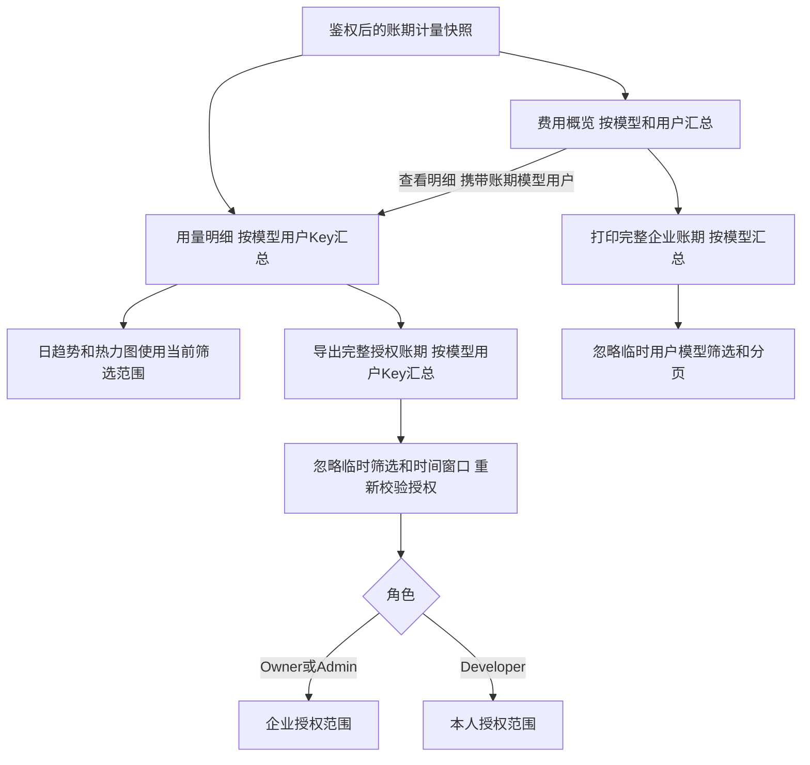

### 7.6 企业与用户

线上入口：[企业与用户](https://moss-api-enterprise-console.vercel.app/?view=enterprise)。副标题：“管理企业成员、模型授权与并发上限。”

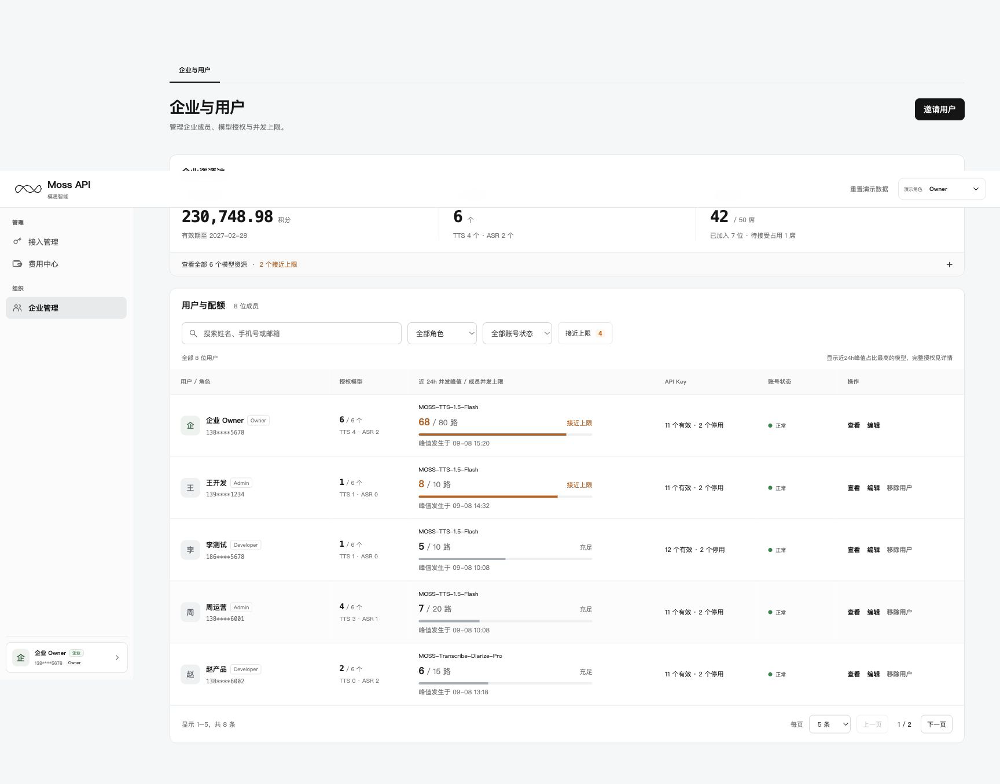

#### 7.6.1 企业资源池与用户列表

资源池摘要依次为企业积分余量、已开通模型、可邀请席位。模型区默认收起，展开后两列：已开通模型、近24h并发峰值/企业并发上限。成员按模型共享企业并发池，成员上限不预留容量；计算、默认值与生效规则见7.7。

总席位50，可邀请席位=max(0,50−正常成员−待接受邀请)。已移除和已过期不占位。辅助文案固定显示已加入数量，仅待接受大于0时追加占位数和分隔点；创建邀请与摘要必须使用同一上限和原子校验。

列表区标题为“用户与配额”。列表列序为用户 / 角色、授权模型、近 24h 并发峰值 / 成员并发上限、API Key、账号状态、操作。并发列展示所示模型的成员近24h并发峰值及当前成员并发上限，例如“8 / 10 路”，分母为该成员在该模型上的生效上限；成员未单独设限时显示企业上限数字，Owner与普通成员使用相同展示形式。授权模型列靠近用户/角色列，列内表头与内容保持左对齐。可见账号状态为正常、待接受、已过期；已移除记录保留在服务端，不进入用户列表、搜索和计数。代表模型取本人已授权模型中近24h峰值/当前上限比例最高者，完整模型在详情展示。

筛选包括姓名/手机号/邮箱关键词、角色、账号状态、“接近上限 N”。N按全部正常成员中任一授权模型达到80%及以上的人数去重，包含已达上限，不受其他筛选影响；按钮与其他条件取交集，再次点击取消。待接受、已过期、已移除、未授权、无覆盖及无效数据不计入N。

#### 7.6.2 邀请、编辑与详情

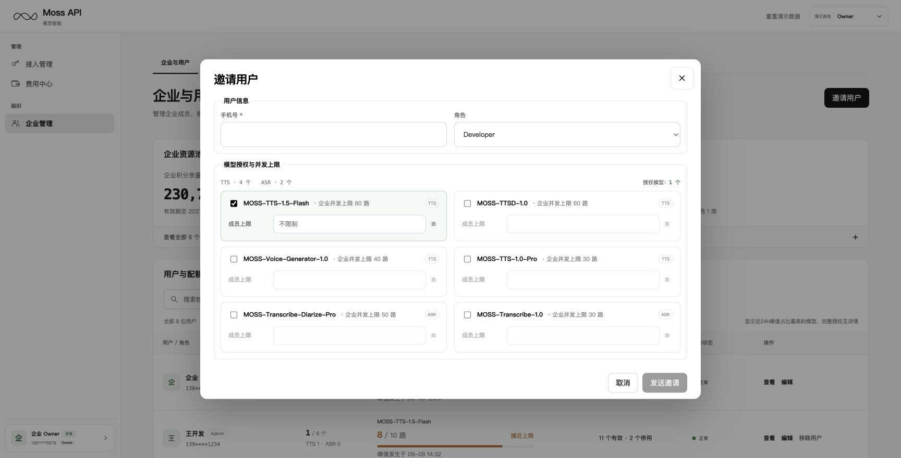

| 操作 | 输入和前置条件 | 成功结果 | 失败处理 |
|---|---|---|---|
| 邀请 | 11位有效手机号；允许的角色；至少一个模型；成员上限可留空，填写时须为1至企业模型上限的整数；席位足够 | 创建待接受邀请并占用席位，保存模型授权和可空成员上限，不预留并发 | 重复在册/邀请记录、权限或容量冲突时保留输入 |
| 邀请默认 | 默认Developer，模型初始未选；勾选后成员上限留空，输入提示“不限制” | 授权数与勾选即时同步 | 未选模型时输入清空并禁用；邀请至少授权一个模型才可提交 |
| 编辑 | 目标正常或待接受，角色在可管理范围；手机号只读，回填原角色和模型并发；无变化禁用保存 | 原子更新角色、模型授权及可空成员上限；待接受成员须接受邀请后才获得调用权限 | 重新校验操作者、成员版本及企业模型上限；单项超限拒绝整笔保存，冲突时保留输入并要求刷新，不校验成员上限之和 |
| 详情 | Owner/Admin查看企业用户 | 用户信息、授权数、有效Key数、获授模型峰值及Key掩码 | 无模型授权显示明确空态；不提供他人Key代操作 |

Owner 首次初始化时，默认获得企业全部已开通模型的调用权限；各模型的成员并发上限默认留空，使用企业共享并发额度。Owner 后续可从本人行或详情进入编辑，修改自己的模型授权和并发上限，已保存的配置不会被初始化逻辑覆盖。手机号和 Owner 角色只读，不能移除本人；取消模型授权不影响企业管理权限和历史查询。编辑可取消全部模型，取消后不能调用对应模型。

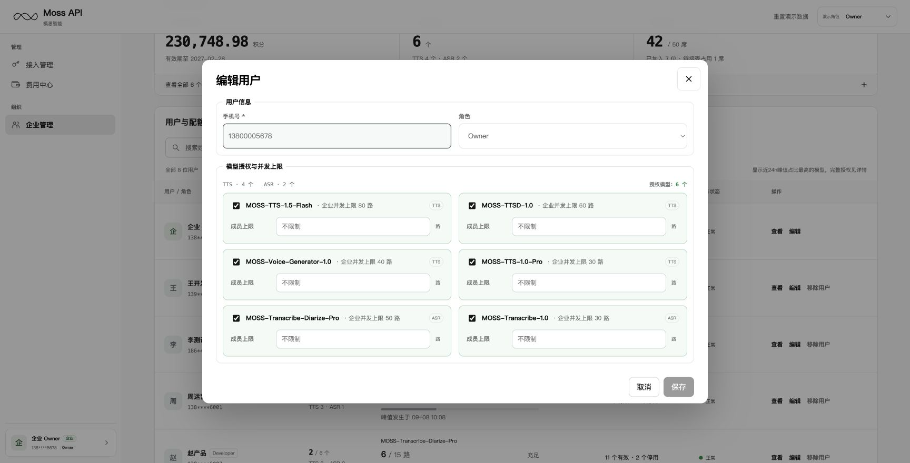

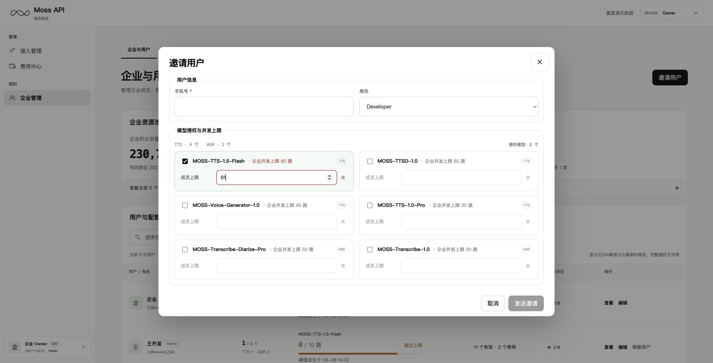

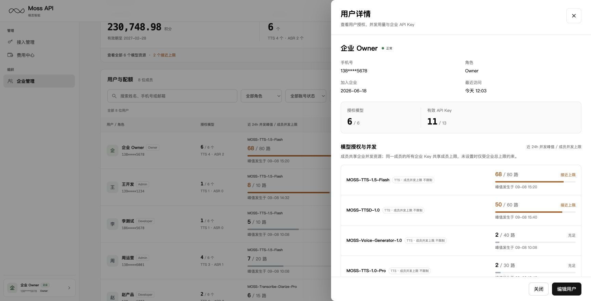

成员详情展示姓名、手机号掩码、角色、账号状态、加入时间和最近访问时间。摘要展示“已授权模型数 / 企业已开通模型数”和“有效 Key 数 / 该成员企业 Key 总数”；模型区仅列出该成员当前获授权的模型。

- **Key 列表范围与浏览方式**：详情中的企业 Key 表仅展示当前查看成员的全部企业 Key 记录，包含“名称及掩码”“状态”“最近调用”三列。记录在详情内连续展示，内容超出弹窗可视区域时通过滚动查看；不设置每页条数和上一页、下一页按钮。API 密钥、用户、费用、用量四张主列表的每页 5/10/20 条分页规则不适用于此处。
- **成员操作权限**：详情中的编辑、移除等成员管理操作与用户列表采用同一权限规则，由当前操作者的权限、目标成员的角色和账号状态共同决定。查看详情不会获得额外操作权限；详情内的企业 Key 仅供查看，不提供代操作。
- **取消编辑后的返回位置**：从用户列表直接进入编辑，点击“取消”后关闭编辑弹窗并返回用户列表；从成员详情进入编辑，点击“取消”后同样直接返回用户列表，不重新打开成员详情。取消时不保存本次尚未提交的修改。

#### 7.6.3 成员生命周期与邀请有效期

移除支持正常、待接受及已过期成员；不得移除本人或 Owner。确认弹窗展示目标姓名、脱敏手机号、角色和以下影响范围，默认聚焦“取消”。

- **移除成功后的企业权限与席位**：该成员从当前企业的用户列表中移除，释放其占用的席位，撤销其对当前企业的访问权限，并取消尚未接受的邀请。该成员在当前企业下原有的企业 Key 永久失效。在途请求的实际占用释放遵循 7.7.1，不能因移除而提前清零计数。
- **历史企业费用与用量**：该成员在当前企业下已产生的费用和用量记录继续保留在原企业账务中，并保留与原成员、原企业 Key 的关联。移除成员不会删除这些记录，也不会将费用或用量转到其个人账号或其他成员名下；历史查询仍按企业的访问权限控制，保留记录不代表被移除成员仍可访问该企业。
- **个人账号与个人 Key**：此次操作仅移除该用户与当前企业的成员关系，不注销其个人账号，不取消其个人身份，也不删除或停用其个人 API Key。个人 API Key 与上述永久失效的企业 Key 是两类独立凭证。
- **移除失败时的反馈**：服务端明确返回本次移除操作失败时，保留“移除用户”确认弹窗并展示具体失败原因，不显示移除成功提示。前端不得按成功结果提前移除列表行或更新可邀请席位；成员状态和席位数据以服务端最新结果为准。

同手机号重新邀请时沿用稳定用户身份，创建新的成员关系版本并重新配置授权。新邀请接受前不能进入企业，原有企业Key永不恢复，重新加入后由本人创建新Key。旧邀请、旧表单和旧请求不得重放到新成员关系。

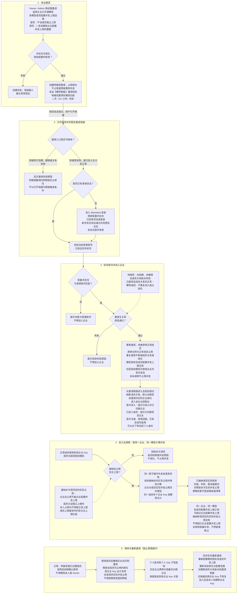

邀请链接有效期为1天（24小时），从账号服务创建邀请成功时起算，expires_at = created_at + 24小时，不按自然日结束时间计算；截止时刻按服务端时间判断，界面按Asia/Shanghai展示。只有处于待接受状态、未被移除且服务端当前时间早于expires_at的邀请可被接受；受邀人须登录并验证邀请绑定的手机号。

到达expires_at仍未接受时，邀请状态变为已过期，链接立即失效，并自该时刻起不再占用席位；页面、席位统计和接受接口必须使用相同的有效性判断，不能因后台状态更新延迟继续接受邀请或占用席位。有效期内接受成功后转为正常成员，邀请不可重复使用，成员资格不随原邀请到期而失效。修改待接受成员的角色或授权不延长链接有效期。

过期链接提示“邀请链接已过期，请联系企业Owner或Admin重新邀请”。操作者按权限移除过期记录后重新邀请，生成新的链接和成员关系版本，重新计算1天（24小时）有效期；旧链接保持失效。验收覆盖截止前、恰好到期、到期后、重复接受、移除后访问及重新邀请后的旧链接访问。

#### 7.6.4 邀请短信与注册登录

邀请创建成功后，由服务端向受邀手机号发送短信；短信签名固定为【模思智能】，正文模板如下：

【模思智能】{企业名称}邀请您加入企业工作空间。请于{到期时间}前点击{邀请链接}，使用本手机号登录或注册。加入后可在平台切换企业身份。如非您预期，请忽略。

{企业名称}取邀请所属企业名称；{到期时间}取邀请expires_at，按Asia/Shanghai显示月日及时分；{邀请链接}由服务端生成并绑定邀请记录。有效期仍从创建成功起算24小时，短信投递重试不重置期限；实际短信应填写明确截止时间，不能在临近到期时再次笼统承诺1天。投递状态与邀请状态分别记录，发送失败不显示“短信已发送”，重试复用仍有效的邀请，不重复占用席位；短信发送失败期间，有效待接受邀请仍保留原席位，不预留并发。

链接与登录入口：短信使用可在24小时内访问的HTTPS邀请入口，点击后携带服务端可验证的邀请上下文进入[Mossland登录](https://mossland.studio/login)，完成SSO后回到[平台](https://platform.mosi.cn/)。SSO跳转链接中的短期state、签名和时间戳由登录服务按次生成，不能复制为固定短信链接。邀请凭证与SSO状态独立；SSO状态过期时，可从仍有效的邀请入口重新发起登录。具体邀请路由由研发评审确定，回跳地址须使用允许的站内地址。

未注册用户：服务端校验邀请后，将受邀手机号预填到登录表单第一行，默认验证码登录。用户获取并输入验证码、勾选服务及隐私协议、点击登录；验证成功后自动创建账号，无需另行注册。手机号预填不代表已验证，前端预填值或修改后的值不能替代服务端身份校验。

已注册用户：未登录时使用受邀手机号对应的账号完成验证码或密码登录；已有有效登录会话时直接进入邀请校验。若登录账号已验证的手机号与受邀手机号不一致，提示“当前登录账号与受邀手机号不一致，请使用受邀手机号登录”，引导切换登录账号并保留邀请上下文，不创建企业成员关系。

接受与企业身份：从邀请链接进入的用户，完成身份校验和下述成员处理后，自动切换至该链接对应的企业身份并进入企业控制台。首次注册、登录回跳和已有登录会话采用同一规则，均无须手动选择企业。

- **先校验登录身份**：未登录时先完成登录；已有有效会话时使用当前登录账号。服务端确认账号已验证的手机号与邀请绑定的手机号一致，并确定邀请对应的企业及成员关系版本。
- **邀请仍为待接受**：校验邀请未到期、未撤销，且对应成员关系版本一致。通过后，服务端将待接受成员转为正常成员；原有席位占用保持不变，不新增席位占用，已保存的模型授权和成员并发上限开始生效。
- **邀请已经接受**：校验该邀请对应的成员关系仍为正常，且版本一致。通过后沿用当前成员关系和权限配置，不重复创建成员关系，不新增席位占用，也不重新覆盖模型授权和并发上限。
- **最后切换身份**：上述两种成员状态分别处理成功后，客户端刷新成员关系，自动切换至该企业身份并进入其控制台。本次新加入的用户提示“已加入{企业名称}，已切换至企业身份”；原本已加入的用户提示“已切换至{企业名称}”。进入企业后，用户可从左下角切回个人身份。

任一校验或成员状态更新失败，均不自动切换至受邀企业、不提示加入或切换成功，并展示具体原因。普通登录未携带邀请上下文时，按普通登录规则进入个人身份，不触发上述邀请处理。

失效与重复访问：待接受邀请到期或被撤销后不能完成加入；登录前和登录回跳后均须校验，登录过程中到期也应拒绝。过期沿用 7.6.3 的提示与重邀规则，撤销提示“邀请已失效，请联系企业 Owner 或 Admin”。同一邀请已接受且对应成员关系仍正常、版本一致时，再次打开按上述“邀请已经接受”分支处理。成员已移除或关系版本已变化时，旧链接不能用于恢复权限或切换至该企业。

验收覆盖未注册、已注册未登录、已登录且手机号匹配/不匹配、验证码错误/超时、未勾选协议、登录期间邀请到期、SSO状态过期后重试、短信发送失败、重复接受和成员移除后的旧链接。仅在接受成功并取得正常成员关系后显示企业选项；网络失败保留重试入口，不提前提示加入成功。

### 7.7 模型授权、并发与状态计算

| 数据 | 计算 / 来源 | 展示和异常规则 |
|---|---|---|
| 模型授权 | 当前有效企业模型与成员授权 | Owner首次默认授权企业全部已开通模型，成员上限为null，继承企业上限；本人可编辑，显式配置不被初始化覆盖；普通成员使用显式授权 |
| 企业并发峰值 | 同一时刻所有成员占用总数，在近24h窗口内取最大值 | 不等于各成员峰值相加，不从调用次数推算 |
| 成员并发峰值 | 成员所有企业Key在同模型同时占用的近24h最大值 | Key共享成员上限；相同峰值取最近发生时间 |
| 当前上限 | 企业模型上限E；有成员限制L时取min(E,L)，无成员限制时取E | 作为分母；调整上限更新状态和筛选，不改历史峰值与时间 |
| 充足 | peak/current_limit低于80% | 中性文字和进度 |
| 接近上限 | 80%含至100%不含 | 橙色文字和进度 |
| 已达上限 | 100%及以上 | 红色文字和进度 |
| 缺失或无效 | 未覆盖、非有限值、负峰值、非正或缺失企业上限；成员上限null表示继承企业上限，不能当作数据缺失 | 显示暂无完整数据，不按0或充足处理；已知上限可显示“— / N路” |

峰值比较用于容量判断，不表示当前调用已受限。真实覆盖且峰值为0才显示0。展开区底部统一显示数据更新时间。生产接口提供scope、model、window_start/end、peak、peak_at、current_limit、coverage、data_as_of；语义一致，字段命名在接口评审统一。

#### 7.7.1 共享并发与成员上限

并发表示同一时刻正在处理的请求数，按企业和模型分别计数。对同一企业的同一模型，需区分配置额度与实际占用：

- **配置额度**：各成员配置的并发上限之和可以超过企业并发上限。成员上限仅约束该成员最多可同时处理多少请求，不代表为其预留或分配了专属容量。
- **实际占用**：同一时刻，所有成员实际并发占用之和不得超过企业并发上限；成员已单独设限时，其本人实际占用还须受该配置值约束。同一成员的多个企业 Key 合并计数。

设企业并发上限为 E，成员配置上限为 Lᵢ，成员当前实际占用为 Cᵢ：不要求 ΣLᵢ≤E，但接纳新请求时必须保证 ΣCᵢ≤E；已配置 Lᵢ 时还须保证 Cᵢ≤Lᵢ。成员上限留空（null）表示不单独设限，仍受企业共享并发上限约束。未使用容量由有权限的成员共享，不承诺任何成员独占或保底并发。不同企业及不同模型相互隔离。

| 场景 | 规则与验收要求 |
|---|---|
| 共享与调用 | 正常成员获授模型后可使用该模型的共享池。同一成员的多个企业API Key共用成员计数，所有成员共用企业计数。成员上限仅约束本人；空闲资源可供其他有权限的成员使用，总实际占用不能超过企业上限。 |
| 并发达到上限 | 达到企业或显式成员并发上限后，直接拒绝新请求并返回明确的并发超限错误，不进入等待队列、不占用并发，由调用方稍后重试；具体错误码与重试指引由研发在接口文档中定义。 |
| 请求占用与释放 | 生产网关按企业、成员、模型及成员关系版本原子校验并增加实际占用，避免多个Key并行请求超限。正常结束、失败、取消、超时均须幂等释放占用，异常中断需回收机制；重复结束不得重复扣减。 |
| 策略变更与在途请求 | 调低上限、停用Key、取消模型授权或移除成员时，允许变更前已接纳的请求继续完成，不因本次策略变更主动中断；后续新请求按新策略判断。在途请求持续计数，直到完成、失败、主动取消或超时后幂等释放。企业缩容不改历史配置值和峰值，当前生效上限取min(企业上限,显式成员上限)，占用未降到新上限以内时不再接纳新请求。 |
| 企业扩容与展示 | 企业上限由模思运营根据销售订单配置。成员上限null随企业上限生效；显式值保持不变。列表、详情、API密钥资源区统一展示峰值/生效上限；不限制时分母显示企业上限数字，不增加Owner专属说明。 |
| 卡片和数据契约 | 宽屏两列、620px及以下一列。首行为勾选框、模型名、“· 企业并发上限 X 路”和TTS/ASR；次行为“成员上限”、输入框与“路”，不显示“选填”、顶部说明或“最多N路”。已选且留空提交enabled=true、concurrency=null；填写正整数提交该值；取消勾选输入置空禁用，提交enabled=false、concurrency=0，重新勾选仍留空。超企业上限仅将上限文字和输入边框以#b8323a标红，禁用保存，不新增错误行或改变卡片高度；其他非法数字仅输入框标红，读屏错误通过aria-describedby关联。 |

示例：企业某模型上限100路，A设置60路、B设置80路、C留空，三人共享100路。A正在使用10路时，企业还可接纳90路，B本人最多80路；若A和B合计已用100路，C即使未单独设限也不能继续增加请求。这里不为任何成员预留容量。

专项验收：多个成员上限总和超过企业上限仍可保存；留空、整数1、恰好企业上限可提交，0/负数/小数/超过企业上限被拒；取消授权与不限制明确区分。验证Owner默认继承及显式覆盖、Admin管理范围、旧配置迁移与永久失效Key不恢复。生产联调补充多Key并发原子计数、跨租户隔离、各种结束路径幂等释放、邀请不占并发以及缩容/撤权期间在途计数不提前清零。达到上限的新请求应立即报错且不排队；策略变更前已接纳的请求仍可正常完成。

### 7.8 计量、账务与数据一致性

费用与用量支持查询近12个月，按Asia/Shanghai的月账期计算，包含当前月及此前11个月；当前月仅显示截至数据快照已发生的计量。费用概览、用量明细、趋势、账单打印和CSV导出采用同一账期范围，超范围参数返回明确错误，不静默改为其他账期。账期尚无数据时按覆盖状态区分真实零与未覆盖。底层账务记录的保存、归档及删除期限由研发与财务另行确定，超出页面可查询范围不代表删除账务记录。

| 指标 | 定义 | 研发约束 |
|---|---|---|
| 计费调用次数 | 纳入有效计费计量的逻辑调用去重次数 | 分片、重放和更正不能重复计数，不以成功状态或实际扣款大于0判断 |
| TTS计费字符 | 生效规则确定的billable quantity | 单位字符，不能用字节数替代或由前端另算通用算法 |
| ASR计费音频时长 | 生效规则确定的音频长度及进位 | 与网络耗时区分，保留规则版本 |
| 消耗积分与金额 | 账务按生效规则计算的计量结果 | 从最小计量记录按精度汇总，不从调用次数或展示值反算 |
| 企业积分余量 | 账务/权益服务独立可用余额快照 | 包含单位与有效期，与页面临时筛选无关 |
| 归属和历史 | 稳定企业 ID、用户 ID、Key ID 及成员关系版本 | Key 名称仅用于展示，同名 Key 仍按不同 Key 分别统计；成员移除或重新邀请只影响后续权限和新关系，不追溯修改历史费用与用量记录 |

| 模型 | 原型参考计费规则 |
|---|---|
| MOSS-TTS-1.5-Flash | 20积分/万字符 |
| MOSS-TTSD-1.0 | 20积分/万字符 |
| MOSS-Voice-Generator-1.0 | 20积分/万字符 |
| MOSS-TTS-1.0-Pro | 20积分/万字符 |
| MOSS-Transcribe-Diarize-Pro | 17积分/音视频小时 |
| MOSS-Transcribe-1.0 | 13积分/音视频小时 |

以上费率及0.03元/积分的换算率仅用于原型页面、计量样例和账单说明。实际计费规则由模思运营人员根据销售订单在后台配置，包含适用企业与模型、价格、折扣、积分换算率、计费单位、进位规则及生效时间；控制台从服务端获取当前企业对应的生效配置，不直接采用原型固定费率。历史账单按计费发生时生效的规则版本核对，新配置不覆盖历史计费结果。

原型按单条计量以整数积分分、金额分舍入后汇总，页面、趋势、CSV及账单共用结果。生产按评审后的计费规则执行，不对汇总展示量重新计价；舍入与更正规则由Q-05落实。

失败、取消、重试、流式部分输出、异步调用和资源包抵扣按服务端生效计量规则判断。费用和用量在相同账期、范围、快照下保持调用、用量、积分和金额一致。本人可查询范围包含当前允许模型及历史授权期间已有计量的模型；收回调用授权不删除历史对账记录，也不恢复调用资格。

### 7.9 个人 C 端入口

参考：[Moss 开放平台](https://platform.mosi.cn/)。切换个人身份后，当前站内显示标题为“平台首页”的个人服务入口页，浏览器标题为“个人页 — Moss API”；页面由语音体验入口、API Keys/用量与积分/个人信息三张服务卡和Quickstart组成。侧栏使用平台首页、开发、配置、账单与用量、个人中心的信息架构，服务操作在C端新窗口打开。

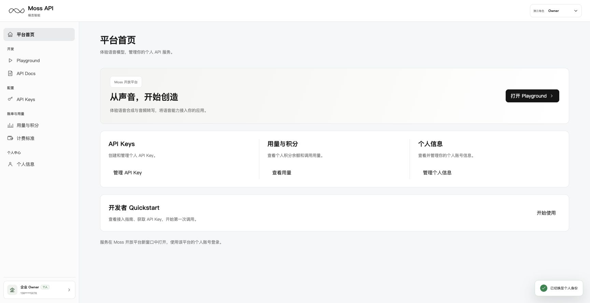

| 服务 | 线上入口 | 交互 |
|---|---|---|
| Playground | [打开Playground](https://platform.mosi.cn/app/playground) | 新窗口打开 |
| API Docs | [接入指南](https://platform.mosi.cn/docs/getting-started/overview) | 新窗口打开 |
| API Keys | [个人API Keys](https://platform.mosi.cn/app/api-keys) | 新窗口打开 |
| 用量与积分 | [个人用量](https://platform.mosi.cn/app/usage) | 新窗口打开 |
| 计费标准 | [计费标准](https://platform.mosi.cn/app/pricing) | 新窗口打开 |
| 个人信息 | [个人账号](https://platform.mosi.cn/app/profile) | 新窗口打开 |

个人服务使用现有C端登录；企业原型不读取或伪造个人余额与Key，不共享企业数据。有正常企业关系者可点击左下角用户信息卡片，在“切换身份”中选择“企业”切换为企业身份；无企业账号者仅显示个人身份信息。演示角色选择保持可见。

### 7.10 接口与异常处理要求

以下是生产服务的能力和数据契约，不代表原型已存在同名HTTP接口。接口路径、传输字段名、错误码和版本策略由研发评审确定。

| 能力 | 请求与返回至少包含 | 一致性和权限要求 |
|---|---|---|
| 身份上下文 | 可信主体、企业关系、角色、能力集、当前上下文；Owner关系由模思运营根据销售订单在后台配置 | 每次读写与下载重新鉴权；身份切换清空旧缓存与在途响应；前端角色参数不能授予Owner身份 |
| Key管理 | 稳定Key ID、名称、掩码、归属、状态、创建/最近调用时间、用量、创建时一次性secret | 所有权与50个额度原子校验；并发提交幂等；停用/启用检查当前状态 |
| 成员管理 | 成员ID、手机号、角色、状态、关系版本、模型授权、可空成员上限、企业各模型上限及配置版本、邀请标识及created_at/expires_at（创建起24小时）、短信投递状态、席位快照 | 原子校验权限、版本、席位及单项上限；不校验成员上限之和，不预留并发；短信重试和接受不重复占席位，到期释放席位；移除与Key撤权协同生效 |
| 资源 | 模型、企业/成员范围、企业上限、可空成员上限、生效上限、实际并发占用、配置版本、峰值及时间、覆盖与更新时间 | 按企业×模型及成员原子计数，多个Key共享计数；请求结束幂等释放；各企业隔离，缺失不能伪装真实0 |
| 费用/用量 | 授权范围、账期、快照、模型/用户/Key聚合、单位、规则版本及生效时间、合计、分页总数；计费规则来自销售订单对应的运营配置 | 合计与分页分离；同一快照稳定；打印与CSV使用完整授权账期 |
| 必要业务记录 | 主体、时间、对象、动作、结果、必要前后值 | 服务端可信写入，敏感字段脱敏，记录不保存secret |

网络失败保留输入，提供可重试反馈；权限或成员关系失效时阻止旧上下文继续访问；数据版本冲突保持失败状态并提示刷新。导出生成和文件获取两个阶段均须鉴权。状态撤销约束后续新调用；已接纳的请求允许继续完成，不因调低上限、停用Key、取消授权或移除成员主动中断，实际并发在请求结束时释放。

### 7.11 验收场景

| 编号 | 操作 / 场景 | 预期结果 |
|---|---|---|
| AC-01 | 运营按销售订单在后台配置Owner；三角色逐页进入、刷新、直接访问地址 | Owner可管理Admin/Developer并编辑本人模型授权与并发上限，Admin可配置Developer但不可编辑Owner；前端参数不能授予Owner；导航与直接访问权限一致，Developer仅本人Key与用量 |
| AC-02 | 正常成员通过左下角用户信息卡片切换企业/个人；无企业账号进入 | 清空旧上下文，无企业数据泄漏；无账号不出现身份切换；角色选择常驻 |
| AC-03 | 创建、复制、关闭、刷新Key | 创建时一次性交付；后续仅掩码，50个额度含普通停用，不含永久失效历史Key |
| AC-04 | 停用后调用、再次启用；并发修改或永久失效Key启用 | 后续新请求按新状态拒绝，停用前已接纳请求允许完成且持续计数至结束；失败不提示成功，历史用量不变 |
| AC-05 | 重复手机号、非法角色、未选模型、上限留空/1/企业上限/0/小数/超企业上限、席位满 | 留空不单独限制，合法整数可提交；非法输入被拒并保留；成员上限之和允许超过企业上限，角色符合管理范围 |
| AC-06 | 移除并用同手机号重新邀请 | 席位释放、原企业Key永久失效、个人数据和历史账本保留；新关系接受后方可访问 |
| AC-07 | 峰值79.9%、80%、95%、99.9%、100%；未知、0、上限变更 | 阈值正确，接近/已达互斥；未知不当0；上限变更不改历史峰值 |
| AC-08 | 用户搜索、角色/状态/接近上限筛选及重置 | 条件取交集，N按全部正常成员去重，重置回第一页和搜索焦点 |
| AC-09 | 费用行查看明细并刷新 | 账期/模型/用户传递，Key全部、窗口整账期、页码1，篡改参数不扩大权限 |
| AC-10 | 月初、近12个月首末账期及范围外月份、近7/15天、无覆盖、真实0 | 可查当前月及此前11个月；范围外查询/打印/导出均明确拒绝；时间交集及空态正确，图表和明细同范围，ASR小时与秒可换算 |
| AC-11 | 临时筛选和翻页后打印或导出 | 仍按完整授权账期，Developer仅本人；合计与同快照账本一致 |
| AC-12 | CSV包含逗号、引号、换行及公式前缀的名称 | 格式正确且公式安全，只含授权聚合字段和掩码 |
| AC-13 | 四主列表首次进入、改每页数、空结果、首末页 | 默认5，选项5/10/20；0–0与1/1，边界禁用，页码不越界 |
| AC-14 | 弹窗取消/Escape、Tab、页签方向键/Home/End、窄屏 | 焦点和关闭正确，危险操作可取消，主要动作可达 |
| AC-15 | 个人服务入口 | 个人服务在C端新窗口使用个人登录 |
| AC-16 | 重置演示数据 | 位于角色选择左侧，先确认；取消不改变状态，确认恢复初始演示数据 |

## 8. 交付与上线

### 8.1 联调顺序与上线门禁

按7.10认领生产服务负责人，准备可信账号、成员关系、资源快照和账务测试数据。依赖顺序为账号与成员、Key与网关、资源限制、计量账务、打印导出；这是联调顺序，功能的两期交付建议见8.2。实际负责人、工期和接口就绪日期在排期评审确定。

各期先完成需求与接口评审，再接入真实服务，最后执行对应AC验收。上线须提供真实鉴权、状态撤销、共享并发计数及同快照账务一致性的证据；原型构建通过或页面成功提示不能替代生产验收。待确认参数须落实为可测值及失败处理，问题清单见8.3。

实施任务与原型差异见3.2。按7.10接入真实服务，完成7.11及各功能专项验收后发布。

### 8.2 功能清单与两期交付建议

建议按可独立估工和验收的功能项拆分，每项标注一期或二期。期次表示完整功能的交付时间，包含必要的前端、后端和联调；研发可在此基础上认领负责人、评估工期。以下仍为待评审建议，不改变本文总交付范围。

| 编号 | 功能项 | 建议期次 | 交付内容 | 依赖与验收要点 |
|---|---|---|---|---|
| F-01 | 企业开通与订单权益配置 | 一期 | 复用运营后台，按销售订单配置企业Owner、合同模型、企业并发及实际计费规则。 | 账号、资源和账务服务读取同一企业生效配置；原型费率不得作为生产价格。 |
| F-02 | 邀请用户与短信投递 | 一期 | 按允许的角色填写手机号、模型和并发，创建待接受邀请并发送【模思智能】短信。 | 依赖成员、席位及短信服务；重复邀请被拦截，发送失败有反馈，投递重试不重复占位。 |
| F-03 | 受邀注册、登录与自动加入 | 一期 | 手机号预填；新用户验证后自动注册，已有用户登录；SSO回跳后自动接受并显示企业身份选项。 | 依赖Mossland与账号服务；核对受邀手机号、邀请及关系版本，错账号不加入，重复接受幂等。 |
| F-04 | 邀请过期与席位管理 | 一期 | 创建起1天（24小时）有效；到期失效并释放席位，接受不重复占位；修改配置不延长期限，邀请不预留并发。 | 服务端统一校验截止时刻；覆盖登录期间到期、席位满和状态更新延迟。 |
| F-05 | 个人与企业身份切换 | 一期 | 保留C端个人入口，正常企业成员通过左下角卡片切换身份，按关系和角色加载权限。 | 无企业关系不显示切换入口；切换清空旧上下文，直接访问地址也执行服务端鉴权。 |
| F-06 | 成员列表与详情 | 一期 | 企业与用户列表、搜索、角色/状态/接近上限筛选、5/10/20分页；查看授权模型及Key掩码。 | Owner/Admin按权限查看；列表与详情数据一致，不暴露他人Key明文。 |
| F-07 | 成员角色、模型授权与并发配置 | 一期 | Owner配置Admin/Developer，Admin配置Developer；模型授权与可选成员上限，Owner默认继承且可编辑本人。 | 校验操作者、角色范围及版本；成员填写时为1至企业上限整数，留空不单独限制，上限之和无需低于企业上限。 |
| F-08 | 移除成员与重新邀请 | 一期 | 移除成员并撤销企业访问，原企业Key永久失效；同手机号重新邀请使用新关系版本与新链接。 | 旧链接和旧Key不恢复；个人账号与Key、历史费用归属不变。 |
| F-09 | 本人API Key管理 | 一期 | 创建并一次性交付Secret、掩码列表、搜索/状态筛选/分页、停用与启用。 | 依赖真实Key服务；校验本人归属、成员状态和50个额度，启停生效且无法启用永久失效Key。 |
| F-10 | 企业与成员并发限制 | 一期 | 同企业同模型共享池，所有Key按成员与企业累计实际请求占用；有成员上限时同时校验。 | 接入网关原子计数及幂等释放；验证实际占用不超企业上限、超限直接拒绝且不排队、已接纳请求在策略变更后可完成、各结束路径幂等释放及租户隔离。 |
| F-11 | 模型资源与近24h并发峰值 | 一期 | 展示企业资源池、本人授权资源、当前上限、近24h峰值、接近/已达上限状态。 | 依赖真实资源与峰值快照；企业和成员范围准确，未知不当0，调整上限不改历史峰值。 |
| F-12 | 计量与账务记录 | 一期 | 从首笔调用记录企业、成员、Key、模型、计费用量、生效规则版本及费用结果，支持运营核对。 | 依赖订单计费配置；去重、舍入和归属可追溯，成员移除或价格变更不重写历史结果。 |
| F-13 | 企业积分余量与有效期 | 一期 | API密钥及企业资源池展示可信积分余量、有效期等权益快照。 | 依赖账务/权益服务，与F-12核对；不能从页面消耗金额反推余额。 |
| F-14 | 费用概览 | 二期 | 账期费用摘要、模型×用户用量汇总、筛选/分页和合计。 | 依赖F-12及账期查询接口；支持当前月及此前11个月，Owner/Admin按企业授权范围查看，同快照与账本一致。 |
| F-15 | API Key用量明细 | 二期 | 按模型、用户及Key展示调用次数、计费用量、积分、金额，支持账期筛选与分页。 | 依赖F-12及明细查询接口；Developer限本人允许范围，合计不随分页变化。 |
| F-16 | 费用与用量趋势图 | 二期 | 累计费用趋势、每日调用/TTS/ASR趋势及用量热力图。 | 依赖F-14/F-15同源聚合；图表与明细同时间范围，零值与未覆盖状态区分。 |
| F-17 | 时间筛选与跨页下钻 | 二期 | 整账期/近7天/近15天，费用行下钻至用量明细，携带账期、模型、用户并支持刷新。 | 依赖F-14/F-15；时间窗口求交集，用户变更清空Key，参数不能扩大查询权限。 |
| F-18 | 账期账单预览与打印 | 二期 | 按完整企业账期生成模型账单预览并打印，保留计费规则和估算语义。 | 依赖F-12/F-14；临时筛选不改变账单范围，金额与同快照账本一致。 |
| F-19 | 账期明细CSV导出 | 二期 | 导出完整授权账期的模型×用户×Key聚合明细。 | 依赖F-12/F-15；明确容量与超时，生成及下载均鉴权，处理公式注入和CSV转义。 |

一期上线门槛是邀请与身份链路、真实并发限制、Key撤权及计量账务均完成服务端验收；一期暂由运营基于可信记录支持对账。二期在一期数据基础上交付客户自助费用/用量页面及打印导出，不补采一期本应记录的历史数据。两期各自执行8.1的评审、接入和验收步骤，具体工期在负责人认领及依赖确认后评估。

### 8.3 问题与待确认项

以下仅保留研发、运营及财务需落实的两项参数与实现细节。并发超限直接拒绝、在途请求继续完成、24小时邀请及近12个月查询均为确定规则，按正文实施。

| 编号 | 待落实事项 | 负责方 | 交付与验收要求 |
|---|---|---|---|
| Q-04 | 查询与数据服务的技术参数 | 研发；账务保存期限由研发与财务共同确认 | 近12个月页面查询范围已确定；落实数据延迟、底层账务保存/归档期限、CSV容量与超时、会话期限及敏感操作校验；下载生成和获取均鉴权 |
| Q-05 | 并发接口与计费配置细节 | 网关研发；计费由运营、财务及账务研发共同确认 | 超限直接拒绝和在途继续完成已确定；研发定义具体错误码及重试指引。计费侧落实销售订单对应价格/折扣版本、舍入和更正规则，确保页面、CSV和账本同快照一致 |
