# Moss API 研发 PRD｜MVP-P0

交付核对：2026-09-15；当前代码快照 bfc7f47。本文件面向产品、设计、研发与测试，定义 MVP-P0 当前有效功能、交互规则、数据口径与联调验收。线上原型为视觉参考，截图中的日期与数字属于演示样例；字段、单位及业务规则以正文为准，不作为生产合同或费率配置。

[线上原型｜API Keys](https://moss-api-mvp-p0-compromise.vercel.app/app/api-keys)

[新版 Figma｜Moss API MVP-P0 产品需求与 UI 交接](https://www.figma.com/design/uKJHefil0SBm8xMnc37NnE)

[GitHub｜公开代码仓库](https://github.com/h-pl/moss-api-mvp-p0-compromise)

[GitHub｜当前交付代码快照｜bfc7f47](https://github.com/h-pl/moss-api-mvp-p0-compromise/commit/bfc7f478676ac0e34397d78bb2100fdca09a0a89)；[GitHub｜首版历史标签｜v1.0.0](https://github.com/h-pl/moss-api-mvp-p0-compromise/tree/moss-api-mvp-p0-compromise-v1.0.0-20260914)

## 概要

Moss API 为企业 Owner 与个人用户提供 API Key 管理、模型授权、用量与积分查询、账单打印和明细导出。企业 Owner 按企业模型权益为每把 Key 设置可用模型及并发上限，个人用户为自己的 Key 设置模型范围；两个空间分别管理 Key、计量和积分。

本轮 MVP-P0 的研发调整集中在：将企业配置落实到 Key、沿用 Platform 页面结构、补齐个人模型范围、统一计费请求与导出口径，并使筛选、金额精度和历史归因在页面、PDF 与 CSV 中一致。正文按最终行为交付，各项调整定位见 3.2。

## 协作分工

| 职责 | 负责内容 | 交付物 |
| --- | --- | --- |
| 产品 | 页面范围、字段、状态、计费与并发口径 | 本 PRD、验收结论与待确认项 |
| 设计 | 页面状态、组件、尺寸、交互路径 | 新版 Figma 与交互说明 |
| 前端 | 身份切换、表单、筛选、图表、打印和导出 | 与原型一致的页面及服务接入 |
| 账号与 Key 服务 | 可信空间权限、Key 签发与撤销、策略保存 | 一次性明文、掩码、稳定 Key ID、授权结果 |
| 网关与资源服务 | 企业及 Key 的模型并发控制 | 原子接纳、超限拒绝、结束释放、峰值接口 |
| 计量与账务 | 已计费请求、费率快照、积分和金额 | 同范围可对账的数据及导出 |
| 模思运营与测试 | 企业开通与模型权益配置；跨场景验收 | 运营配置记录、联调和回归证据 |

具体负责人、接口评审人和联调时间由项目启动会确认；本文不预设人员分配与工期承诺。

## 背景与交付范围

企业客户需要按模型合同权益使用 API，并按不同项目或用途管理调用凭证。Owner 要能判断每把 Key 的授权范围、控制峰值并核对费用；个人用户同样需要限制 Key 可以调用的模型。产品在现有 Platform 体验中完成这些任务，减少凭证误配和人工对账。

### 页面地图与线上入口

| 分组 | 页面 / 路径 | 适用空间 | 主要任务 |
| --- | --- | --- | --- |
| 配置 | API Keys · /app/api-keys | 企业 / 个人 | 创建、编辑、启停、删除 Key，查看授权与用量 |
| 账单与用量 | 用量与积分 · /app/usage | 企业 / 个人 | 筛选计费用量、查看趋势和请求明细、打印账单与导出 CSV |
| 账单与用量 | 计费标准 · /app/pricing | 企业 / 个人 | 查看积分包、模型费率；企业查看折扣价 |
| 通用入口 | 获取积分 / 充值弹窗 | 企业 / 个人 | 个人充值、企业支付及商务联系 |
| 通用入口 | 左下角账户菜单 | 拥有企业资格的当前账号 | 在个人和企业空间切换 |

顶部与侧栏沿用 Moss Platform。平台首页、Playground、API Docs、Mossland 连接现有站点。个人信息页沿用现有页面，不改变本轮业务规则。Figma 按“目录与交互说明、全局导航 · 工作空间切换、接入管理 · API 密钥、费用中心 · 用量与积分、费用中心 · 计费标准、通用组件与提示”组织；状态画板按“模块 / 页面 / 状态”命名。工作空间双向流程单列在全局导航页；通用组件页保留账户入口、切换菜单和侧栏组件。

### 本轮研发调整定位

| 需求编号 | 调整点 | MVP-P0 落地行为 / 研发动作 |
| --- | --- | --- |
| P0-01 | 企业 Key 授权 | Owner 统一管理企业 Key；按 Key 保存模型及各模型并发上限；网关同时校验企业与 Key |
| P0-02 | 个人 Key 模型范围 | 创建与编辑默认 / 恢复模型勾选；两列卡片；列表展示授权模型；保存和刷新一致 |
| P0-03 | 空间和账户状态 | 个人 / 企业数据隔离；切换清空旧弹窗、草稿和筛选；服务端判断资格 |
| P0-04 | 查询口径 | 时间、模型、Key 取交集；所有计费视图以实际扣分请求为依据 |
| P0-05 | 时间与可恢复筛选 | 近 7 天截至昨日；本月按当前月份；URL 保存条件和分页 |
| P0-06 | 并发峰值 | 仅企业展示滚动近 24 小时；峰值与查询日期独立，模型 / Key 条件生效 |
| P0-07 | 账单预览 | 按筛选模型汇总；显示费率、折扣与合计；浏览器打印 PDF |
| P0-08 | 明细 CSV | 模型→Key 汇总和逐请求两种粒度；导出字段与页面口径对应；包含稳定 Key ID |
| P0-09 | 金额精度 | CSV 金额 4 位小数；汇总后舍入 2 位；页面与 PDF 金额 2 位 |
| P0-10 | 计费标准 | 企业按模型显示标准价、折扣、企业价；两个模型分组列宽统一 |
| P0-11 | 视觉与交互 | 共用表头颜色、行分隔线、类型标签、黑色按钮悬停、摘要卡片及键盘行为 |

### 原型与生产的责任边界

| 能力 | 当前可验证原型 | 生产交付要求 |
| --- | --- | --- |
| 账户与 Key | 浏览器内保存演示空间与 Key 策略 | 真实登录、可信 Owner 关系、服务端密钥生成和鉴权 |
| 并发 | 根据演示请求展示峰值和上限 | 网关原子计数、实时配置、真实近 24 小时监测 |
| 计费 | 演示数据贯通趋势、明细、账单和 CSV | 可信账本、费率快照、同步水位及账务校验 |
| 积分获取 | 表单、积分包与支付状态展示 | 真实订单、收款信息、支付结果与入账回调 |
| 打印 / 导出 | 浏览器打印与本地 CSV 已实现 | 目标浏览器 PDF 分页验收；完整授权范围导出、大数据量任务服务 |

## 目标与验收结果

| 目标 | 验收时点 | 通过标准 |
| --- | --- | --- |
| Key 范围清楚且可执行 | Key / 网关联调完成 | 企业与个人均可保存有效模型范围；后续请求按保存结果鉴权 |
| 资源权益有效 | 企业并发联调完成 | 同时满足企业×模型与 Key×模型上限；上限边界无超发和重复释放 |
| 费用可核对 | 计量联调完成 | 同空间、筛选与数据快照的积分一致；CSV 金额加总后与账单一致 |
| 空间隔离 | 上线前 | 切换无旧空间残留；篡改 URL 不能越权 |
| 界面可用 | 原型 / 前端验收 | 关键状态、键盘操作、桌面与窄屏、筛选刷新和空态通过验证 |

2026-09-15 在当前代码快照 bfc7f47 重新执行 scripts/verify-platform.mjs，40 项业务检查全部通过；GitHub 对应提交的 Vercel 部署状态为成功。该结果不代表真实支付、鉴权、并发网关和账务服务已完成生产验收。

## 使用者与任务

| 使用者 | 主要任务 | 操作边界 |
| --- | --- | --- |
| 企业 Owner | 按项目创建企业 Key、分配模型与 Key 上限、核对企业用量和积分 | 企业资格、模型和企业上限由运营配置；Owner 使用当前企业权益 |
| 个人用户 | 创建个人 Key、选择模型范围、查看个人用量和积分 | 仅本人的个人空间；模型范围取账户可用模型 |
| API 调用方 | 使用 Owner 或本人提供的 Key 发起模型请求 | 凭 Key 的有效状态、模型权限和实时额度接纳请求 |
| 模思运营 | 开通企业 Owner、配置模型、并发和合同折扣 | 沿用运营后台维护权威配置 |
| 研发与支持 | 定位具体 Key / 请求、核对计量和策略 | 依稳定 ID、当前权限和历史快照追溯 |

## 用户价值

Owner 能用一把 Key 对应一个项目或用途，快速知道哪些模型可调用、每个模型允许多大并发；个人用户也能缩小 Key 的模型范围。用量与账单在相同筛选下归集，导出保留稳定标识和足够的金额精度，使开发排查和费用核对可复现。

## 需求、流程与研发契约

### 身份与权限

运营将已有账户配置为企业 Owner，并提供企业名称、已授权模型、每模型企业并发上限和合同折扣。账户菜单展示可进入的空间；前端呈现与服务端鉴权分别实现，URL 和本地状态不授予企业资格。

| 行为 | 企业空间 | 个人空间 |
| --- | --- | --- |
| Key 管理 | Owner 管理当前企业全部 Key | 管理本人个人 Key |
| 模型范围 | 企业已授权模型的子集 | 个人可用模型的子集 |
| Key 并发配置 | 每模型 1 至企业上限的整数 | 无需填写，仍遵循平台账户限制 |
| 用量 / 积分 | 企业独立归集与扣减 | 个人独立归集与扣减 |
| 并发峰值卡片 | 展示 | 不展示 |
| 模型折扣 | 企业合同逐模型折扣 | 个人标准价 |

切换空间后关闭弹窗、放弃未提交草稿、清空筛选及旧查询结果，以目标空间重新加载。服务端失去访问资格时终止新操作并清理当前上下文，不展示上次空间的缓存数据。

#### 工作空间切换：入口与操作

切换入口位于左侧导航底部的账户区域。当前空间以名称和角色标识：企业展示“星河科技 / 企业空间 · Owner”，个人展示“林晓 / 个人空间”。截图取自已部署原型，名称及数据为演示样例。

**企业 → 个人：** 点击左下角企业账户区域，在菜单中选择“切换至个人空间”。菜单关闭后仍停留在 API Keys 页面，账户标识、积分余额和 Key 列表更新为个人空间内容。

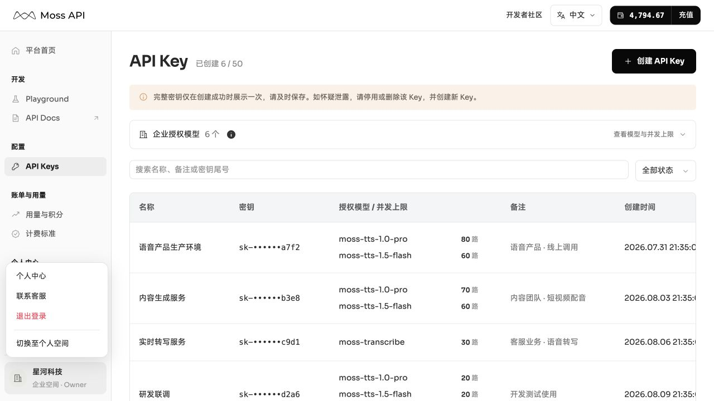

**个人 → 企业：** 点击左下角个人账户区域，选择“切换至星河科技”（正式环境显示可进入的企业名称）。返回企业后展示企业 Key、授权模型及并发上限。

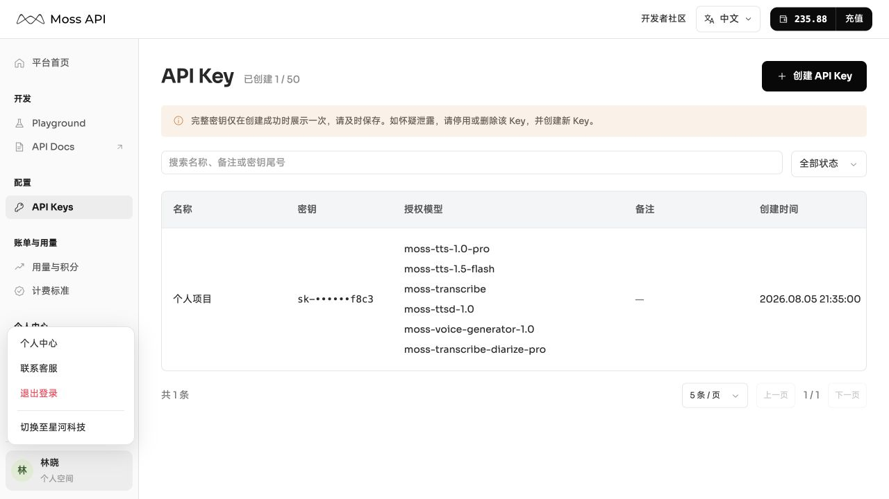

**切换后的规则：** 保留当前功能页面，按目标空间重新加载数据；关闭账户菜单及弹窗，清除未提交草稿、搜索、筛选、分页及 URL 查询条件。用量页面回到默认近 7 天、全部模型、全部 Key。已经保存的 Key、历史用量和积分仍归属原空间，不因切换而迁移或删除。仅展示用户有权进入的企业入口，切换空间不新增企业权限。刷新保留已选工作空间；切换用量空间后请求页码回到第 1 页，每页 10 条。

### 共用 UI 与交互

用量概览 / 请求明细切换时，白色选中背景平滑移动 220ms；鼠标和键盘切换均保留当前滚动位置，不自动回到顶部，也不因内容变短向上跳动。选中页签与内容面板保持无障碍关联；系统要求减少动态效果时取消动画。企业、个人设计稿按独立区域排布。

按钮的类型与交互状态分别整理：主按钮、次按钮、文字按钮是类型；默认、悬停、键盘焦点、禁用是状态。灰色主按钮表示禁用。通用组件区同时整理输入框、选择器、开关、授权模型卡片、字段错误、Info、Tooltip、Toast，以及创建、编辑、启停、删除、一次性密钥、请求详情、账单预览和两种导出弹窗；复用相同字体、颜色、间距与关闭行为。

| 位置 | 统一 Info 文案 |
| --- | --- |
| Key 安全提示 | 完整密钥仅在创建成功时展示一次，请及时保存。如怀疑泄露，请停用或删除该 Key，并创建新 Key。 |
| 企业授权模型 | 同一模型的所有 Key 共享企业并发上限。Key 上限仅限制该 Key，不预留并发额度。 |
| 企业用量筛选 | 筛选条件同时用于用量、账单和明细导出。并发峰值仅随模型、Key 筛选变化，固定统计近 24 小时。 |
| 个人用量筛选 | 筛选条件同时用于用量、账单和明细导出。 |
| 并发峰值 | 近 24 小时的最高同时处理请求数 / 当前企业（指定 Key 时为 Key）并发上限。绿色低于 80%，橙色为 80% 至不足 100%，红色为达到或超过上限；不代表当前并发。 |
| 模型用量概览 | 请求次数仅统计实际扣除积分的请求，消耗积分已包含模型折扣。 |
| 逐请求导出 | 将导出当前筛选范围内的 {N} 条计费请求，不受页面分页影响。 |
| 企业支付 · 企业空间 | 当前企业已认证，请按合同约定付款 |
| 企业支付 · 个人空间 | 企业支付需完成企业认证~~并签署合同~~ |

| 项目 | 规则 | 验收点 |
| --- | --- | --- |
| 页面骨架 | 顶部品牌 / 余额，左侧导航，主区域标题与主操作、筛选、表格、分页 | 页面名称、浏览器标题与当前位置一致 |
| 字体与色彩 | 线上使用 Sora / MiSans；主文 #282828、次文 #777、普通表头 #555；账单预览与导出明细表头统一 #777，分隔线 #e5e5e5，摘要浅灰 | 两导出弹窗及计费表颜色一致 |
| 主操作 | 默认 #080808，hover #292929，禁用样式不可点击 | 创建、打印与下载共享样式 |
| 表格 | 文字左对齐、数值与表头右对齐；白底与细横线；模型类型使用 TTS / ASR 标签 | 概览 / 请求 / 导出间无对齐漂移 |
| 弹窗 | Reka 对话框；标题、内容、底部操作；焦点限制在弹窗，关闭返回触发按钮。充值、购买、获取积分与创建 Key 统一使用 rgba(0,0,0,0.8) 背景遮罩，个人充值与企业支付共用 | Tab、Esc、关闭、取消可操作；取消不保存 |
| 分页 | API Keys 默认每页 5 条，请求明细默认每页 10 条；均可选 5 / 10 / 20。筛选变化回第 1 页；页码不得越界 | 导出和汇总不随分页截断 |
| 动效 | 展开区和进度条轻量过渡；数字直接更新；遵循 reduced-motion | 筛选切换不出现虚构的滚动数值 |
| 窄屏 | 表格容器横向滚动，弹窗内滚动；个人模型卡片≤600px 时单列 | 内容可读、操作可触达、不截断必要字段 |

### API Keys：资源区、列表和操作

企业 · API Keys：授权模型与并发上限按 Key 管理；企业授权模型区域支持展开。

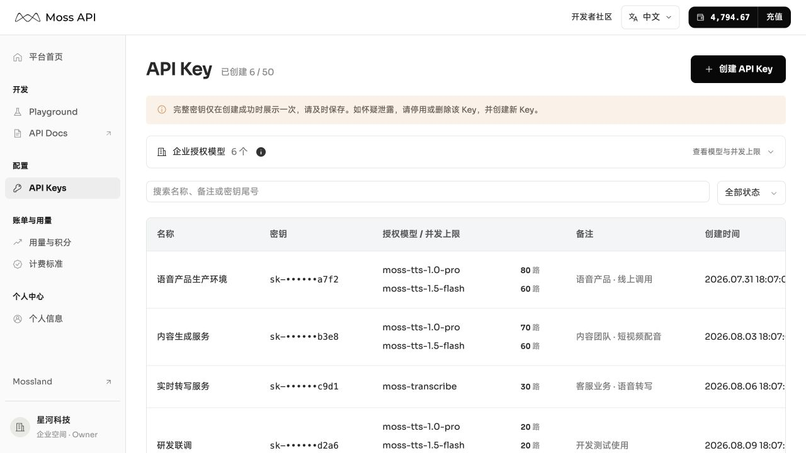

个人 · API Keys：展示授权模型列；个人 Key 仅配置模型范围。

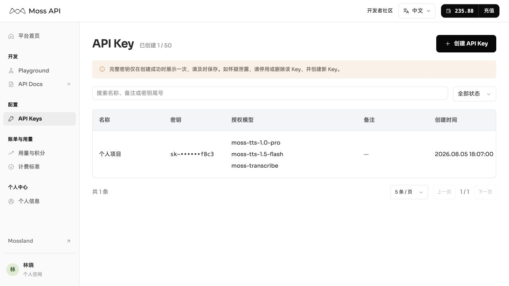

进入 API Keys 后显示创建数量（最多 50）、创建按钮和一次性密钥提示。企业显示可折叠的“企业授权模型”区，列出模型及企业共享上限；个人直接进入 Key 管理内容。

| 字段 / 控件 | 需求 |
| --- | --- |
| 搜索 | 匹配 Key 名称、备注或密钥尾号；与状态筛选共同生效 |
| 状态 | 全部状态 / 已启用 / 已停用 |
| 列表列序 | 名称、密钥、授权模型 / 并发上限（个人为授权模型）、备注、创建时间、状态、操作 |
| 授权列 | 逐项列模型名称；企业附该 Key 上限，个人仅显示名称 |
| 密钥 | 只展示掩码；列表不提供完整密钥恢复 |
| 操作 | 启停开关、编辑、查看用量、删除；名称也可打开编辑 |
| 查看用量 | 跳转 /app/usage 并将该 Key ID 写入筛选 URL |
| 空态 | 无 Key 引导创建；筛选无匹配提示调整条件；表头保留 |
| 额度 | 每空间最多 50 个未删除 Key，停用计入，删除释放名额 |

#### 创建与编辑

企业 · 创建 API Key：选择模型，并逐项设置 Key 并发上限。

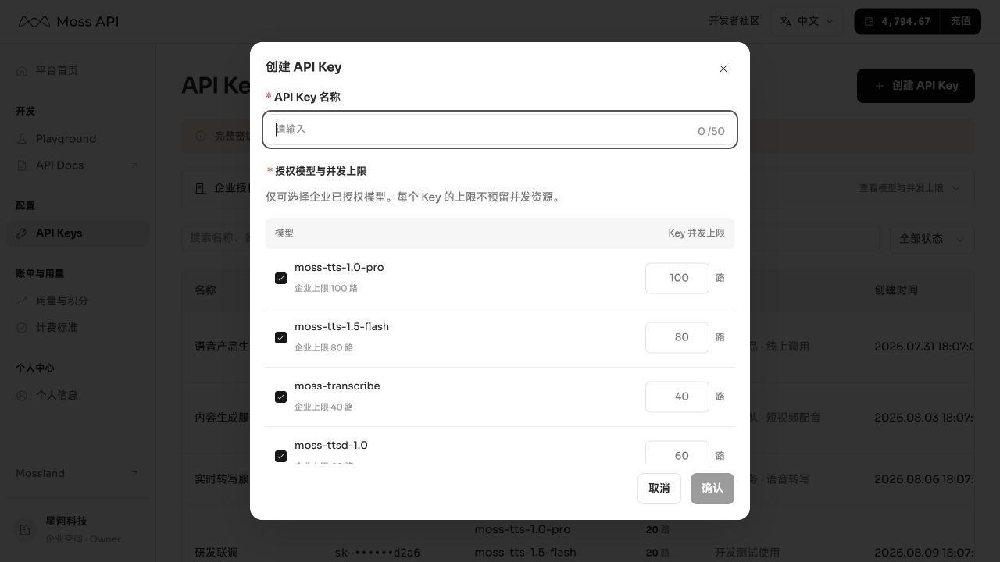

个人 · 创建 API Key：授权模型采用两列布局，至少选择一个模型。

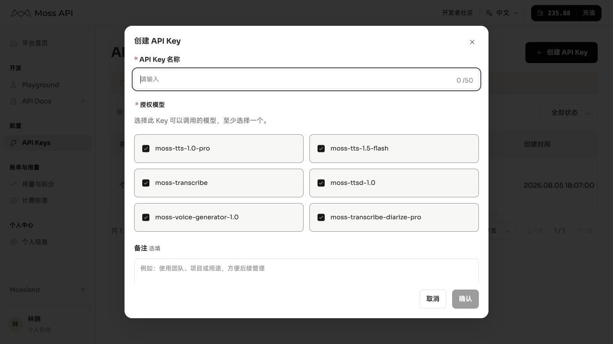

创建流程：按空间类型进行授权与参数校验，成功后仅展示一次完整密钥。

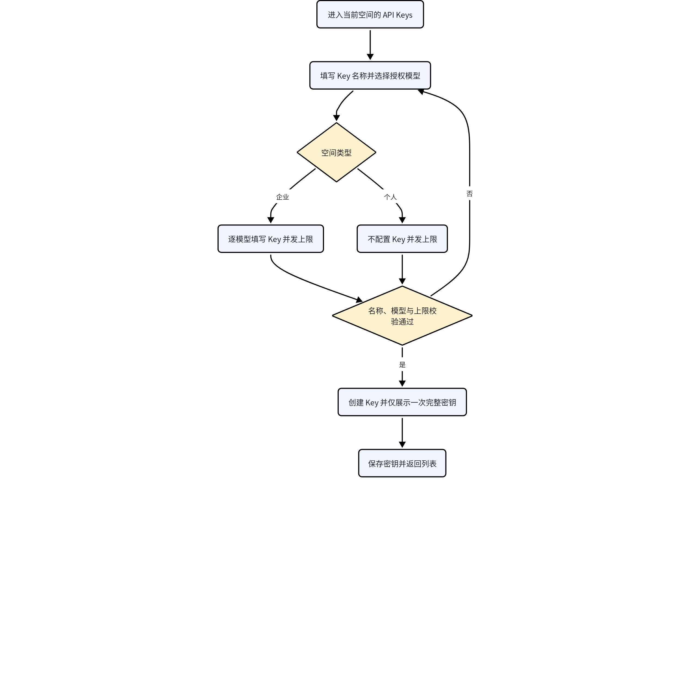

[可编辑 Mermaid 源码](assets/20260915/create.mmd)

| 字段 | 校验与默认值 | 反馈 |
| --- | --- | --- |
| API Key 名称 | 必填，去首尾空格后 1–50 字符 | 长度计数；不满足时不可提交 |
| 授权模型 | 至少一个；新建默认全选当前可用模型，编辑恢复已保存范围 | 企业与个人的创建 / 编辑表单取消全部模型后，立即在模型列表下显示红字“请至少选择一个授权模型。”，确认 / 保存保持禁用；重新勾选至少一个模型后提示消失，其他字段也有效时允许提交。错误说明与授权模型字段组关联，供辅助技术读取。 |
| 企业每模型 Key 上限 | 必填整数；范围 1 至企业该模型上限；默认企业上限 | 取消模型勾选后输入禁用；超限 / 非整数行内错误 |
| 个人模型选择 | 两列勾选卡片；只选择范围 | 无需并发输入；保存后列表及重新编辑显示相同范围 |
| 备注 | 选填，最多 200 字符；说明项目、团队或用途 | 字符计数；原样归属当前 Key |

企业授权模型空选状态（Figma 设计稿）：取消全部模型后，在列表下方即时显示错误；下图名称已填写，确认按钮仍因未授权任何模型而禁用。

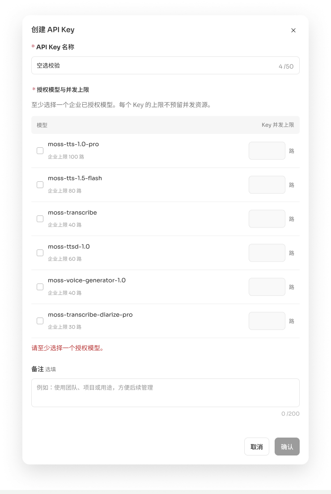

[查看企业未选择模型设计状态](https://www.figma.com/design/uKJHefil0SBm8xMnc37NnE?node-id=107-1178)

创建提交期间防止重复操作；失败保留表单并显示错误。成功进入持续存在的密钥结果弹窗，完整密钥仅此一次展示；支持复制和手动选中，复制失败提示手动复制。用户关闭后只能看到掩码。原型中的 sk-prototype 示例不可用于真实服务。

编辑保存不改变 Key 字符串；取消不保存。模型范围、企业 Key 上限和备注对后续请求生效，不改写已发生用量。

#### Key 生命周期

Key 生命周期：启用、停用可切换；删除后保留历史计量归因。

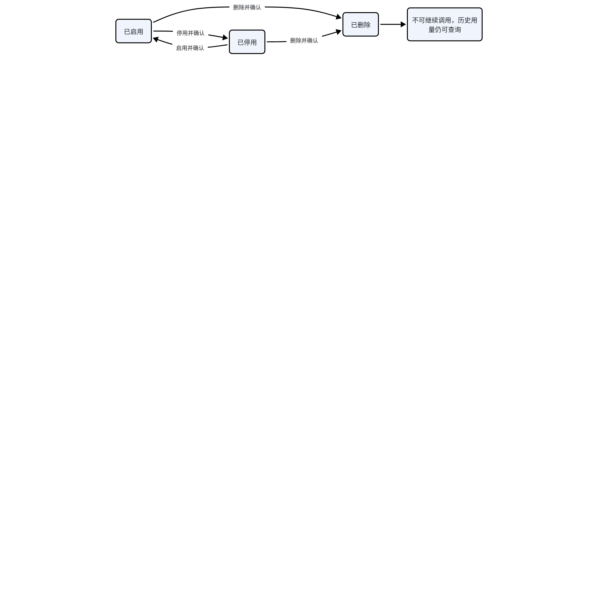

[可编辑 Mermaid 源码](assets/20260915/lifecycle.mmd)

| 操作 | 确认内容 | 成功结果 / 历史处理 |
| --- | --- | --- |
| 停用 | 后续新请求被拒绝，已接纳请求可完成 | Key 标记已停用，支持再次启用 |
| 启用 | 按当前模型范围和有效上限接纳新请求 | Key 标记已启用 |
| 删除 | 永久撤销，无法恢复；历史用量和账单保留 | 活动列表移除并释放名额；历史筛选保留稳定 Key ID 与状态 |
| 保存失败 | 显示服务端原因并保留输入 | 不得提前更改列表或显示成功 |
| 复制失败 | 提示手动选中复制 | 保留一次性结果弹窗，不能假报复制成功 |

### 模型授权、共享并发与峰值

企业模型并发接纳与释放流程。Key 上限不预留企业共享额度。

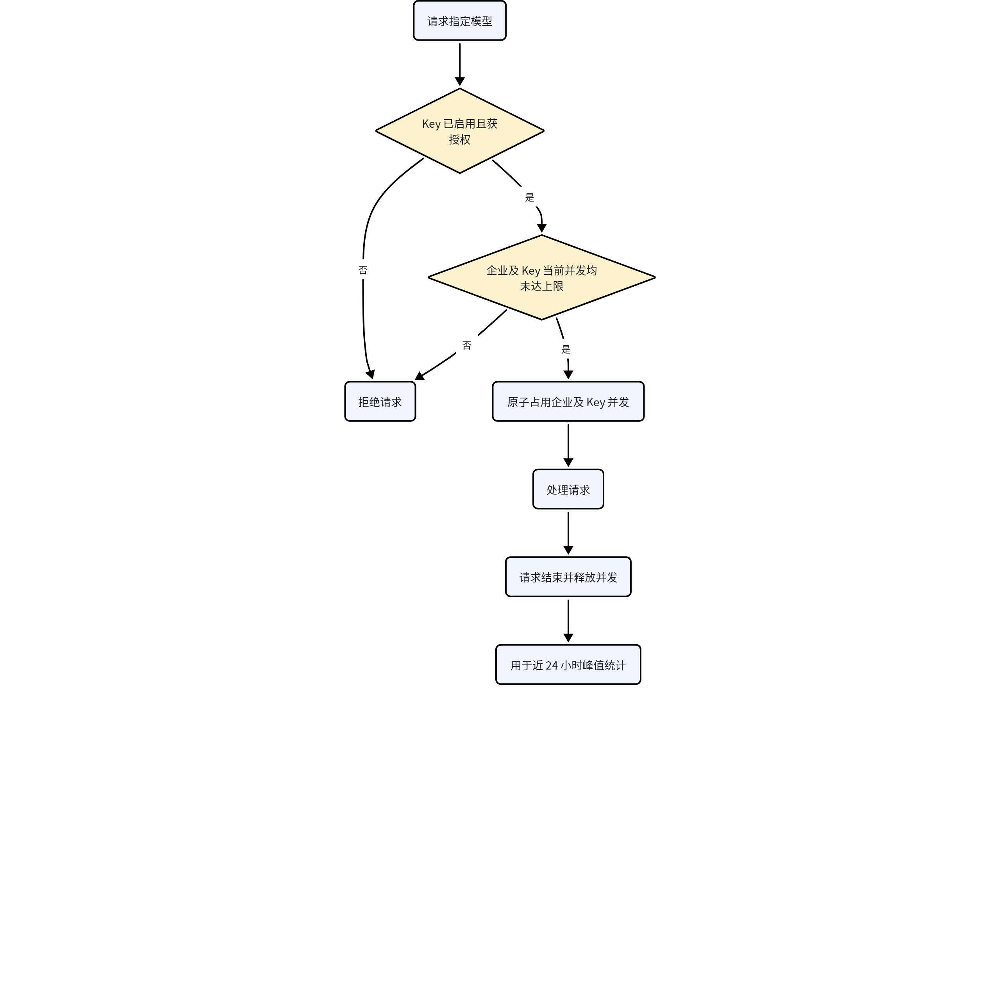

[可编辑 Mermaid 源码](assets/20260915/concurrency.mmd)

峰值颜色按“近 24 小时峰值 ÷ 当前上限”显示：低于 80% 为绿色 #7aa286；80% 至不足 100% 为橙色 #dd954d；达到或超过 100% 为红色 #b96154。零值显示空进度条；橙色与红色同时展示文字状态，不依赖颜色辨认。默认演示同时包含 41/100、50/80、21/40 的正常状态，moss-ttsd-1.0 为 0/60，moss-voice-generator-1.0 为 34/40，moss-transcribe-diarize-pro 为 30/30。并发监测 mock 随当前分钟生成近 24 小时的请求区间，由重叠区间计算峰值，跨日或旧浏览器存储不导致样例消失；与固定账单历史数据分开，不能用于计费。生产峰值由监测服务返回。峰值不是实时并发。

同一企业、同一模型共享一个并发池。每把企业 Key 可配置自身模型上限，单项不得大于企业上限，各 Key 上限之和允许大于企业上限。Key 上限不预留资源。

示例：企业某模型上限 100 路，两把 Key 各设 80 路。当第一把正在处理 70 路时，第二把最多还能接纳 30 路。企业峰值按同一时刻所有 Key 在途数计算，不能相加各 Key 各自的历史峰值。

新请求必须同时满足模型授权、Key 启用、企业与 Key 两级并发限制。达到任一上限后直接拒绝，不排队；已接纳请求可完成，完成 / 失败 / 超时 / 取消均幂等释放。模型撤权或企业上限降低时按当前有效配置判断新请求，历史统计保留原值。

| 查询组合 | 企业并发卡片 |
| --- | --- |
| 全部模型 + 全部 Key | 每个模型企业峰值 / 当前企业上限 |
| 指定模型 + 全部 Key | 该模型企业峰值 / 当前企业上限 |
| 全部模型 + 指定 Key | 此 Key 各模型峰值 / 对应 Key 上限 |
| 指定模型 + 指定 Key | 此 Key 在该模型的峰值 / Key 上限 |

卡片窗口固定滚动近 24 小时，不随账单日期改变；模型与 Key 筛选生效。显示更新时间；历史峰值超过当前下调后的上限时不得截断。个人用量页不展示该卡片。原型按分钟更新展示时钟；生产服务返回权威峰值及统计时刻。

### 用量与积分：筛选、概览与请求

企业 · 用量概览：积分、计费请求统计及近 24 小时并发峰值。

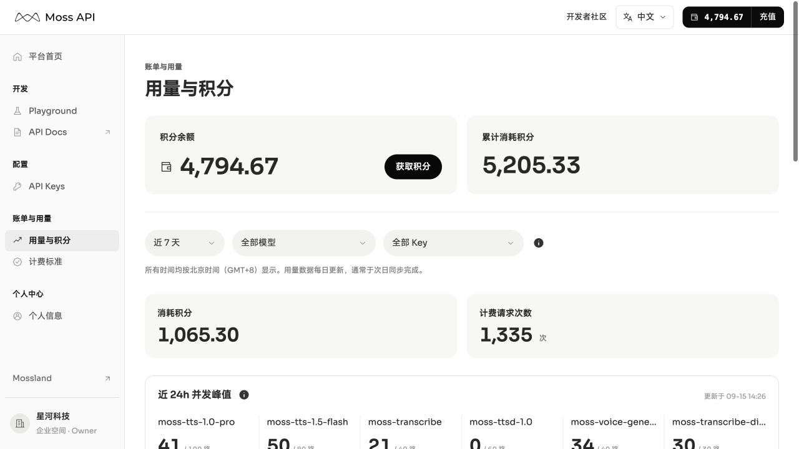

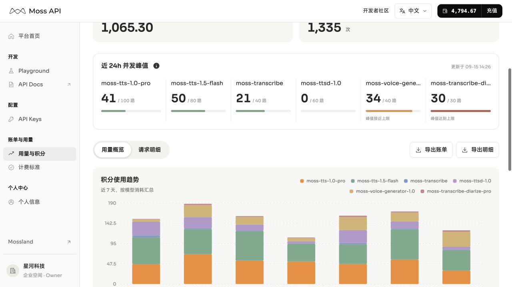

个人 · 用量概览：保留积分、计费请求统计，不展示企业并发卡片。

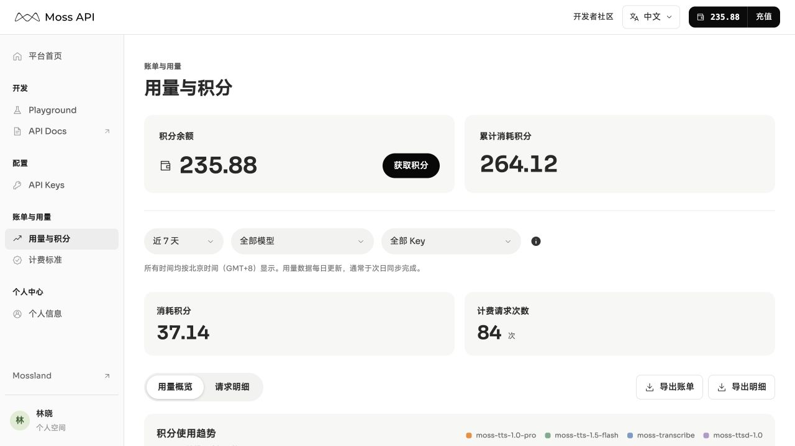

请求明细：与用量概览共用筛选条件，仅列出计费请求。

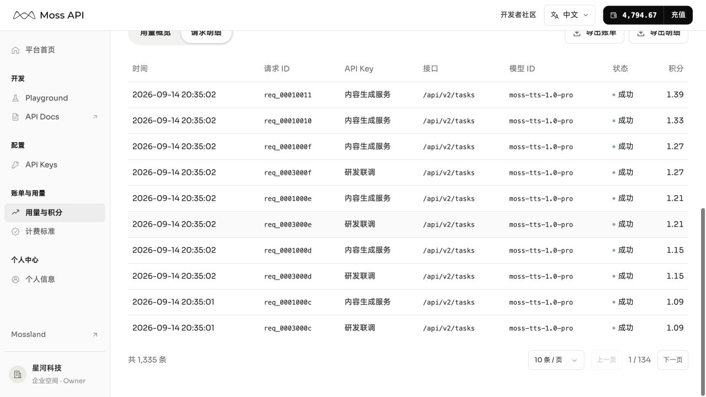

请求详情：保留 Key 标识、计费用量、积分、结算单价与模型折扣。

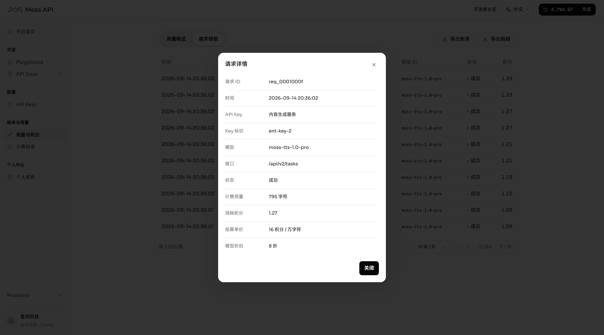

布局顺序：账户积分余额 / 累计消耗 → 时间 / 模型 / Key 筛选 → 所选范围消耗积分 / 计费请求次数 → 企业并发区 → 用量概览 / 请求明细。账户总余额和累计消耗不受筛选影响；其他计费模块使用同一筛选范围。

| 筛选 / 数据 | 规则 |
| --- | --- |
| 时间范围 | 北京时间自然日，起止日期均包含；近 7 天截至昨日 |
| 本月 | 当前月份 1 日至昨日；每月 1 日显示“本月暂无已同步数据”，不得返回上个月 |
| 自定义 | 开始≤结束，截止≤昨日；无效日期提示并禁用导出 |
| 模型 / Key | 独立可选并取交集；历史已删除 Key 可查询并标记状态 |
| 同步 | 按日同步、通常次日完成；明确展示已同步口径，不把待同步当真实零 |
| URL | 用量 URL 保存时间预设、自定义起止、模型、Key、页签、页码、每页条数；刷新按当前 URL 恢复。条件变化替换当前历史记录，不为每次筛选新增记录；前进 / 后退按所到 URL 恢复。非法或越权条件归一化，URL 不授予权限 |
| 计费请求 | 仅实际扣除积分（积分>0）的请求；失败是否扣费以实际计量结果为准 |
| 无数据 | 图表 / 表格显示对应空态；两个导出入口均不可用 |

用量概览按模型展示积分堆叠趋势及模型汇总表。列为模型、计费请求次数、计费用量、消耗积分、折后金额估算、查看明细。TTS 使用字符；ASR 在概览、账单 / PDF 和模型→Key 导出预览中将秒数除以 3600，显示 2 位小数小时。请求详情与两种 CSV 保留原始计费用量，ASR 单位为秒。合计分别显示字符与小时，不能直接合成一个用量数字；不得用已舍入的小时展示值重算费用。

请求明细每个已计费请求一行，显示北京时间、请求 ID、API Key、接口、模型、状态、积分。点击请求 ID 打开详情，字段依次为请求 ID、时间、API Key、Key 标识、模型、接口、状态、计费用量、消耗积分、结算单价、模型折扣。分隔线只出现在相邻字段之间，最后一行下方无分隔线；长内容在弹窗内部滚动。模型下钻保留时间和 Key 条件。概览、请求明细、账单和两种 CSV 均沿用实际扣分请求口径；生产费率快照缺失时不得用当前价补算历史。

### 账单预览与 PDF 打印

账单预览：按模型汇总，企业抬头显示企业名称，个人抬头显示“用户名 · 用户 ID”；仅展示实际计费单价与单位，点击“打印账单”进入浏览器打印。

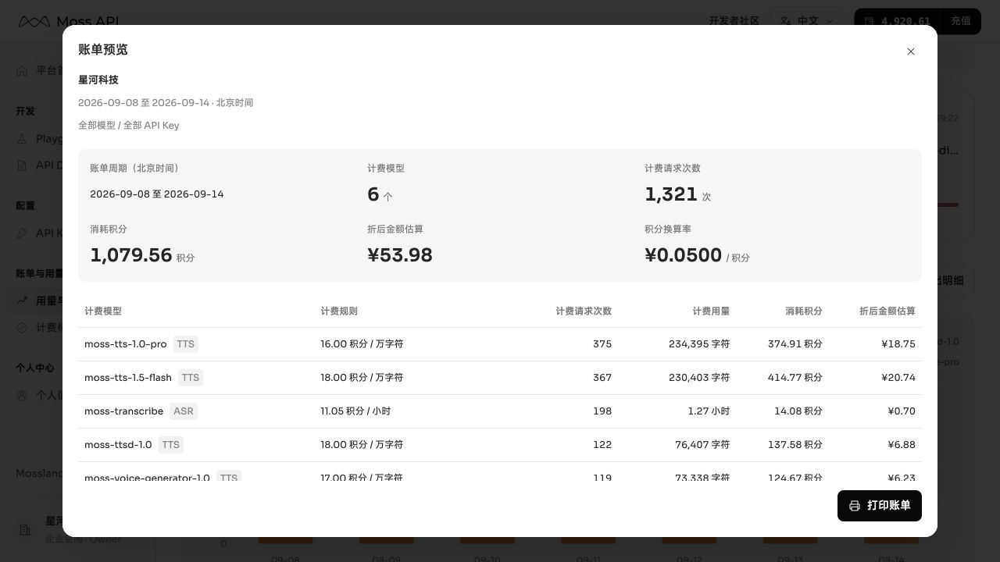

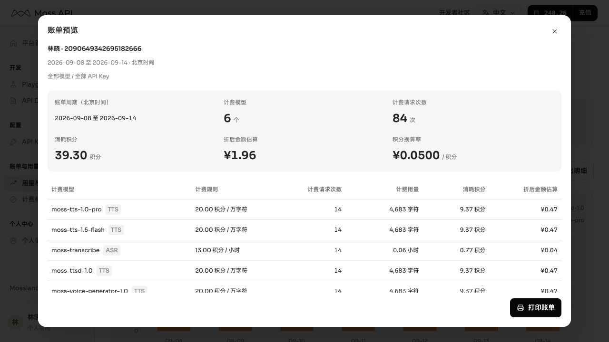

账单与 CSV 共用计费请求范围；分页不影响导出。

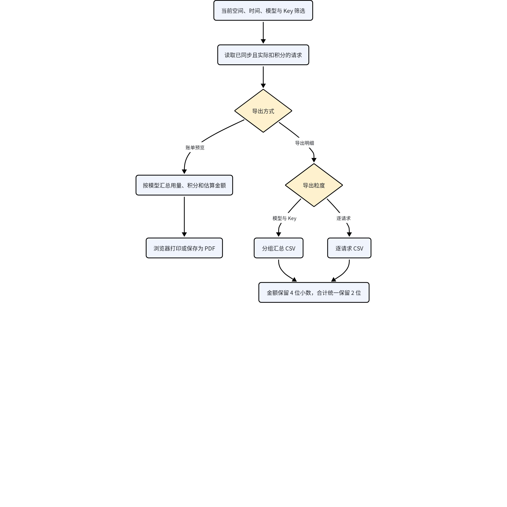

[可编辑 Mermaid 源码](assets/20260915/export.mmd)

入口为“导出账单”，弹窗名“账单预览”。头部依次显示账户名称、北京时间起止日期、模型 / API Key 条件。摘要卡片六项：账单周期、计费模型、计费请求次数、消耗积分、折后金额估算、积分换算率。

| 区块 | 字段 / 行为 |
| --- | --- |
| 表格 | 计费模型（附类型标签）、计费规则、计费请求次数、计费用量、消耗积分、折后金额估算 |
| 计费规则 | 采用请求费率快照；企业仅显示实际计费单价与单位，个人显示标准单价与单位，均不显示额外价格标签。账单弹窗与打印版统一使用“计费规则”列名，企业不展示划线原价及折扣标签，个人不展示“标准价”标签。同一模型包含多个生效费率时，在同一模型行列出各个费率，不使用一个当前单价重算整行积分 |
| 合计 | 筛选全量请求、不同单位用量、积分及金额；不受分页影响 |
| 金额 | 金额估算 = 当前筛选范围内的消耗积分 × 参考换算率。参考换算率来自基础积分包：20 元 ÷ 400 积分 = 0.05 元 / 积分。消耗积分已包含模型折扣，不再次乘折扣；该金额仅供展示参考，不代表实际支付金额或实际成本。 |
| 打印 | 点击“打印账单”调用浏览器打印；A4 横向，仅打印账单正文，移除背景与操作按钮 |
| 版式 | 摘要卡片、白底横线表、数值右对齐；常见 6 模型账单紧凑展示，较多内容允许分页 |

PDF 页面金额保留 2 位小数。打印内容与预览同源；在目标浏览器检查文字、表头、分页和合计完整性，不以屏幕弹窗能完整显示替代实际 PDF 验收。

### 导出明细与 CSV

导出明细 · 模型与 Key 汇总：摘要按次数、积分、金额、导出记录排列。

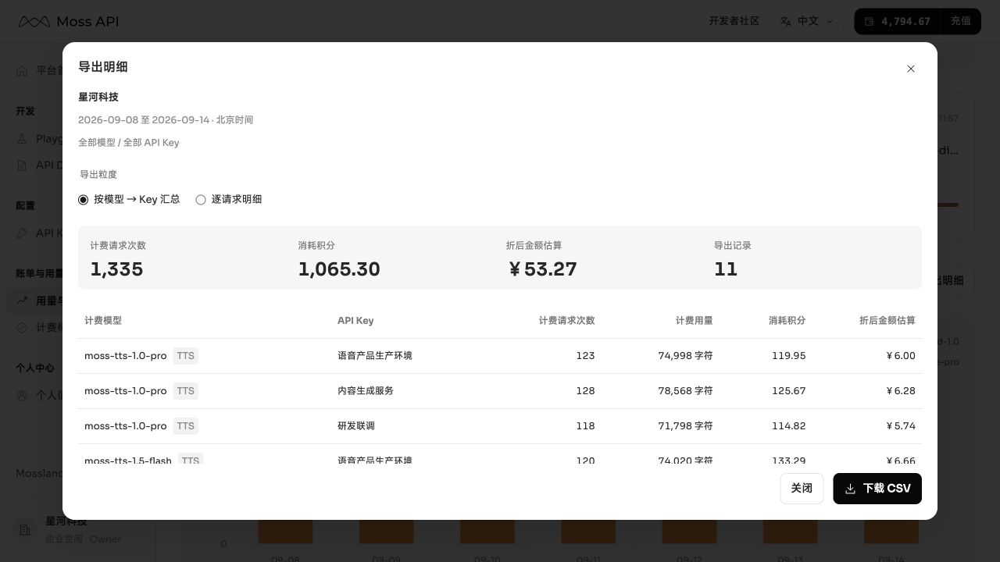

导出明细 · 逐请求：提示本次计费请求条数；CSV 金额保留 4 位小数。

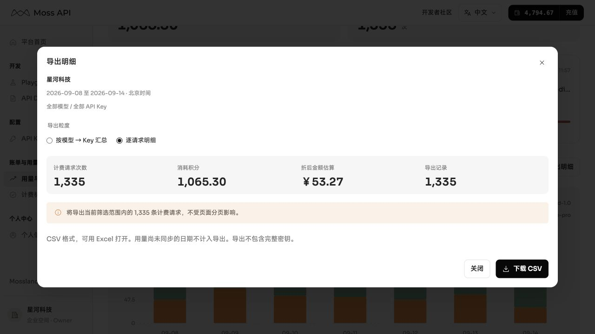

入口“导出明细”，头部与账单预览采用相同账户、日期和条件形式。导出粒度默认“按模型 → Key 汇总”，可切换“逐请求明细”。摘要顺序固定为计费请求次数、消耗积分、折后金额估算、导出记录。汇总模式展示筛选范围内的模型与 Key 汇总记录；逐请求模式展示记录数量说明。下载均包含筛选全量。

| 粒度 | CSV 字段 | 预览 / 口径 |
| --- | --- | --- |
| 模型 → Key 汇总 | 账户、开始日期、结束日期、计费模型、Key ID、API Key、密钥掩码、备注、计费请求次数、计费用量、单位、消耗积分、折后金额估算（元） | 预览为模型（类型标签）、API Key、计费请求次数、计费用量、消耗积分、折后金额估算 |
| 逐请求 | 账户、开始日期、结束日期、请求时间（北京时间）、请求 ID、计费模型、Key ID、API Key、密钥掩码、备注、接口、状态、计费用量、单位、消耗积分、结算单价、单价单位、模型折扣、折后金额估算（元） | 每个实际扣分请求一行；历史标识与费率快照保持一致 |

CSV 按上表列名及顺序输出业务字段，密钥始终为掩码。计费用量和单位分列；ASR 用量单位是秒，结算单价单位是小时，TTS 用量单位是字符、单价单位是万字符，不能混用两组单位。支持中文、逗号、引号、换行，用户填写内容进行公式注入转义。Key 删除或改名后仍保留稳定 ID，历史归因不能丢失。

两种 CSV 的“折后金额估算（元）”保留 4 位小数，先汇总再统一舍入为 2 位。例：1,079.56 积分按 0.05 换算得到 53.9780 元，页面 / PDF 展示 ¥53.98；不得先把逐请求金额舍入为 2 位后求和。

### 计费标准与积分获取

企业 · 计费标准：模型标准价、企业折扣与企业价使用一致列宽。

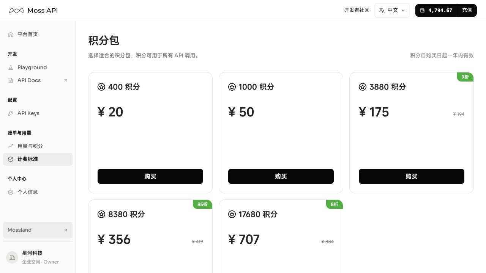

个人 · 计费标准：展示个人可用的积分包及模型计费标准。

获取积分 · 个人充值：选择积分包与在线支付入口。

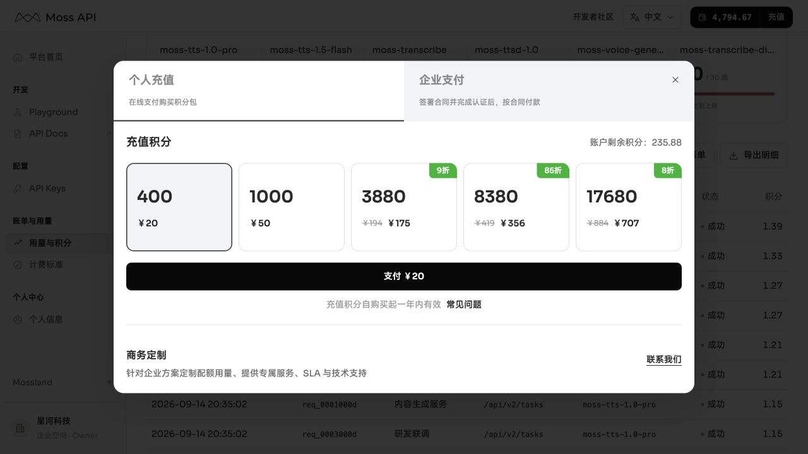

获取积分 · 企业支付：认证对象为当前企业，付款按合同约定。

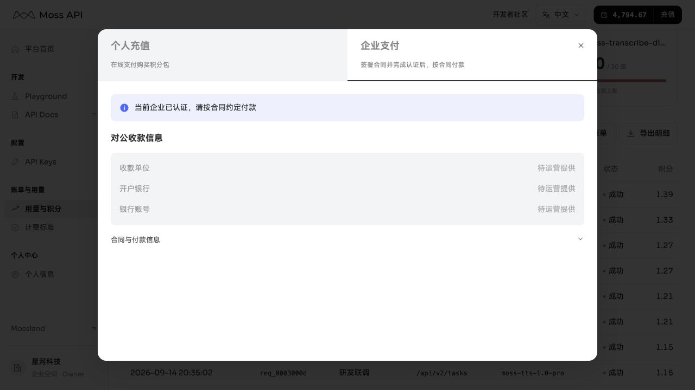

| 项目 | 当前要求 |
| --- | --- |
| 模型分组 | 语音生成 / 语音转写两表相同列宽，标准价、折扣和企业价垂直对齐 |
| 企业模型价 | 按模型展示标准价、企业折扣、企业价及最低扣费；Owner 只读 |
| 个人模型价 | 使用当前个人标准价格，不继承企业合同折扣 |
| 历史计费 | 每次请求保存生效单价、单位、模型折扣、最低扣费及内部快照标识，历史金额不由当前价倒算 |
| 获取积分 | 个人充值 / 企业支付页签；积分包选择、应付金额、有效期说明 |
| 个人充值 | 保留原平台积分包与商务定制入口；个人充值页签展示个人余额，积分入个人空间，即使入口来自企业页面也不计入企业余额。未接支付时明确提示并可前往原平台 |
| 企业支付 | 显示当前企业认证状态及收款单位、银行、账号；已认证 Owner 可展开合同 / 付款信息。企业付款按合同核实后入当前企业空间，与个人充值独立 |
| 生产数据 | 认证、合同和收款信息由服务返回；未提供时显示待配置，不能伪造银行账号或二维码 |

“积分换算率”在当前 MVP-P0 中是固定展示参考值，来源于基础积分包的价格与积分数量，不是按筛选范围内的金额与积分动态定价。筛选只改变计入的消耗积分及其金额估算，不改变参考换算率。用未舍入的估算金额除以消耗积分，会反算出同一参考值，没有独立的业务含义；不能从页面已舍入的两位小数金额反推费率。此估算未追踪用户实际购买的积分包、充值优惠或赠送积分，因此不作为实付成本、结算、退款或开票依据。模型折扣在消耗积分阶段生效；充值优惠与模型折扣是不同口径。

### 接口与异常处理要求

| 领域 | 最小数据 / 契约 | 异常要求 |
| --- | --- | --- |
| 空间 | 当前账户、可信企业资格、当前空间、模型权益 | 无资格不能访问；空间切换废弃旧响应 |
| Key | 稳定 ID、名称、掩码、模型策略、备注、状态、创建时间 | 一次性明文仅创建成功返回；并发修改冲突明确反馈 |
| 网关 | 企业 / Key / 模型、策略状态、原子计数 | 未授权 / 停用 / 超限分别反馈；结束幂等释放 |
| 用量 | 筛选条件、自然日时区、同步水位、请求 / Key / 模型 ID、积分 | 加载、失败、无结果、未同步区分；失败不展示伪零 |
| 计价 | 生效单价、单位、折扣、最低扣费、历史快照 | 不按当前合同重算历史；多费率模型可追溯明细 |
| 导出 | 与页面同权限、同筛选、同快照的全部计费记录 | 失败可重试；大数据量采用服务端异步任务 |
| 支付 | 合同主体、认证、收款信息、订单、入账结果 | 未接入与失败区别展示；不得未到账先加余额 |

### 验收场景

| 编号 | 操作 / 前提 | 预期结果 |
| --- | --- | --- |
| A01 | 企业 / 个人创建或编辑 Key，取消全部模型，再重新勾选一个模型 | 空选后模型列表下立即显示“请至少选择一个授权模型。”，确认 / 保存禁用；勾选后提示移除，全部字段有效时可提交。取消编辑不改变已保存范围。 |
| A02 | 企业上限100，Key填写0、101或小数 | 阻止提交，提示有效整数范围 |
| A03 | 两个 Key 各80，企业100 | 配置可保存；同时在途仍不超过企业100 |
| A04 | 个人新建 / 编辑 Key | 两列模型可勾选，不要求并发输入 |
| A05 | 个人保存单一模型后刷新和重开编辑 | 授权列和勾选均保持单一模型 |
| A06 | 创建成功关闭弹窗再查看列表 | 只能看到掩码，完整密钥不能再次读取 |
| A07 | 取消编辑 / 服务端保存失败 | 不修改已保存配置，失败保留表单 |
| A08 | 停用 / 删除有历史数据的 Key | 新请求拒绝，历史用量和 ID 仍可查询 |
| A09 | Key 行查看用量后刷新 | URL 恢复 Key 及其他查询条件 |
| A10 | 切换个人 / 企业 | 保留当前功能页面，余额、Key 与用量切换至目标空间；旧弹窗、草稿、筛选及 URL 参数清除；刷新保留目标空间，历史数据不迁移 |
| A11 | 每月1日选择本月 | 本月暂无已同步数据；两个导出禁用 |
| A12 | 组合时间、模型和 Key | 图表、合计、请求、账单与 CSV 使用交集 |
| A13 | 切换数据日期但保持模型 / Key | 企业近24h峰值统计窗口不变 |
| A14 | 同一筛选导出两种CSV并求和 | 积分与账单一致，金额4位求和后舍入2位一致 |
| A15 | 表格翻页后打印或导出 | 仍包含筛选全量，非仅当前页 |
| A16 | 模型名称、备注含逗号 / 引号 / 换行或公式前缀 | CSV 列结构正确，不触发公式执行 |
| A17 | 打印6模型账单与多页账单 | 正文、重复表头和合计完整，不含操作或背景页面 |
| A18 | 页面滚动后，用鼠标及方向键来回切换用量概览 / 请求明细；同时检查窄屏和 reduced-motion | 两种切换均保持滚动位置，不回顶或因内容变短跳动；选中背景过渡为 220ms，减少动态效果时关闭；焦点及面板关联正确，窄屏个人授权卡片单列且操作可达。 |

补充验收：A19，ASR 请求详情和 CSV 以秒为计费用量，概览 / PDF 以小时展示，积分按原始计量汇总；A20，同模型跨多个费率时列出各费率，合计等于已扣积分之和；A21，分别打开创建 Key、充值、购买和获取积分，背景遮罩均为 rgba(0,0,0,0.8)，请求详情最后一行没有多余分隔线；A22，企业页面打开个人充值，展示并入账个人余额，企业合同付款进入企业余额，两者不得串账。

## 交付与上线

### 交付物与版本基线

交付包括本飞书 PRD、新 Figma、线上交互原型及公开 GitHub 仓库中的代码快照。首版历史基线为 eefa799，保留原标签 moss-api-mvp-p0-compromise-v1.0.0-20260914；本次研发交付代码快照为 bfc7f47，2026-09-15 已核验 Vercel 部署成功。后续 main 可能继续更新，复现本次交付请使用上述提交。新版 Figma 按企业 / 个人分区；个人用量与积分包括用量概览、请求明细、请求详情、账单预览、模型与 Key 汇总导出、逐请求导出六个状态。API Keys 企业区包含未选择模型状态；全局导航独立整理工作空间双向切换，通用组件区保留菜单组件。

[全局导航 · 工作空间切换（双向流程）](https://www.figma.com/design/uKJHefil0SBm8xMnc37NnE?node-id=129-41)；[个人角色 · 用量与积分（六个状态）](https://www.figma.com/design/uKJHefil0SBm8xMnc37NnE?node-id=80-1104)；[通用组件与提示](https://www.figma.com/design/uKJHefil0SBm8xMnc37NnE?node-id=76-41)。设计画板按“模块 / 子页面 / 状态”命名；中文设计使用 Noto Sans SC，上线仍使用 MiSans，英文和数字使用 Sora。

### 联调顺序与上线门禁

| 阶段 | 联调内容 | 进入下一阶段条件 |
| --- | --- | --- |
| 空间与 Key | 身份、权益、创建 / 编辑 / 启停 / 删除、一次性密钥 | 隔离及生命周期场景通过 |
| 网关与监测 | 模型授权、两级并发、峰值和配置变更 | 原子接纳与幂等释放验证通过 |
| 计量与导出 | 同步水位、筛选、历史快照、精度、PDF / CSV | 同范围账务核对通过 |
| 支付与发布 | 真实收款资料、订单、入账、异常反馈；发布配置 | 业务负责人确认服务状态和上线证据 |

### 待确认项

| 事项 | 需要结论 | 确认方 / 时点 |
| --- | --- | --- |
| 生产接口 | 空间、Key、并发、计量、导出及支付接口字段与错误码 | 对应后端负责人，接口评审前 |
| 运营数据 | 真实企业权益、合同折扣、认证和收款资料 | 模思运营 / 计费负责人，联调前 |
| 配置生效 | 撤权、降低上限的传播时延及版本校验方式 | 网关 / Key 服务负责人，压测前 |
| 大数据导出 | 同步导出阈值、异步任务状态与下载期限 | 产品 / 后端，导出联调前 |
| PDF | 目标浏览器的实际分页、字体和合计位置 | 设计 / 测试，发布验收前 |
| 负责人 | 具名责任人和相对联调计划 | 项目负责人，研发启动时 |

前端交付收口：本次线上核对发现，用量页面的浏览器标签标题仍为“API 密钥 — Moss API”。研发实现时须随当前功能页面更新为相应标题，并验证空间切换后保持正确；正文页面标题及本轮业务规则不受影响。

上线前以真实服务联调证据关闭以上事项。交互原型的可点击状态和演示数据，不替代生产能力确认。
